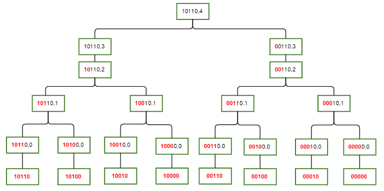

# SOS DP

## Nguồn

 [SOS Dynamic Programming [Tutorial]](https://codeforces.com/blog/entry/45223)

## Bài toán

Cho một mảng $A$ gồm $2^N$ phần tử, ta cần tính với mọi $x$ giá trị hàm $F(x)$ = tổng tất cả các phần tử $A[i]$ sao cho $x \& i = i$, nghĩa là $i$ là một tập con của $x$.

$$F[mask] = \sum_{i \in \subseteq} A[i]$$

Đây là bài toán tổng trên tập con, hay tiếng Anh là Sum over Subsets (SOS).

## Các kiến thức cần biết

- DP cơ bản
- Bitmask

## Lời giải

### Duyệt trâu

```cpp
// với mỗi mask, ta tìm các tập con của nó, sau đó cộng lại
for (int mask = 0; mask < (1<<N); ++mask) {
    for (int i = 0; i < (1<<N); ++i) {
        if ((mask & i) == i) {
            F[mask] += A[i];
        }
    }
}
```

Lời giải này khá đơn giản nhưng không hiệu quả với độ phức tạp $O(4^N)$.

### Lời giải chưa tối ưu

```cpp
// duyệt từng mask
for (int mask = 0; mask < (1<<n); mask++) {
    F[mask] = A[0];
    // duyệt qua các tập con của mask
    for (int i = mask; i > 0; i = (i-1) & mask) {
        F[mask] += A[i];
    }
}
```

Không đơn giản như cách trên nhưng lời giải này hiệu quả hơn với độ phức tạp $O(3^N)$. Để tính được độ phức tạp của thuật toán này, để ý rằng với mỗi mask, ta chỉ duyệt các tập con của nó, thay vì duyệt lại $2^N$. Vì vậy nếu một mask có $K$ bit 1, ta chỉ duyệt $2^K$ tập con của nó. Thêm nữa, số các mask với $K$ bit 1 là $\binom{N}{K}$. Như vậy tổng số lần duyệt là: $\sum_{K=0}^{N} \binom{N}{K} 2^K = (1 + 2)^N = 3^N$.

### SOS DP

Với cách này, ta sẽ duyệt tất cả các tập con của mask theo một cách tinh tế hơn. Vấn đề của lời giải trước là, xét $A[x]$ với $x$ có $K$ bit 0, nó sẽ được thăm bởi $2^K$ mask. Thành ra ta tính bị trùng nhiều lần.

Lý do cho việc trùng này là vì ta chưa thiết lập bất kỳ quan hệ nào giữa các $A[x]$ đang được các $F[mask]$ khác nhau sử dụng. Ta phải tìm cách nào đó để thêm vào một trạng thái nữa vào các mask này và thiết lập quan hệ để tránh tính toán lại.

Gọi $S(mask) = \{x | x \subseteq mask\}$, nghĩa là tập các tập con $x$ của $mask$. Giờ ta sẽ chia tập này thành các tập nhỏ hơn không giao nhau.

Gọi $S(mask, i) = \{x | x \subseteq mask \text{ && } mask \oplus x < 2^{i+1}\}$, nghĩa là tập các tập con của $mask$ mà bit thứ $i+1$ trở lên phải giống với $mask$ (bit đầu tiên là bit thứ 0).

Ví dụ $S(\textbf{101}1010, 3) = \{\textbf{101}1010, \textbf{101}0010, \textbf{101}1000, \textbf{101}0000\}$. Với cách này ta có thể biểu thị bất kỳ tập nào theo dạng hợp của một số tập không giao nhau.

Thử kết nối các tập số này nhé. $S(mask, i)$ gồm tập các tập con của $mask$ có bit thứ $i+1$ trở lên giống với $mask$, hay nói cách khác là các tập con này có thể khác mask ở bit thứ $i$ và thấp hơn.

- Giả sử bit thứ $i$ của $mask$ là 0. Trong trường hợp này, không có tập con nào khác mask ở bit thứ $i$ được chấp nhận, vì như vậy bit thứ $i$ của tập con sẽ là 1, nó sẽ không còn là tập con của $mask$ nữa. Vì thế số các tập con sẽ phải khác mask ở bit thứ $i-1$ và thấp hơn, suy ra $S(mask, i) = S(mask, i-1)$.
- Giả sử bit thứ $i$ của $mask$ là 1. Giờ số các tập con của $S(mask, i)$ có thể được chia thành hai tập không giao nhau. Một tập chứa các tập con có bit thứ $i$ là 1 và có thể khác mask ở bit thứ $i-1$ và thấp hơn. Tập còn lại chứa các tập con có bit thứ $i$ là 0 và khác $mask \oplus 2^i$ ở bit thứ $i-1$ và thấp hơn. Suy ra $S(mask, i) = S(mask, i-1) \cup S(mask \oplus 2^i, i-1)$.

$$S(mask, i) = \begin{cases} S(mask, i-1) & \text{nếu bit i của mask là 0} \\ S(mask, i-1) \cup S(mask \oplus 2^i, i-1) & \text{nếu bit i của mask là 1} \end{cases}$$

Hình sau đây mô tả cách ta liên kết các tập $S(mask, i)$ với nhau. Các phần tử của bất kỳ tập $S(mask, i)$ nào đều là các node lá trên cây con của nó. Các tiền tố màu đỏ mô tả rằng phần đầu của mask sẽ giống nhau trong tất cả các phần tử của tập con này, phần màu đen có thể khác nhau.

{:class="centered-img" }

Lưu ý rằng các quan hệ này sẽ tạo ra một đồ thị có hướng không chu trình và không nhất thiết là một cây (ví dụ như khi có các giá trị khác nhau của $mask$ và cùng giá trị của $i$). Sau khi tạo được quan hệ, ta có thể dễ dàng tạo được lời giải với DP.

```cpp
// cài đặt theo công thức
for (int mask = 0; mask < (1<<N); ++mask) {
    dp[mask][-1] = A[mask];	// Node lá, trường hợp cơ bản
    for (int i = 0; i < N; ++i) {
        if (mask & (1<<i)) {
            dp[mask][i] = dp[mask][i-1] + dp[mask ^ (1<<i)][i-1];
        } else {
            dp[mask][i] = dp[mask][i-1];
        }
    }
    F[mask] = dp[mask][N-1];
}
```

```cpp
// cài đặt tối ưu bộ nhớ
for (int i = 0; i < (1<<N); ++i) {
    F[i] = A[i];
}
for (int i = 0; i < N; ++i) {
    // để ý rằng ta tính dp[mask][i] chỉ từ dp[][i-1] nên ta có thể dùng một mảng 1 chiều
    for (int mask = 0; mask < (1<<N); ++mask) {
        if (mask & (1<<i)) {
            F[mask] += F[mask ^ (1<<i)];
        }
    }
}
```

Thuật toán trên chạy trong thời gian $O(N \cdot 2^N)$.

## Bài tập thảo luận

Giờ ta đã biết cách tính SOS cho một mảng $A$ cho trước. Chuyện gì sẽ xảy ra nếu $A$ và $F$ là các hàm SOS của nhau. Xét bài toán sau: Giả sử $H1$ và $H2$ là hai hàm hash nguyên 32 bit (để tránh các cách dùng tổ hợp để qua được bài toán này), và có thể lấy kết quả trong thời gian hằng số:

$$F[mask] = H1(\sum_{i \subseteq mask} G[i])$$

$$G[mask] = H2(\sum_{i \subseteq mask} F[i])$$

## Luyện tập

| Problem | Status | Submission | Code | Date |
| :---: | :-----------: | :---: | :---: | :---: |
| [Codeforces - Compatible Numbers](https://codeforces.com/contest/165/problem/E) | :white_check_mark: | [Submission](https://codeforces.com/contest/165/submission/350259211) | [Code](https://github.com/farmerboy95/CompetitiveProgramming/blob/master/Codeforces/CF165-D2-E.cpp) | 22/11/2025 |
| [Codeforces - Vowels](https://codeforces.com/contest/383/problem/E) | :white_check_mark: | [Submission](https://codeforces.com/contest/383/submission/350913823) | [Code](https://github.com/farmerboy95/CompetitiveProgramming/blob/master/Codeforces/CF383-D1-E.cpp) | 27/11/2025 |
| [CSES - Bit Problem](https://cses.fi/problemset/task/1654) | :white_check_mark: | Unavailable public link | [Code](https://github.com/farmerboy95/CompetitiveProgramming/blob/master/CSES/CSES%201654.cpp) | 27/11/2025 |
| [USACO 2023 February - Problem Setting](http://usaco.org/index.php?page=viewproblem2&cpid=1309) | :white_check_mark: | Unavailable public link | [Code](https://github.com/farmerboy95/CompetitiveProgramming/blob/master/USACO/USACO%2023feb-problem-setting.cpp) | 03/12/2025 |
| [Codeforces - Bits And Pieces](https://codeforces.com/contest/1208/problem/F) | :white_check_mark: | [Submission](https://codeforces.com/contest/1208/submission/357263374) | [Code](https://github.com/farmerboy95/CompetitiveProgramming/blob/master/Codeforces/CF1208-D12-F.cpp) | 10/01/2026 |
| [Codechef - COVERING](https://www.codechef.com/problems/COVERING) | :white_check_mark: | [Submission](https://www.codechef.com/viewsolution/1225153608) | [Code](https://github.com/farmerboy95/CompetitiveProgramming/blob/master/Codechef/CODECHEF%20COVERING.cpp) | 11/01/2026 |
| [COCI 2011/2012 - KOSARE](http://hsin.hr/coci/archive/2011_2012/contest6_tasks.pdf) | :white_check_mark: | Unavailable public link | [Code](https://github.com/farmerboy95/CompetitiveProgramming/blob/master/COCI/COCI%2011-Kosare.cpp) | 12/01/2026 |
| [HackerRank - Vim War](https://www.hackerrank.com/contests/w16/challenges/vim-war) | :white_check_mark: | Unavailable public link | [Code](https://github.com/farmerboy95/CompetitiveProgramming/blob/master/HackerRank/HACKR%20vim-war.cpp) | 12/01/2026 |
| [Codeforces - Jzzhu and Numbers](https://codeforces.com/problemset/problem/449/D) | | | | |
| [HackerRank - Subset](https://www.hackerrank.com/contests/countercode/challenges/subset) | | | | |
| [Jersey Number](https://icpcarchive.ecs.baylor.edu/index.php?option=com_onlinejudge&Itemid=8&category=635&page=show_problem&problem=4997) | | | | |
| [Codechef - BEAUTY](https://www.codechef.com/SNFL16MR/problems/BEAUTY) | | | | |
| [Codeforces - Pepsi Cola](https://codeforces.com/group/qcIqFPYhVr/contest/203881/problem/K) | | | | |
| [HackerEarth - Uchiha and Two Products](https://www.hackerearth.com/problem/algorithm/uchiha-brothers-and-two-products-circuit/) | | | | |
| [Codechef - STR_FUNC](https://www.codechef.com/IPC15P2B/problems/STR_FUNC) | | | | |
| [Codeforces - Varying Kibibits](https://codeforces.com/contest/800/problem/D) | | | | |
