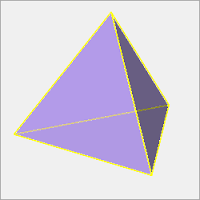

# Giá trị kỳ vọng

## Nguồn

 [Expected Value - Brilliant](https://brilliant.org/wiki/expected-value/)

## Mở đầu

Trong lý thuyết xác suất, một **giá trị kỳ vọng** là giá trị trung bình lý thuyết của một [phép thử](https://brilliant.org/wiki/uniform-probability/#definitions-of-key-terms) số học qua nhiều lần lặp lại phép thử. Giá trị kỳ vọng là thước đo **xu hướng trung tâm**; một giá trị mà kết quả sẽ có tính hướng vào đó. Khi phân phối xác suất là [chuẩn tắc](https://brilliant.org/wiki/normal-distribution/), nhiều kết quả sẽ gần với giá trị kỳ vọng.

Bất kỳ biến ngẫu nhiên nhất định nào cũng chứa vô số thông tin. Nó có thể có nhiều (hoặc vô số) kết quả có thể xảy ra và mỗi kết quả có thể có khả năng xảy ra khác nhau. Giá trị kỳ vọng là một cách để tóm tắt tất cả thông tin này trong một giá trị số duy nhất.

## Định nghĩa

Nếu không gian mẫu của một phép thử xác suất chỉ chứa các kết quả số học, thì **biến ngẫu nhiên** là biến đại diện cho các kết quả này. Ví dụ, kết quả của việc tung một con xúc xắc 6 mặt đều (nghĩa là xác suất tung ra mỗi mặt là như nhau) là một biến ngẫu nhiên nhận từng giá trị từ 1 đến 6 với xác suất $\frac{1}{6}$. Đây là một ví dụ về [biến ngẫu nhiên rời rạc](https://brilliant.org/wiki/discrete-random-variables-definition/).

Đối với một biến ngẫu nhiên rời rạc, giá trị kỳ vọng có thể được tính bằng cách nhân từng kết quả số với xác suất của kết quả đó, sau đó tính tổng các tích đó lại với nhau. Giá trị kỳ vọng của một con xúc xắc sáu mặt đều được tính như sau:

$$\frac{1}{6} \cdot 1 + \frac{1}{6} \cdot 2 + \frac{1}{6} \cdot 3 + \frac{1}{6} \cdot 4 + \frac{1}{6} \cdot 5 + \frac{1}{6} \cdot 6 = 3.5$$

!!! info "Định nghĩa"
    Gọi $X$ là một biến ngẫu nhiên rời rạc. Thì giá trị kỳ vọng của $X$, ký hiệu là $E[X] hay $\mu$, là:

    $$E[X] = \mu = \sum_{x} xP(X=x)$$

!!! question "Ví dụ"
    Một bộ bài chứa một lá bài có số $1$, hai lá bài có số $2$, ba lá bài có số $3$, và bốn lá bài có số $4$. Nếu bộ bài được xáo lên và ta lấy một lá ra, kỳ vọng giá trị của lá đó là bao nhiêu?

??? tip "Lời giải"
    Gọi $X$ là biến ngẫu nhiên đại diện cho giá trị của lá bài được lấy. Ta có

    $$\begin{align}
    P(X = 1) &= \frac{1}{10}\\
    P(X = 2) &= \frac{2}{10}\\
    P(X = 3) &= \frac{3}{10}\\
    P(X = 4) &= \frac{4}{10}\\
    \Rightarrow E[X] &= (1 \times \frac{1}{10}) + (2 \times \frac{2}{10}) + (3 \times \frac{3}{10}) + (4 \times \frac{4}{10})\\
    &= 3
    \end{align}$$

    Vậy kỳ vọng giá trị lá bài là $3$.

Từ góc độ lý thuyết đo lường, gọi $(\Omega, \mathcal{F}, P)$ là không gian đo lường. Để tính kỳ vọng hoặc tích phân của các biến ngẫu nhiên nói chung, ta phải tiến hành theo cách sau (lưu ý, để biết định nghĩa $\sigma$-đại số, vui lòng truy cập [Tiên đề Xác suất](https://brilliant.org/wiki/axioms-of-probability/)):

Đầu tiên, kỳ vọng, $\mathbb{E}\{X\}$ của các biến ngẫu nhiên đơn giản

!!! info "Định nghĩa"
    Một biến ngẫu nhiên, $X$ được gọi là đơn giản, nếu nó có thể được viết thành $X = \sum_{i=1}^{n} a_i 1_{A_i}$. Trong ddos $A_i$ tạo thành một phân vùng của $\Omega$, nghĩa là, $\bigcup_{i=1}^{n} A_i = \Omega$ và $A_i \cap A_j = \emptyset$ ($\forall i \ne j$), với mỗi $a_i = A_i$.

Giờ ta có thể định nghĩa kỳ vọng của một biến ngẫu nhiên đơn giản:

!!! info "Định nghĩa"
    $\mathbb{E}\{X\} = \sum_{i=1}^{n} a_i \mathbb{P}(A_i)$, trong đó \mathbb{P}(A_i) là xác suất đo lường và mỗi $A_i \in \mathcal{F}$, $\mathcal{F}$ là một $\sigma$-đại số của các tập con trong $\Omega$. $\mathbb{E}\{X\}$ tương đương với việc viết $\mathbb{E}\{X\} = \int X(\omega) \mathbb{P}(d\omega)$ hay $\int X d \mathbb{P}$

Vì sự phân vùng $\Omega$ có nhiều cách biểu diễn, ta phải cho thấy rằng, dù dùng cách biển diễn nào, ta cũng phải suy ra được một khái niệm kỳ vọng được xác định rõ ràng.

!!! info "Định lý"
    Định nghĩa của $\mathbb{E}\{X\}$ cho các biến ngẫu nhiên đơn giản được xác định rõ ràng.

!!! info "Chứng minh"
    Gọi $X = \sum_{i=1}^{n} a_i 1_{A_i}$ và $Y = \sum_{j=1}^{m} b_j 1_{B_j}$ là hai biến ngẫu nhiên đơn giản sao cho $\bigcup_{i=1}^{n} A_i = \Omega = \bigcup_{j=1}^{m} B_j$ với $A_i \cap A_l = \emptyset$ ($\forall i \ne l$) vaf $B_j \cap B_k = \emptyset$ ($\forall j \ne k$).

    Lưu ý rằng ta có thể viết mỗi $A_i = A_i \cap \Omega = A_i \cap (\bigcup_{j=1}^{m} B_j)$ và mỗi $B_j = B_j \cap \Omega = B_j \cap (\bigcup_{i=1}^{n} A_i)$. Vì vậy ta có thể viết lại $X$ thành $X = \sum_{i=1}^{n} a_i 1_{A_i} = \sum_{i=1}^{n} a_i 1_{A_i \cap (\bigcup_{j=1}^{m} B_j)}$.

    Vì tất cả các $A_i$ và $B_j$ không giao nhau, nên mỗi $A_i \cap B_j$ tạo ra một tập rời rạc của $\Omega$, do vậy, $X = \sum_{i=1}^{n} a_i 1_{A_i \cap (\bigcup_{j=1}^{m} B_j)} = \sum_{i=1}^{n} \sum_{j=1}^{m} a_i 1_{A_i \cap B_j}$. Ta làm tương tự với biến ngẫu nhiên đơn giản $Y$ thì ta có $Y = \sum_{j=1}^{m} \sum_{i=1}^{n} b_j 1_{A_i \cap B_j}$.

    Vì vậy, ta cho $a_i = b_j$ trên mọi $A_i \cap B_j \ne \emptyset$ thì ta thấy rằng $X = \sum_{i=1}^{n} \sum_{j=1}^{m} a_i 1_{A_i \cap B_j} = \sum_{j=1}^{m} \sum_{i=1}^{n} b_j 1_{A_i \cap B_j} = Y$.

    Giờ lấy kỳ vọng của $X$ và $Y$, ta có $\mathbb{E}\{X\} = \sum_{i=1}^{n} \sum_{j=1}^{m} a_i \mathbb{P}(A_i \cap B_j) = \sum_{j=1}^{m} \sum_{i=1}^{n} b_j \mathbb{P}(A_i \cap B_j) = \mathbb{E}\{Y\}$ nên định nghĩa kỳ vọng của biến ngẫu nhiên đơn giản được xác định rõ ràng.

## Tính chất

!!! info "Định lý"
    Với biến ngẫu nhiên $X$ và bất kỳ hằng số $c$ nào,

    $$E[X + c] = E[X] + c$$

!!! info "Chứng minh"
    Ta có

    $$\begin{align}
    E[X + c] &= \sum_{x} (x + c) P(X+c = x+c)\\
    &= \sum_{x} xP(X = x) + \sum_{x} cP(X = x) \\
    &= E[X] + c \sum_{x} P(X = x)\\
    &= E[X] + c \cdot 1\\
    &= E[X] + c\\
    \end{align}$$

!!! info "Định lý"
    Với biến ngẫu nhiên $X$ và bất kỳ hằng số $c$ nào,

    $$E[cX] = c \cdot E[X]$$

!!! info "Chứng minh"
    Theo định nghĩa kỳ vọng,

    $$\begin{align}
    E[cX] &= \sum_{x} cx \cdot P(cX = cx)\\
    &= c \sum_{x} x \cdot P(X = x)\\
    &= c \cdot E[X]\\
    \end{align}$$

Định lý đầu tiên cho ta thấy dịch duyển tất cả các biến theo một hằng số cũng dịch chuyển kỳ vọng theo hằng số đó. Điều này rất hợp lý vì nếu tất cả các biến được dịch chuyển theo một hằng số, giá trị trung bình cũng được dịch chuyển theo hằng số đó. Định lý thứ hai cho ta biết rằng nhân các giá trị của một biến ngẫu nhiên theo một hằng số $c$ cũng bội hoá giá trị kỳ vọng lên $c$ lần.

!!! question "Ví dụ"
    Một xúc xắc 6 mặt đều có các mặt ghi các số từ 5 đến 10. Kỳ vọng số tung ra được là bao nhiêu?

??? tip "Lời giải"
    Trước đó ta biết rằng kỳ vọng khi tung một xúc xắc 6 mặt đều là $E[X] = 3.5$. Bài này hỏi làm sao tính $E[X + 4]$.

    Vậy kỳ vọng số trên xúc xắc là $3.5 \times 4 = 7.5$.

!!! question "Ví dụ"
    Một xúc xắc 6 mặt đều có các mặt ghi bội của 6 số dương đầu tiên với 5. Kỳ vọng số tung ra được là bao nhiêu?

??? tip "Lời giải"
    Trước đó ta biết rằng kỳ vọng khi tung một xúc xắc 6 mặt đều là $E[X] = 3.5$. Bài này hỏi làm sao tính $E[5X]$.

    Vậy kỳ vọng số trên xúc xắc là $3.5 \times 5 = 17.5$.

Giờ ta sẽ xem làm sao để tính giá trị kỳ vọng của tổng các biến ngẫu nhiên.

!!! info "Định lý"
    Gọi $X$ và $Y$ là các biến ngẫu nhiên, thì

    $$E[X+Y] = E[X] + E[Y]$$

!!! question "Ví dụ"
    Hai con xúc xắc 6 mặt đều được tung. Kỳ vọng tổng các số là bao nhiêu?

??? tip "Lời giải"
    Trước đó ta biết rằng kỳ vọng khi tung một xúc xắc 6 mặt đều là $E[X] = 3.5$. Bài này hỏi làm sao tính $E[X+X]$.

    Vậy kỳ vọng tổng các số là $3.5 + 3.5 = 7$.

## Kỳ vọng tuyến tính

Các định lý ở trên có thể kết hợp thành:

!!! info "Định lý"
    Với bất kỳ các biến ngẫu nhiên $X_1, X_2, \ldots, X_k$ và các hằng số $c_1, c_2, \ldots, c_k$ ta có
    
    $$E\left[ \sum_{i=1}^{k} c_i X_i \right] = \sum_{i=1}^{k} c_i E[X_i]$$

Nó còn được biết đến với cái tên [Kỳ vọng tuyến tính](https://brilliant.org/wiki/linearity-of-expectation/), và đúng ngay cả khi các biến ngẫu nhiên $X_i$ không độc lập.

!!! question "Ví dụ"
    Một con xúc xắc 6 mặt đều được tung cho đến khi ra ba số 6 liên tiếp. Kỳ vọng số lần tung là bao nhiêu?

??? tip "Lời giải"
    Gọi $X_n$ là biến ngẫu nhiên số lần tung cần để có $n$ số 6 liên tiếp.

    Để có $n$ số 6 liên tiếp thì ta phải có $n-1$ số 6 liên tiếp. Sau đó, số 6 thứ $n$ sẽ xuất hiện trong lần tung tiếp theo với xác suất $\frac{1}{6}$, hoặc quá trình sẽ quay lại từ đầu với xác suất $\frac{5}{6}$:

    $$E[X_n] = E \left[\frac{1}{6} (X_{n-1} + 1)  + \frac{5}{6} (X_{n-1} + 1 + X_n) \right] = E \left[X_{n-1} + 1 + \frac{5}{6} X_n \right]$$

    Theo kỳ vọng tuyến tính,

    $$E[X_n] = E[X_{n-1}] + 1 + \frac{5}{6} E[X_n]$$

    Giải $E[X_n]$ ta có

    $$E[X_n] = 6E[X_{n-1}] + 6$$

    Có thể thấy rằng $E[X_1] = 6$, nên $E[X_2] = 6 \times 6 + 6 = 42$, và $E[X_3] = 6 \times 42 + 6 = 258$.

    Kỳ vọng số lần tung để ra 3 số 6 là $258$.

!!! question "Ví dụ"
    Một đồng xu công bằng được tung cho đến khi có 5 mặt ngửa liên tiếp. Kỳ vọng số lần tung là bao nhiêu?

??? tip "Lời giải"
    Gọi $X_n$ là biến ngẫu nhiên số lần tung cần để có $n$ số mặt ngửa liên tiếp.

    Để có $n$ mặt ngửa liên tiếp thì ta phải có $n-1$ mặt ngửa liên tiếp. Sau đó, mặt ngửa thứ $n$ sẽ xuất hiện trong lần tung tiếp theo với xác suất $\frac{1}{2}$, hoặc quá trình sẽ quay lại từ đầu với xác suất $\frac{1}{2}$ còn lại:

    $$E[X_n] = E \left[\frac{1}{2} (X_{n-1} + 1) + \frac{1}{2} (X_{n-1} + 1 + X_n) \right] = E \left[X_{n-1} + 1 + \frac{1}{2} X_n \right]$$

    Theo kỳ vọng tuyến tính,

    $$E[X_n] = E[X_{n-1}] + 1 + \frac{1}{2} E[X_n]$$

    Giải $E[X_n]$ ta có

    $$E[X_n] = 2E[X_{n-1}] + 2$$

    Có thể thấy rằng $E[X_1] = 2$. Theo công thức trên ta sẽ tính được $E[X_5] = 62$

    Kỳ vọng số lần tung để ra 5 mặt ngửa là $62$.

## Biến ngẫu nhiên liên tục

Có hai loại biến ngẫu nhiên, đó là biến ngẫu nhiên rời rạc và biến ngẫu nhiên liên tục. Xúc xắc ở ví dụ trên là một ví dụ về biến ngẫu nhiên rời rạc vì biến này có thể nhận một số hữu hạn các giá trị rời rạc. Chọn một số thực ngẫu nhiên từ khoảng $[0, 1]$ là một ví dụ về biến ngẫu nhiên liên tục.

!!! info "Định nghĩa"
    Cho một biến ngẫu nhiên liên tục $X$ và một [hàm mật độ xác suất](https://brilliant.org/wiki/continuous-random-variables-probability-density/) $f(x)$, giá trị kỳ vọng của $X$ được định nghĩa là

    $$E[X] = \int_{x} xf(x)dx$$

!!! question "Ví dụ"
    Cho hàm mật độ xác suất $f(x) = 3x^2$ được định nghĩa trên đoạn $[0, 1]$, $E[X]$ bằng bao nhiêu?

??? tip "Lời giải"
    Theo định nghĩa ở trên,
    
    $$\begin{align}
    E[X] &= \int_{0}^{1} 3x^3 dx\\
    &= \left. \frac{3}{4} x^4 \right\rvert_0^1 \\
    &= \frac{3}{4}\\
    \end{align}$$

!!! question "Ví dụ"
    $$f(x) = \frac{\pi}{14400} x \sin \left( \frac{\pi}{120} x \right) , 0 < x < 120$$

    Một chuyên gia tính toán bảo hiểm nhân thọ ước tính xác suất của $X$ (tuổi thọ của một người) với hàm mật độ xác suất như mô tả ở trên

    Theo model này, $\lfloor E[X] \rfloor$ là bao nhiêu?

??? tip "Lời giải"
    Theo định nghĩa ở trên,

    $$E[X] = \int_{0}^{120} xf(x) dx = \int_{0}^{120}  \frac{\pi}{14400} x^2 \sin \left( \frac{\pi}{120} x \right) dx$$

    Dùng [tích phân từng phần](https://brilliant.org/wiki/integration-by-parts/) ta có

    $$E[X] = \left. - \frac{1}{120} x^2 \cos\left( \frac{\pi}{120} x \right) + \frac{2}{\pi} x \sin \left( \frac{\pi}{120} x \right) + \frac{240}{\pi^2} cos \left( \frac{\pi}{120} x \right) \right\rvert_0^{120}$$

    Ta sẽ tính ra được:

    $$E[X] = 120 - \frac{480}{\pi^2} \approx 71.366$$

    Như vậy $\lfloor E[X] \rfloor = 71$.

## Kỳ vọng có điều kiện

!!! info "Định nghĩa"
    Gọi $X$ và $Y$ là các biến ngẫu nhiên rời rạc. Giá trị kỳ vọng của $X$ biết biến cố $Y = y$, ký hiệu là $E[X | Y = y]$ là

    $$E[X | Y = y] = \sum_x xP(X = x | Y = y)$$

!!! question "Ví dụ"
    Kỳ vọng số mặt ngửa trong 5 lần tung đồng xu công bằng là bao nhiêu, với điều kiện là số lần tung mặt ngửa lớn hơn 2?

??? tip "Lời giải"
    Trong ví dụ này, $X$ là số mặt ngửa trong 5 lần tung đồng xu, còn $Y = y$ là biến cố $X > 2$.

    Nhớ lại công thức [xác suất có điều kiện](https://brilliant.org/wiki/conditional-probability-distribution/): $P(X = x | Y = y) = \frac{P(X = x \cap Y = y)}{P(Y = y)}$

    Nên kết quả sẽ là

    $$E[X | Y] = 3 \cdot \frac{P(X = 3)}{P(X > 2)} + 4 \cdot \frac{P(X = 4)}{P(X > 2)} + 5 \cdot \frac{P(X = 5)}{P(X > 2)}$$

    Các xác suất này có thể được tính theo [phân phối nhị thức](https://brilliant.org/wiki/binomial-distribution/):

    $$\begin{align}
    P(X = 3) &= \binom{5}{3} \cdot \left(\frac{1}{2}\right)^5 = \frac{5}{16} \\
    P(X = 4) &= \binom{5}{4} \cdot \left(\frac{1}{2}\right)^5 = \frac{5}{32} \\
    P(X = 5) &= \binom{5}{5} \cdot \left(\frac{1}{2}\right)^5 = \frac{1}{32} \\
    \Rightarrow P(X > 2) &= P(X = 3) + P(X = 4) + P(X = 5) = \frac{1}{2}\\
    \end{align}$$

    Thay các giá trị vào thì ta có,

    $$E[X | Y] = 3 \cdot \frac{\frac{5}{16}}{\frac{1}{2}} + 4 \cdot \frac{\frac{5}{32}}{\frac{1}{2}} + 5 \cdot \frac{\frac{1}{32}}{\frac{1}{2}} = \frac{55}{16}$$

    Như vậy kỳ vọng số mặt ngửa tung được khi có nhiều hơn 2 lần tung mặt ngửa là $\frac{55}{16} = 3.4375$.

!!! info "Định nghĩa"
    Gọi $X$ là biến ngẫu nhiên liên tục, và $f(x)$ là hàm mật độ xác suất của nó. Gọi $Y = y$ là một biến cố, và $\chi$ là phạm vi của $X$ với $Y = y$ cho trước. Giá trị kỳ vọng của $X$ với $Y = y$ cho trước, ký hiệu là $E[X | Y = y]$, là

    $$E[X | Y = y] = \frac{\int_{x \in \chi} xf(x) dx}{P(Y=y)}$$

!!! question "Ví dụ"
    Gọi $X$ là một biến ngẫu nhiên liên tục với hàm mật độ $f(x) = 2x, 0 < x < 1$. $E[X | X < \frac{1}{2}]$ là bao nhiêu?

??? tip "Lời giải"
    Trong ví dụ này, điều kiện $X < \frac{1}{2}$ được áp dụng vào biến ngẫu nhiên $X$. Phạm vi của $X$ là $0 < x < \frac{1}{2}$ theo điều kiện đó.

    Xác suất $P(X < \frac{1}{2})$ có thể được tính với phạm vi như vậy.

    $$\begin{align}
    P(X < \frac{1}{2}) &= \int_0^{\frac{1}{2}} 2x dx \\
    &= \left. x^2 \right\rvert_0^{1/2} \\
    &= \frac{1}{4} \\
    \end{align}$$

    Thì kỳ vọng của $X$ với $X < \frac{1}{2}$ cho trước được tính theo công thức trên

    $$\begin{align}
    P(X = 3) &= \frac{\int_0^{1/2} 2x^2 dx}{P(X < \frac{1}{2})} \\
    &= \frac{\left. \frac{2}{3} x^3 \right\rvert_0^{1/2}}{\frac{1}{4}} \\
    &= \frac{\frac{1}{12} - 0}{\frac{1}{4}} \\
    &= \frac{1}{3}\\
    \end{align}$$

    Vậy kỳ vọng của $X$ với $X < \frac{1}{2}$ cho trước là $\frac{1}{3}$

## Các ví dụ

### Ví dụ 1

Cho 2 túi bóng, mỗi túi có 5 trái bóng được đánh số từ 1 đến 5. Lấy mỗi túi 1 trái bóng. Kỳ vọng tổng hai số trên 2 bóng lấy ra được là bao nhiêu?

??? tip "Lời giải"
    Gọi $X$ là biến ngẫu nhiên số trên trái bóng được lấy ra từ túi 1, $Y$ là biến ngẫu nhiên số trên trái bóng lấy ra từ túi 2. Kỳ vọng tổng hai số sẽ là $E[X + Y] = E[X] + E[Y]$, theo kỳ vọng tuyến tính.

    Vì hai túi như nhau nên hai biến ngẫu nhiên này như nhau, nghĩa là kỳ vọng của chúng cũng như nhau, như vậy $E[X + Y] = E[X] + E[Y] = 2 \cdot E[X]$.

    Với một túi thì ta có thể tính đơn giản với công thức kỳ vọng, $E[X] = 1 \cdot \frac{1}{5} + 2 \cdot \frac{1}{5} + 3 \cdot \frac{1}{5} + 4 \cdot \frac{1}{5} + 5 \cdot \frac{1}{5} = 3$.

    Vậy kết quả là $E[X + Y] = E[X] + E[Y] = 2 \cdot E[X] = 2 \cdot 3 = 6$.

    Ngoài cách này, ta cũng có thể tính tất cả tổng có thể xảy ra và xác suất để xảy ra mỗi trường hợp, sau đó dùng công thức kỳ vọng để tính, cũng cho ra kết quả như vậy. Cách này có trong bài viết gốc, các bạn có thể tìm đọc.

### Ví dụ 2

Tung $n$ con xúc xắc 6 mặt. Kỳ vọng số số 5 trong kết quả là bao nhiêu?

??? tip "Lời giải"
    Để xác định được kỳ vọng số số 5 sau khi tung, ta có thể định nghĩa $Y$ là biến ngẫu nhiên số số 5 tung ra được, và $Y_i$ là biến ngẫu nhiên con xúc xắc thứ $i$ ra $5$. Dễ thấy rằng $E[Y_i] = \frac{1}{6} \cdot 1 + \frac{5}{6} \cdot 0 = \frac{1}{6}$. Ta có $Y = \sum_{i=1}^n Y_i$, nên theo kỳ vọng tuyến tính, $E(Y) = \sum_{i=1}^n E(Y_i)$. Vậy $E(Y) = \frac{n}{6}$.

    Lưu ý, ta cũng có thể giải bằng cách để ý rằng vì xác suất ra mỗi số là như nhau, nên kỳ vọng số lần ta có mỗi số là như nhau, và tổng các kỳ vọng này sẽ là $n$, nên với mỗi số, kỳ vọng có số đó là $\frac{n}{6}$.

    Nói một cách toán học, gọi $Z_i$ là biến ngẫu nhiên số lần $i$ được tung ra sau $n$ lần tung. Do tính cân đối, ta biết rằng $E[Z_i]$ là một hằng số. Vì có tất cả $n$ kết quả, $n = Z_1 + Z_2 + Z_3 + Z_4 + Z_5 + Z_6$. Điều này cho ta

    $$\begin{align}
    n &= E[ Z_1 + Z_2 + Z_3 + Z_4 + Z_5 + Z_6 ] \\
    &= E[Z_1] + E[Z_2]+ E[Z_3]+E[Z_4]+E[Z_5]+E[Z_6] \\
    &= 6 E[Z_i]
    \end{align}$$

### Ví dụ 3

Xét một quy trình Bernoulli của một dãy các lần tung đồng xu độc lập với xác suất mặt ngửa là $p$. Gọi $X_i$ là biến ngẫu nhiên với $X_i = 1$ nếu lần tung thứ $i$ là mặt ngửa và $X_i = 0$ nếu lần tung thứ $i$ là mặt sấp. Gọi $Y$ là biến ngẫu nhiên thể hiện số lần tung cho đến khi ra được mặt ngửa. Kỳ vọng của $Y$ là bao nhiêu?

??? tip "Lời giải"
    Các giá trị có thể của số lần tung đồng xu cho đến khi ra được mặt ngửa là $1, 2, 3, \ldots$, nên đây là các giá trị có thể có của biến ngẫu nhiên $Y$. Với $i = 1,2,3,\ldots$, xác suất $Y = i$ là xác suất $i-1$ lần tung đầu là mặt sấp, và lần $i$ là mặt ngửa. Điều này cho ta phân phối $p(Y = i) = (1-p)^{i-1} p$, đây là biến ngẫu nhiên phân phối hình học. Vậy thì

    $$\begin{align}
    E(Y) &= \sum_{i=1}^{\infty} i(1-p)^{i-1} p\\
    &= p (1 + 2(1-p) + 3(1-p)^2 + 4(1-p)^3 + \ldots)
    \end{align}$$

    Giờ với $|x| < 1$, ta có

    $$1 + x + x^2 + x^3 + \ldots = \frac{1}{1-x}$$

    Đạo hàm hai vế ta có

    $$1 + 2x + 3x^2 + \ldots = \frac{1}{(1-x)^2}$$

    Vậy

    $$\begin{align}
    E(Y) &= p (1 + 2(1-p) + 3(1-p)^2 + 4(1-p)^3 + \ldots) \\
    &= \frac{p}{(1 - (1-p))^2} = \frac{p}{p^2} = \frac{1}{p} 
    \end{align}$$

### Ví dụ 4

Tìm kỳ vọng của số trả về khi tung một con xúc xắc 6 mặt đều.

??? tip "Lời giải"
    Một phép thử tung xúc xắc sẽ có các kết quả trong tập $\{1,2,3,4,5,6\}$. Nên biến ngẫu nhiên $X$ (là số trả về khi tung một con xúc xắc 6 mặt) có thể có 6 giá trị như sau

    $$x_1 = 1, x_2 = 2, x_3 = 3, x_4 = 4, x_5 = 5, x_6 = 6$$

    Với một con xúc xắc đều, $P(x_1) = P(x_2) = P(x_3) = P(x_4) = P(x_5) = P(x_6) = \frac{1}{6}$, nghía là

    $$\begin{align}
    E(X) &= x_1 P(x_1) + x_2 P(x_2) + x_3 P(x_3) + x_4 P(x_4) + x_5 P(x_5) + x_6 P(x_6) \\
    &= \frac{1}{6} \cdot (1 + 2 + 3 + 4 + 5 + 6) \\
    &= 3.5
    \end{align}$$

    Lưu ý, ta thấy rằng giá trị kỳ vọng của biến $X$ không nhất thiết phải là một trong các giá trị mà $X$ thực sự có khi tung.

### Ví dụ 5

Tìm kỳ vọng số lần tung một đồng xu công bằng cho đến khi có mặt ngửa.

??? tip "Lời giải"
    Gọi $X$ là biến ngẫu nhiên số lần tung để ra được mặt ngửa. Theo công thức xác suất ta có $E(X) = \frac{1}{2} \cdot 1 + \frac{1}{2} \cdot (1 + E(X))$. Chuyển vế ta có $E(X) = 2$.

    Ngoài ra ta còn có cách giải như sau, ta có các biến cố là ${N, SN, SSN, SSSN, SSSSN, \ldots}$, trong đó N là ngửa, S là sấp. Thì ta có:

    $$\begin{align}
    X &= \{1, 2, 3, 4, 5, \ldots\}\\
    P(X) &= \left\{\frac{1}{2}, \frac{1}{4}, \frac{1}{8}, \frac{1}{16}, \frac{1}{32}, \ldots\right\}
    \end{align}$$

    Đến đây ta có
    
    $$E(X) = 1 \cdot \frac{1}{2} + 2 \cdot \frac{1}{4} + 3 \cdot \frac{1}{8} + 4 \cdot \frac{1}{16} + 5 \cdot \frac{1}{32} + \ldots \text{   (1)}$$
    
    Chia hai vế cho $2$, ta có

    $$\frac{1}{2} E(X) = \frac{1}{4} + 2 \cdot \frac{1}{8} + 3 \cdot \frac{1}{16} + 4 \cdot \frac{1}{32} + 5 \cdot \frac{1}{64} + \ldots \text{   (2)}$$

    Lấy $(1) - (2)$ ta có

    $$\begin{align}
    \frac{1}{2} E(X) &= \frac{1}{2} + \frac{1}{4} + \frac{1}{8} + \frac{1}{16} + \frac{1}{32} + \frac{1}{64} + \ldots \\
    &= \frac{\frac{1}{2}}{1 - \frac{1}{2}}\\
    &= 1 \\ 
    \Rightarrow E(X) &= 2
    \end{align}$$

## Bài tập

### Bài 1

Một casino có một trò chơi cá cược như sau: người chơi cược một số tiền ($A$ đô chẳng hạn), có 50% cơ hội người đó sẽ có thêm $A$ đô nữa, nhưng 50% còn lại người chơi sẽ mất đi $A$ đô. Người chơi cảm thấy rằng kỳ vọng mỗi lần chơi là 0, khi chơi lâu dài sẽ không lời và không lỗ.

Một thanh niên quyết định thử chơi. Anh ta có vô số tiền, và chơi kiểu như sau:

- Đầu tiên anh ta cược 10 đô.
- Nếu thắng, anh ta lấy tiền thắng và nghỉ
- Nếu thua, anh ta gấp đôi số tiền cược và chơi tiếp

Vậy kỳ vọng tổng số tiền thắng từ khi bắt đầu chơi đến khi nghỉ là bao nhiêu?

??? tip "Lời giải"
    Gọi $E$ là kỳ vọng số tiền thắng được. Ta có

    $$E = \frac{1}{2} \cdot 10 + \frac{1}{4} \cdot ((-10) + 20) + \frac{1}{8} \cdot ((-10) + (-20) + 40) + \frac{1}{16} \cdot ((-10) + (-20) + (-40) + 80) + \ldots$$

    Suy ra

    $$\begin{align}
    E &= \frac{1}{2} \cdot 10 + \frac{1}{4} \cdot 10 + \frac{1}{8} \cdot 10 + \frac{1}{16} \cdot 10 + \ldots \\
    &= 10 \cdot (\frac{1}{2} + \frac{1}{4} + \frac{1}{8} + \frac{1}{16} + \ldots) \\
    &= 10 \cdot 1 \\
    &= 10
    \end{align}$$

### Bài 2

{:class="centered-img" }

Một con bọ đi từ một đỉnh A của một hình khối có 12 mặt, 20 đỉnh, mỗi mặt là một ngũ giác đều (dodecahedron). Gọi một đỉnh kề với đỉnh A là đỉnh B.

Mỗi giây nó đi ngẫu nhiên dọc theo một cạnh đến một đỉnh khác, không quan tâm nó có từng đi cạnh đó hay chưa. Kỳ vọng số giây cần để nó đến đỉnh B là bao nhiêu? Lưu ý ở đây mỗi đỉnh sẽ kề với 3 đỉnh khác.

??? tip "Lời giải"
    Hình khối này có 12 mặt, 20 đỉnh, và có thể được chia ra thành 6 nhóm

    1. Đỉnh đối diện đỉnh B
    2. 3 đỉnh kề với đỉnh nhóm 1
    3. 6 đỉnh kề với các đỉnh nhóm 2
    4. 6 đỉnh kề với các đỉnh nhóm 3
    5. 3 đỉnh kề với đỉnh B (trong đó có đỉnh A)
    6. Đỉnh B

    Gọi $E_i$ là kì vọng số bước để đi từ đỉnh nhóm $i$ đến B, ta sẽ có các phương trình sau:

    - $E_1 = E_2 + 1$
    - $E_2 = \frac{2}{3} \cdot (1 + E_3) + \frac{1}{3} \cdot (1 + E_1) = 1 + \frac{2}{3} \cdot E_2 + \frac{1}{3} \cdot E_1$
    - $E_3 = \frac{1}{3} \cdot (1 + E_2) + \frac{1}{3} \cdot (1 + E_3) + \frac{1}{3} \cdot (1 + E_4) = 1 + \frac{1}{3} \cdot E_2 + \frac{1}{3} \cdot E_3 + \frac{1}{3} \cdot E_4$
    - $E_4 = \frac{1}{3} \cdot (1 + E_3) + \frac{1}{3} \cdot (1 + E_4) + \frac{1}{3} \cdot (1 + E_5) = 1 + \frac{1}{3} \cdot E_3 + \frac{1}{3} \cdot E_4 + \frac{1}{3} \cdot E_5$
    - $E_5 = \frac{2}{3} \cdot (1 + E_4) + \frac{1}{3} \cdot 1 = 1 + \frac{2}{3} \cdot E_4$

    Vì đỉnh A nằm trong nhóm 5 nên ta cần tính $E_5$. Thay $E_4, E_3, E_2, E_1$ vào phương trình cuối thì ta tính được $E_5 = 19$.

### Bài 3

{:class="centered-img" }

Có hai hộp bóng, hộp bên trái chứa 1 bóng đỏ và 2 bóng xanh, hộp bên phải chứa 2 bóng xanh và 3 bóng đỏ. Trong một trò chơi, bạn phải chọn ngẫu nhiên và đồng thời một bóng mỗi hộp với cả hai tay.

Nếu lấy được bóng xanh từ hộp bên trái, bạn sẽ được thưởng 4 đô, nhưng sẽ bị mất 5 đô nếu bốc ra bóng đỏ. Trong khi đó, lấy được bóng đỏ ở hộp bên phải sẽ làm cho bạn mất 7 đô, nhưng lấy ra được bóng xanh sẽ cho bạn thêm 8 đô.

Kỳ vọng số tiền kiếm được là bao nhiêu?

??? tip "Lời giải"
    Gọi $X$ là biến ngẫu nhiên tiền thưởng từ hộp bên trái, $Y$ là biến ngẫu nhiên tiền thưởng từ hộp bên phải. Kỳ vọng tổng tiền thưởng là $E(X + Y) = E(X) + E(Y)$, theo kỳ vọng tuyến tính.

    Theo công thức kỳ vọng,

    $$E(X) = \frac{2}{3} \cdot 4 + \frac{1}{3} \cdot (-5) = 1$$

    $$E(Y) = \frac{2}{5} \cdot 8 + \frac{3}{5} \cdot (-7) = -1$$

    Vậy $E(X + Y) = E(X) + E(Y) = 1 + (-1) = 0$. Kỳ vọng tiền thưởng là $0$.

### Bài 4

Bạn tung một đồng xu công bằng vài lần. Tìm kỳ vọng số lần tung để ra được SNS hoặc SSS. Nếu kỳ vọng có thể được biểu diễn là $\frac{a}{b}$ (phân số tối giản), tìm $a + b$.

??? tip "Lời giải"
    Bài này hoàn toàn không giống bài tung ra 3 số 6 liên tiếp ở trên, có một số ví dụ làm bài này phức tạp hơn, ví dụ khi tung được SS, bạn tung ra N thì trạng thái bây giờ là SN chứ không quay về trạng thái chưa có gì, làm cho việc tính kỳ vọng như bài đó khó khăn hơn.

    Gọi $E$ là kỳ vọng số lần tung để có được trạng thái mong muốn, $E_1$ là số lần tung để có được trạng thái mong muốn khi đã có S ở cuối (nhưng ngay trước nó không có S), $E_2$ là số lần tung để có được trạng thái mong muốn khi đã có SS ở cuối (nhưng chưa thấy SNS hay SSS), $E_3$ là số lần tung để có được trạng thái mong muốn khi đã có SN ở cuối (nhưng chưa thấy SNS hay SSS).

    Theo công thức xác suất, ta có

    $$E = \frac{1}{2} \cdot (1 + E_1) + \frac{1}{2} \cdot (1 + E) = 1 + \frac{1}{2} \cdot E_1 + \frac{1}{2} \cdot E \text{    (1)}$$

    $$E_1 = \frac{1}{2} \cdot (1 + E_2) + \frac{1}{2} \cdot (1 + E_3) = 1 + \frac{1}{2} \cdot E_2 + \frac{1}{2} \cdot E_3 \text{    (2)}$$

    $$E_2 = \frac{1}{2} \cdot 1 + \frac{1}{2} \cdot (1 + E_3) = 1 + \frac{1}{2} \cdot E_3 \text{    (3)}$$

    $$E_3 = \frac{1}{2} \cdot 1 + \frac{1}{2} \cdot (1 + E) = 1 + \frac{1}{2} \cdot E \text{    (4)}$$

    Giải lần lượt hai phương trình đầu ta có

    $$E = E_1 + 2$$

    $$E_1 = 1 + \frac{1}{2} \cdot E_2 + \frac{1}{2} \cdot E_3$$

    Suy ra

    $$E = 3 + \frac{1}{2} \cdot E_2 + \frac{1}{2} \cdot E_3 \text{    (5)}$$

    Thay (4) vào (3) ta có

    $$E_2 = 1 + \frac{1}{2} \cdot (1 + \frac{1}{2} \cdot E) = \frac{3}{2} + \frac{1}{4} \cdot E \text{    (6)}$$

    Thay (4) và (6) vào (5) ta có

    $$E = 3 + \frac{1}{2} \cdot (\frac{3}{2} + \frac{1}{4} \cdot E) + \frac{1}{2} \cdot (1 + \frac{1}{2} \cdot E) = 3 + \frac{3}{4} + \frac{1}{8} \cdot E + \frac{1}{2} + \frac{1}{4} \cdot E = \frac{17}{4} + \frac{3}{8} \cdot E$$

    Chuyển vế ta có $E = \frac{34}{5}$. Suy ra $a + b = 34 + 5 = 39$.

### Bài 5

{:class="centered-img" }

Một con bọ đi từ một đỉnh của một hình khối có 20 mặt, mỗi mặt là một tam giác đều (icosahedron). 

Mỗi giây nó đi ngẫu nhiên dọc theo một cạnh đến một đỉnh khác, không quan tâm nó có từng đi cạnh đó hay chưa. Kỳ vọng số giây cần để nó đến đỉnh đối diện đỉnh ban đầu là bao nhiêu? Lưu ý ở đây mỗi đỉnh sẽ kề với 5 đỉnh khác.

??? tip "Lời giải"
    Hình khối này có 12 đỉnh, 20 mặt, và có thể được chia ra thành 4 nhóm

    1. Đỉnh ban đầu
    2. Các đỉnh kề với đỉnh ban đầu (5 đỉnh), cách đỉnh đầu ít nhất 1 bước
    3. Các đỉnh kề với đỉnh đích (5 đỉnh), cách đỉnh đầu ít nhất 2 bước
    4. Đỉnh đích, cách đỉnh đầu ít nhất 3 bước

    Ta sẽ giải bài này khác với bài 2 một chút để thay đổi không khí.

    Gọi $E_i$ là kì vọng số bước để đi từ đỉnh nhóm $i$ đến nhóm $i+1$. Kết quả của chúng ta sẽ là $E = E_1 + E_2 + E_3$. Hãy đi giải quyết từng kỳ vọng một.

    Ta có $E_1 = 1$ vì đi kiểu gì cũng sẽ đến các đỉnh kề với đỉnh ban đầu.

    Đến nhóm 2, theo công thức kỳ vọng ta có $E_2 = \frac{1}{5} \cdot (1 + E_1 + E_2) + \frac{2}{5} \cdot (1 + E_2) + \frac{2}{5} \cdot 1$. Cụ thể là vì

    - Có $\frac{1}{5}$ khả năng đi về nhóm 1, sau đó con bọ cần $E_1$ bước để lên nhóm 2, và $E_2$ bước để lên nhóm 3.
    - Có $\frac{2}{5}$ khả năng giữ nguyên nhóm, sau đó con bọ cần $E_2$ bước để lên nhóm 3.
    - Có $\frac{2}{5}$ khả năng lên nhóm 3 luôn.

    Đến đây tính ra được $E_2 = 3$

    Đến nhóm 3, theo công thức kỳ vọng ta có $E_3 = \frac{2}{5} \cdot (1 + E_2 + E_3) + \frac{2}{5} \cdot (1 + E_3) + \frac{1}{5} \cdot 1$. Cụ thể là vì

    - Có $\frac{2}{5}$ khả năng đi về nhóm 2, sau đó con bọ cần $E_2$ bước để lên nhóm 3, và $E_3$ bước để lên nhóm 4.
    - Có $\frac{2}{5}$ khả năng giữ nguyên nhóm, sau đó con bọ cần $E_3$ bước để lên nhóm 4.
    - Có $\frac{1}{5}$ khả năng lên nhóm 4 luôn.

    Đến đây tính ra được $E_3 = 11$.

    Như vậy $E = E_1 + E_2 + E_3 = 1 + 3 + 11 = 15$.

### Bài 6

{:class="centered-img" }

Gọi các đỉnh của một tứ diện là A, B, C và D.

Một con bọ bắt đầu ở đỉnh A. Mỗi giây nó đi ngẫu nhiên dọc theo một cạnh đến một đỉnh khác, không quan tâm nó có từng đi cạnh đó hay chưa. Kỳ vọng số giây cần để nó đến đỉnh D là bao nhiêu?

??? tip "Lời giải"
    Mỗi giây con bọ có xác suất $\frac{1}{3}$ để đến đỉnh D, và $\frac{2}{3}$ để đến các đỉnh khác, nhưng khoảng cách từ các đỉnh khác đến đỉnh D vẫn như thế, nói chung trạng thái vấn như vậy, do cân đối. Nên

    $$E = 1 \cdot \frac{1}{3} + (1 + E) \cdot \frac{2}{3}$$

    Giải ra được $E = 3$.
