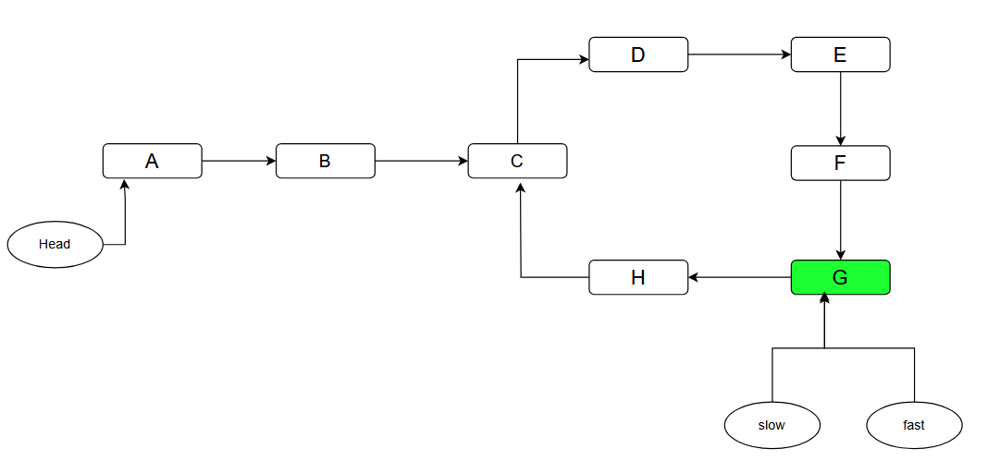

# Thuật toán Floyd tìm chu trình trong Linked List

## Nguồn

 [Floyd's Linked List Cycle Finding Algorithm](https://cp-algorithms.com/others/tortoise_and_hare.html)

## Bài toán

Cho một linked list, với node đầu tiên của linked list được gọi là `head`. và có thể có hoặc không có chu trình trong linked list này. Ví dụ:

{:class="centered-img" }

Ở đây bạn cần tìm node **C**, node đầu tiên của chu trình.

## Thuật toán đề xuất

Thuật toán sau đây được gọi là **Thuật toán tìm chu trình Floyd - Floyd’s Cycle Algorithm** hoặc **Thuật toán rùa và thỏ - Tortoise and Hare Algorithm**. Để tìm được node đầu tiên của chu trình, trước tiên ta cần tìm xem có chu trình hay không. Như vậy thuật toán sẽ gồm hai bước chính: Kiểm tra xem có tồn tại chu trình hay không, và Tìm node đầu tiên của chu trình.

### Bước 1: Linked List có chu trình hay không?

1. Khởi tạo hai con trỏ `slow` và `fast`.
2. Ban đầu cả hai con trỏ sẽ trỏ vào `head` của linked list.
3. `slow` sẽ di chuyển một bước mỗi lần lặp
4. `fast` sẽ di chuyển hai bước mỗi lần lặp, nghĩa là tốc độ của `fast` gấp đôi tốc độ của `slow`.
5. Kiểm tra xem có thời điểm nào chúng trỏ vào cùng một node trước khi một trong hai con trỏ (hoặc cả hai) trỏ vào `NULL` hay không.
6. Nếu chúng trỏ vào cùng một node tại một thời điểm nào đó, thì ta kết luận rằng linked list có chu trình.
7. Nếu một trong hai con trỏ trỏ vào `NULL` thì ta kết luận rằng linked list không có chu trình.

{:class="centered-img" }

Giờ ta đã biết rằng chu trình có tồn tại trong linked list, bước tiếp theo là tìm node đầu tiên của chu trình, trong trường hợp này là node **C**.

### Bước 2: Tìm điểm bắt đầu của chu trình

1. Đưa `slow` về lại `head` của linked list.
2. Di chuyển cả hai con trỏ `slow` và `fast` một bước mỗi lần lặp.
3. Khi chúng trỏ vào cùng một node, ta kết luận rằng node đó là node đầu tiên của chu trình.

```java
// Kiểm tra xem linked list có chu trình hay không
public boolean hasCycle(ListNode head) {
    ListNode slow = head;
    ListNode fast = head;

    while (slow !=null && fast != null && fast.next != null) {
        slow = slow.next;
        fast = fast.next.next;
        if (slow == fast) {
            return true;
        }
    }

    return false;
}
```

```java
// Giả sử linked list có chu trình, slow và fast đang trỏ vào cùng một node
slow = head;
while (slow != fast) {
    slow = slow.next;
    fast = fast.next;
}

return slow; // Node đầu tiên của chu trình
```

## Chứng minh

### Bước 1: Linked List có chu trình hay không?

Vì `fast` di chuyển gấp đôi tốc độ của `slow`, ta có thể nói rằng tại bất cứ thời điểm nào, `fast` đã đi được hành trình gấp đôi `slow`. Ta cũng có thể suy ra rằng khoảng cách của hai node này sẽ tằng $1$ sau mỗi lần lặp.

```
slow: 0 --> 1 --> 2 --> 3 --> 4 (quãng đường)
fast: 0 --> 2 --> 4 --> 6 --> 8 (quãng đường)
diff: 0 --> 1 --> 2 --> 3 --> 4 (hiệu quãng đường)
```

Gọi $L$ là độ dài (số node) của chu trình, và $a$ là số bước cần để `slow` đến node đầu tiên của chu trình. Tồn tại số nguyên dương $k$ ($k > 0$) sao cho $k \cdot L \ge a$. Khi `slow` đi được $k \cdot L$ bước, `fast` đã đi được $2 \cdot k \cdot L$ bước, cả hai sẽ đều nằm trong chu trình. Đến đây, "khoảng cách" của cả hai là $k \cdot L$. Ta có độ dài của chu trình là $L$, nghĩa là chúng sẽ gặp nhau tại cùng một node trên chu trình, dẫn đến việc chúng trùng nhau.

### Bước 2: Tìm điểm bắt đầu của chu trình

Cùng tính quãng đường mà cả hai con trỏ đi qua cho đến khi chúng gặp nhau trong chu trình.

{:class="centered-img" }

$$slowDist = a + xL + b, x \ge 0$$

$$fastDist = a + yL + b, y \ge 0$$

Trong đó,

- $slowDist$ là quãng đường của `slow` đi qua.
- $fastDist$ là quãng đường của `fast` đi qua.
- $a$ là số bước cần để cả hai con trỏ đến node đầu tiên của chu trình.
- $b$ là khoảng cách giữa **C** và **G**, nghĩa là khoảng cách giữa node đầu tiên của chu trình và node mà `slow` và `fast` gặp nhau, theo chiều từ **C** đến **G**.
- $x$ là số lần `slow` đi một vòng chu trình, bắt đầu và kết thúc ở **C**.
- $y$ là số lần `fast` đi một vòng chu trình, bắt đầu và kết thúc ở **C**.

$$fastDist = 2 \cdot (slowDist)$$

$$a + yL + b = 2 \cdot (a + xL + b)$$

Giải phương trình trên ta được:

$$a = (y - 2x)L - b$$

với $y - 2x$ là một số nguyên.

Điều này nghĩa là $a$ bước sẽ tương đương với việc đi vài vòng chu trình, và sau đó đi lùi $b$ bước. Vì `fast` đã cách node đầu chu trình $b$ bước (theo chiều từ đầu chu trình đi tới), nếu `fast` đi thêm $a$ bước nữa thì nó sẽ dừng lại ở node đầu chu trình. Và vì ta đã đưa `slow` về lại `head` của linked list, nên nếu `slow` đi thêm $a$ bước nữa thì nó sẽ dừng lại ở node đầu chu trình. Vì vậy, nếu cả hai đi $a$ bước thì chúng sẽ gặp nhau ở node đầu chu trình.

## Luyện tập

| Problem | Status | Submission | Code | Date |
| :---: | :-----------: | :---: | :---: | :---: |
| [LeetCode 141 - Linked List Cycle](https://leetcode.com/problems/linked-list-cycle/) | :white_check_mark: | Unavailable public link | [Code](https://github.com/farmerboy95/CompetitiveProgramming/blob/master/LeetCode/LC141-linked-list-cycle.cpp) | 21/10/2023 |
| [LeetCode 142 - Linked List Cycle II](https://leetcode.com/problems/linked-list-cycle-ii/) | :white_check_mark: | Unavailable public link | [Code](https://github.com/farmerboy95/CompetitiveProgramming/blob/master/LeetCode/LC142-linked-list-cycle-ii.cpp) | 21/10/2023 |
| [LeetCode 287 - Find the Duplicate Number](https://leetcode.com/problems/find-the-duplicate-number/) | :white_check_mark: | Unavailable public link | [Code](https://github.com/farmerboy95/CompetitiveProgramming/blob/master/LeetCode/LC287-find-the-duplicate-number.cpp) | 21/10/2023 |
