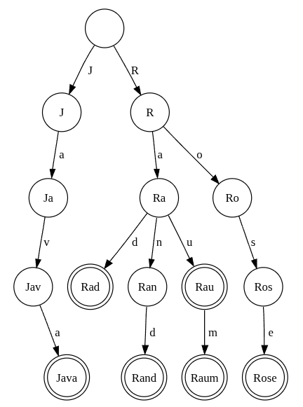
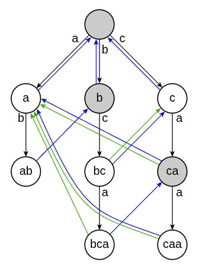

# Thuật toán Aho-Corasick

## Nguồn

 [Aho-Corasick algorithm](https://cp-algorithms.com/string/aho_corasick.html)

## Tổng quan

Thuật toán Aho-Corasick cho phép ta tìm kiếm nhiều mẫu (pattern) trong một văn bản một cách nhanh chóng. Một tập các xâu mẫu được gọi là _từ điển_ (dictionary). Ta sẽ ký hiệu tổng độ dài của các xâu trong từ điển là $m$ và kích thước của bảng chữ cái là $k$. Thuật toán này xây dựng một automaton hữu hạn dựa trên một trie trong thời gian $O(m k)$ và sau đó sử dụng nó để xử lý văn bản.

Thuật toán này được đề xuất bởi Alfred Aho và Margaret Corasick vào năm 1975.

## Cấu trúc của cây trie

<figure markdown>
{:class="centered-img" }
<figcaption>Một cây trie với các từ "Java", "Rad", "Rand", "Rau", "Raum" và "Rose".</figcaption>
</figure>

Cây trie là một cây có gốc, trong đó mỗi cạnh của cây được gán một ký tự và các cạnh đi ra từ một node có nhãn khác nhau.

Chúng ta sẽ xác định mỗi node trên cây trie bằng xâu được tạo thành từ các nhãn trên đường đi từ gốc đến node đó.

Mỗi node cũng sẽ có một cờ $\text{output}$, cờ này sẽ được gán giá trị true nếu node đó tương ứng với một xâu mẫu trong từ điển.

Theo đó, một cây trie của một tập các xâu là một cây trie mà mỗi node có cờ $\text{output}$ bằng true tương ứng với một xâu từ tập đó, và ngược lại, mỗi xâu của tập tương ứng với một node $\text{output}$.

Ta sẽ mô tả cách xây dựng một cây trie cho một tập các xâu trong thời gian tuyến tính theo tổng độ dài của các xâu đó.

Ta có struct như sau cho các node của cây:

```cpp
const int K = 26;

struct Vertex {
    int next[K];
    bool output = false;

    Vertex() {
        fill(begin(next), end(next), -1);
    }
};

vector<Vertex> trie(1);
```

Ta lưu trie dưới dạng một mảng các $\text{Vertex}$. Mỗi $\text{Vertex}$ chứa cờ $\text{output}$ và các cạnh dưới dạng một mảng $\text{next}[]$, trong đó $\text{next}[i]$ là chỉ số của node mà ta sẽ đến bằng cách theo ký tự $i$, hoặc $-1$ nếu không có cạnh như vậy. Ban đầu, trie chỉ bao gồm một node - gốc - với chỉ số $0$.

Bây giờ ta sẽ cài một hàm để thêm xâu $s$ vào trie. Cách triển khai rất đơn giản: ta bắt đầu từ node gốc, và miễn là có các cạnh tương ứng với các ký tự của $s$, ta sẽ theo chúng. Nếu không có cạnh cho một ký tự nào đó, ta sẽ tạo một node mới và kết nối node hiện tại vào nó bằng một cạnh. Cuối cùng, ta đánh dấu node cuối bằng cờ $\text{output}$.

```cpp
void add_string(string const& s) {
    int v = 0;
    for (char ch : s) {
        int c = ch - 'a';
        if (trie[v].next[c] == -1) {
            trie[v].next[c] = trie.size();
            trie.emplace_back();
        }
        v = trie[v].next[c];
    }
    trie[v].output = true;
}
```

Cách cài này chạy trong thời gian tuyến tính, và vì mỗi node chỉ lưu $k$ cạnh, nó sẽ sử dụng $O(m k)$ bộ nhớ.

Ta có thể giảm bộ nhớ xuống $O(m)$ bằng cách sử dụng một map thay vì một mảng trong mỗi node. Tuy nhiên, điều này sẽ làm tăng độ phức tạp thời gian lên $O(m \log k)$.

## Cấu trúc của automaton

Giả sử ta có một cây trie cho tập các xâu đã cho. Giờ thử nhìn từ một góc khác xem. Nếu ta nhìn vào bất kỳ node nào, xâu tương ứng với nó sẽ là một tiền tố của một hoặc nhiều xâu trong tập, do đó mỗi node của cây trie có thể được hiểu là một vị trí trong một hoặc nhiều xâu từ tập.

Trên thực tế, các node của cây trie có thể được hiểu là các trạng thái trong một **automaton xác định hữu hạn**. Từ bất kỳ trạng thái nào, ta có thể chuyển tiếp (transition) - bằng cách sử dụng một ký tự đầu vào - đến các trạng thái khác, tức là đến một vị trí khác trong tập các xâu. Ví dụ, nếu chỉ có một xâu $abc$ trong từ điển, và ta đang đứng ở node $ab$, thì bằng cách sử dụng ký tự $c$, ta có thể đi đến node $abc$.

Do đó, ta có thể hiểu các cạnh của cây trie như là các transition trong một automaton theo ký tự tương ứng. Tuy nhiên, trong một automaton, ta cần phải có các transition cho mỗi tổ hợp của một trạng thái và một ký tự. Nếu ta cố gắng thực hiện một transition bằng cách sử dụng một ký tự, và không có cạnh tương ứng trong cây trie, thì ta vẫn phải đi vào một trạng thái nào đó.

Cụ thể hơn, giả sử ta đang ở một trạng thái tương ứng với một xâu $t$, và ta muốn transition đến một trạng thái khác bằng cách sử dụng ký tự $c$.
Nếu có một cạnh được gán với ký tự $c$, thì ta có thể đơn giản đi qua cạnh này, và nhận được node tương ứng với $t + c$. Nếu không có cạnh như vậy, vì ta muốn duy trì bất biến rằng trạng thái hiện tại là sự khớp một phần dài nhất trong xâu đã xử lý, ta phải tìm xâu dài nhất trong cây trie là một hậu tố  của xâu $t$, và cố gắng thực hiện một transition từ đó.

Ví dụ, cho cây trie tạo thành từ các xâu $ab$ và $bc$, và ta hiện đang ở node tương ứng với $ab$, cũng là một node $\text{output}$. Để transition với ký tự $c$, ta buộc phải đi đến trạng thái tương ứng với xâu $b$, và từ đó theo cạnh với ký tự $c$.

<figure markdown>
{:class="centered-img" }
<figcaption>Một automaton Aho-Corasick với các từ "a", "ab", "bc", "bca", "c" và "caa". Mũi tên xanh chỉ các liên kết hậu tố, mũi tên đỏ chỉ các liên kết thoát.</figcaption>
</figure>

Một **liên kết hậu tố (suffix link)** cho một node $p$ là một cạnh chỉ đến hậu tố  dài nhất của xâu tương ứng với node $p$. Trường hợp đặc biệt duy nhất là gốc của cây trie, mà liên kết hậu tố của nó sẽ chỉ đến chính nó. Như vậy, khi không có transition từ node hiện tại của cây trie bằng cách sử dụng ký tự hiện tại (hoặc cho đến khi ta đến node gốc), ta sẽ đi theo liên kết hậu tố.

Do đó, ta rút gọn bài toán xây dựng automaton thành bài toán tìm liên kết hậu tố cho tất cả các node của cây trie. Tuy nhiên, ta sẽ xây dựng các liên kết hậu tố này bằng cách sử dụng các transition được xây dựng trong automaton.

Liên kết hậu tố ở node gốc và tất cả các node con trực tiếp của node gốc sẽ trỏ về node gốc. Với các node $v$ nằm sâu hơn trên cây, ta tìm liên kết hậu tố như sau: nếu $p$ là node cha của $v$ với ký tự $c$ nằm trên cạnh từ $p$ đến $v$, ta sẽ đi đến $p$, và từ đó theo liên kết hậu tố của $p$ và thực hiện transition với ký tự $c$ từ đó.

Như vậy, bài toán tìm các transition đã được chuyển thành bài toán tìm liên kết hậu tố, và bài toán tìm liên kết hậu tố đã được chuyển thành bài toán tìm một liên kết hậu tố và một transition, ngoại trừ các node gần gốc. Vậy ta có một kiểu phụ thuộc đệ quy mà ta có thể giải quyết trong thời gian tuyến tính.

Về phần cài đặt, ta sẽ lưu node cha $p$ và ký tự $pch$ của cạnh từ $p$ đến $v$ cho mỗi node $v$. Ngoài ra, ta sẽ lưu liên kết hậu tố $\text{link}$ (hoặc $-1$ nếu nó chưa được tìm ra), và lưu trong mảng $\text{go}[k]$ các transition trong automaton cho mỗi ký tự (cũng là $-1$ nếu nó chưa được tỉm ra).

```cpp
const int K = 26;

struct Vertex {
    int next[K];
    bool output = false;
    int p = -1;
    char pch;
    int link = -1;
    int go[K];

    Vertex(int p=-1, char ch='$') : p(p), pch(ch) {
        fill(begin(next), end(next), -1);
        fill(begin(go), end(go), -1);
    }
};

vector<Vertex> t(1);

void add_string(string const& s) {
    int v = 0;
    for (char ch : s) {
        int c = ch - 'a';
        if (t[v].next[c] == -1) {
            t[v].next[c] = t.size();
            t.emplace_back(v, ch);
        }
        v = t[v].next[c];
    }
    t[v].output = true;
}

int go(int v, char ch);

int get_link(int v) {
    if (t[v].link == -1) {
        if (v == 0 || t[v].p == 0)
            t[v].link = 0;
        else
            t[v].link = go(get_link(t[v].p), t[v].pch);
    }
    return t[v].link;
}

int go(int v, char ch) {
    int c = ch - 'a';
    if (t[v].go[c] == -1) {
        if (t[v].next[c] != -1)
            t[v].go[c] = t[v].next[c];
        else
            t[v].go[c] = v == 0 ? 0 : go(get_link(v), ch);
    }
    return t[v].go[c];
} 
```

Dễ thấy rằng việc ghi nhớ các liên kết hậu tố và các transition sẽ cho phép ta tìm tất cả các liên kết hậu tố và các transition trong thời gian tuyến tính.

Bạn có thể tham khảo ví dụ của concept trong slide 103 của [Stanford slides](http://web.stanford.edu/class/archive/cs/cs166/cs166.1166/lectures/02/Slides02.pdf).

### Tạo automation với BFS

Thay vì tính toán các transition và các liên kết hậu tố bằng các lời gọi đệ quy đến `go` và `get_link`, ta có thể tính toán chúng theo cách bottom-up bắt đầu từ node gốc. (Trên thực tế, khi từ điển chỉ bao gồm một xâu, ta thu được thuật toán Knuth-Morris-Pratt, hay KMP quen thuộc)

Cách này sẽ có một số ưu điểm so với cách đã mô tả ở trên, vì thời gian chạy của nó phụ thuộc vào số lượng các node $n$ trong cây trie thay vì tổng độ dài $m$ của các xâu. Hơn nữa, nó có thể được điều chỉnh cho các bảng chữ cái lớn bằng cách sử dụng cấu trúc dữ liệu persistent array, do đó làm cho thời gian xây dựng là $O(n \log k)$ thay vì $O(mk)$, đây là một cải tiến đáng kể vì $m$ có thể lên đến $n^2$.

Ta có thể lập luận quy nạp bằng cách sử dụng thực tế rằng BFS từ gốc sẽ duyệt các node theo thứ tự tăng dần chiều dài. Ta có thể giả sử rằng khi ta đang ở một node $v$, liên kết hậu tố của nó $u = link[v]$ đã được tính toán thành công, và đối với tất cả các node có chiều dài ngắn hơn, các transition từ chúng cũng đã được tính toán đầy đủ.

Giả sử rằng vào thời điểm ta đứng ở một node $v$ và xem xét một ký tự $c$. Về cơ bản có hai trường hợp:

1. $go[v][c] = -1$. Ta có thể gán $go[v][c] = go[u][c]$, theo giả thuyết quy nạp trên;
2. $go[v][c] = w \neq -1$. Ta có thể gán $link[w] = go[u][c]$.

Với cách này, ta sẽ dùng $O(1)$ thời gian cho mỗi cặp node và ký tự, làm cho thời gian chạy là $O(nk)$. Chi phí chính ở đây là ta sao chép rất nhiều transition từ $u$ trong trường hợp 1, trong khi các transition của trường hợp 2 tạo thành trie và tổng cộng lại là $n$ trên tất cả các node. Để tránh việc sao chép $go[u][c]$, ta có thể sử dụng cấu trúc dữ liệu persistent array, bằng cách mà ban đầu sao chép $go[u]$ vào $go[v]$ và sau đó chỉ cập nhật các giá trị cho các ký tự mà transition sẽ khác. Lúc này độ phức tạp sẽ là $O(n \log k)$.

## Ứng dụng

### Tìm tất cả các xâu từ một tập trong một văn bản

Cho một tập các xâu và một văn bản nào đó. Tìm tất cả các vị trí xuất hiện của các xâu trong tập được cho, ở trong văn bản đó, trong $O(\text{len} + \text{ans})$, trong đó $\text{len}$ là độ dài của văn bản và $\text{ans}$ là kích thước của đáp án.

Ta tạo một automaton cho tập các xâu này. Ta sẽ xử lý văn bản theo từng ký tự với automaton, bắt đầu từ node gốc của trie. Nếu vào bất ký thời điểm nào ở node $v$, và ký tự tiếp theo là $c$, thì ta chuyển đến trạng thái tiếp theo với $\text{go}(v, c)$, do đó tăng độ dài của chuỗi khớp hiện tại lên $1$ hoặc giảm nó bằng cách theo liên kết hậu tố.

Sao ta biết khi đứng ở node $v$, nó có khớp với xâu nào đó trong tập hay không? Thứ nhất, nếu node $v$ là một node $\text{output}$, thì xâu tương ứng với node này kết thúc tại vị trí hiện tại trong văn bản. Tuy nhiên, đây không phải là trường hợp duy nhất có thể xảy ra: nếu ta có thể đi đến một hoặc nhiều node $\text{output}$ bằng cách di chuyển theo các liên kết hậu tố, thì sẽ khớp tương ứng với mỗi node $\text{output}$ tìm thấy. Một ví dụ đơn giản là khi ta có các xâu "dabce", "abc", "bc" và văn bản "dabc".

Vậy nếu ta lưu trong mỗi node $\text{output}$ chỉ số của xâu tương ứng với nó (hoặc danh sách các chỉ số nếu có các xâu trùng lặp xuất hiện trong tập), thì ta có thể tìm trong $O(n)$ các chỉ số của tất cả các xâu khớp với trạng thái hiện tại, bằng cách đơn giản là theo các liên kết hậu tố từ node hiện tại đến gốc. Đây không phải là giải pháp hiệu quả nhất, vì nó dẫn đến độ phức tạp tổng thể là $O(n ~ \text{len})$. Tuy nhiên, ta có thể tối ưu hóa bằng cách tính toán và lưu trữ node $\text{output}$ gần nhất có thể tiếp cận được bằng cách sử dụng các liên kết hậu tố (đôi khi được gọi là **liên kết thoát - exit link hay terminal link**). Ta có thể tìm ra các liên kết này một cách lazy trong thời gian tuyến tính. Vì vậy, đối với mỗi node, ta có thể đi tiếp trong $O(1)$ đến node được đánh dấu tiếp theo trong đường đi liên kết hậu tố, tức là đến lần khớp tiếp theo. Do đó, đối với mỗi lần khớp, ta chi cần $O(1)$ thời gian, và do đó đạt được độ phức tạp $O(\text{len} + \text{ans})$.

Nếu ta chỉ muốn đếm số lần xuất hiện mà không tìm các chỉ số của chúng, ta có thể tính toán số lượng node được đánh dấu trong đường đi liên kết hậu tố cho mỗi node $v$. Ta có thể tính trong O(n) tổng cộng. Vì vậy, ta có thể tổng hợp tất cả các lần khớp trong $O(\text{len})$.

### Tìm xâu có thứ tự từ điển nhỏ nhất với độ dài cho trước mà không khớp với bất kỳ xâu nào trong tập

Cho một tập các xâu và một độ dài $L$. Ta cần tìm một xâu có độ dài $L$, không chứa bất kỳ xâu nào trong tập, và tìm xâu nhỏ nhất theo thứ tự từ điển trong số các xâu như vậy.

Tạo automation cho các xâu trong tập. Để ý rằng các node $\text{output}$ là các trạng thái mà tại đó ta có một khớp với một xâu từ tập. Vì trong bài toán này ta phải tránh các khớp, nên ta không được phép vào các trạng thái như vậy. Mặt khác, ta có thể vào tất cả các node khác. Vậy ta xóa các node "xấu" ra khỏi automaton, và trong đồ thị còn lại của automaton, ta tìm đường đi có thứ tự từ điển nhỏ nhất với độ dài $L$. Ta có thể giải trong $O(L)$ với DFS.

### Tìm xâu ngắn nhất chứa tất cả các xâu trong tập

Ta dùng cách tương tự. Với mỗi node, ta lưu một mask mà biểu thị các xâu khớp tại trạng thái này. Sau đó, bài toán có thể được diễn đạt lại như sau: ban đầu ở trạng thái $(v = \text{root},~ \text{mask} = 0)$, ta muốn đạt đến trạng thái $(v,~ \text{mask} = 2^n - 1)$, trong đó $n$ là số lượng xâu trong tập.
Khi ta chuyển từ một trạng thái này sang trạng thái khác bằng cách sử dụng một ký tự, ta cập nhật mask tương ứng. Bằng cách chạy BFS, ta có thể tìm được một đường đi đến trạng thái $(v,~ \text{mask} = 2^n - 1)$ với độ dài nhỏ nhất.

### Tìm xâu có thứ tự từ điển nhỏ nhất với độ dài $L$ cho trước mà chứa $k$ xâu {data-toc-label="Tìm xâu có thứ tự từ điển nhỏ nhất với độ dài L cho trước mà chứa k xâu"}

Trong bài trước, với mỗi node ta tìm số lần khớp ứng với nó (tức là số lượng node được đánh dấu có thể tiếp cận được bằng cách sử dụng các liên kết hậu tố). Ta diễn đạt lại bài toán: trạng thái hiện tại được xác định bởi một bộ ba số $(v,~ \text{len},~ \text{cnt})$, và ta muốn đạt được từ trạng thái $(\text{root},~ 0,~ 0)$ đến trạng thái $(v,~ L,~ k)$, trong đó $v$ có thể là bất kỳ node nào. Vậy ta có thể tìm được một đường đi như vậy bằng cách sử dụng DFS (và nếu tìm kiếm xem xét các cạnh theo thứ tự từ điển từ nhỏ tới lớn, thì đường đi tìm được sẽ tự động là đường đi nhỏ nhất theo thứ tự từ điển).

## Luyện tập

| Problem | Status | Submission | Code | Date |
| :---: | :-----------: | :---: | :---: | :---: |
| [UVA #11590 - Prefix Lookup](https://uva.onlinejudge.org/index.php?option=com_onlinejudge&Itemid=8&page=show_problem&problem=2637) | | | | |
| [UVA #11171 - SMS](https://uva.onlinejudge.org/index.php?option=com_onlinejudge&Itemid=8&page=show_problem&problem=2112) | | | | |
| [UVA #10679 - I Love Strings!!](https://uva.onlinejudge.org/index.php?option=onlinejudge&page=show_problem&problem=1620) | | | | |
| [Codeforces - x-prime Substrings](https://codeforces.com/problemset/problem/1400/F) | | | | |
| [Codeforces - Frequency of String](http://codeforces.com/problemset/problem/963/D) | | | | |
| [CodeChef - TWOSTRS](https://www.codechef.com/MAY20A/problems/TWOSTRS) | | | | |
