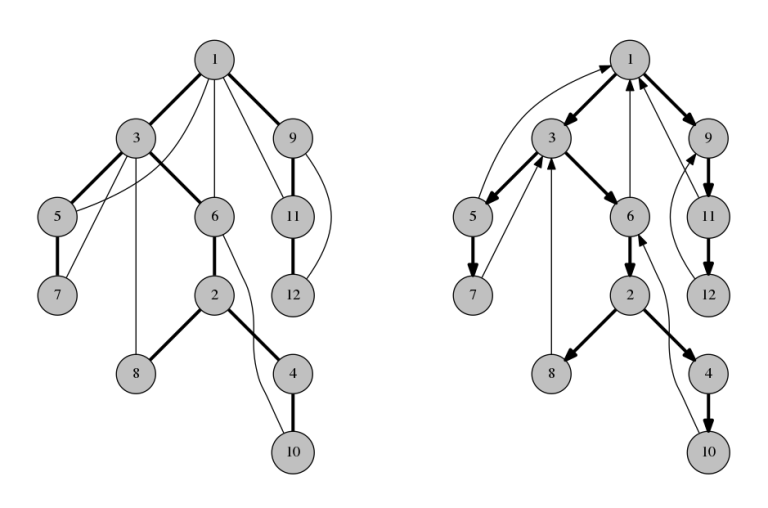

# Cây DFS và ứng dụng

## Nguồn
[[Tutorial] The DFS tree and its applications: how I found out I really didn't understand bridges](https://codeforces.com/blog/entry/68138)

<hr/>
## Cây DFS

Cho một đồ thị $G$ vô hướng liên thông. Chạy DFS trên đồ thị đó với điểm gốc bất kỳ, có thể cài đặt như sau:

```
function visit(u):
  mark u as visited
  for each vertex v among the neighbors of u:
    if v is not visited:
      mark the edge uv
      call visit(v)
```

Nếu ta `visit(1)` thì nó sẽ như thế này:


Nhìn vào các cạnh được đánh dấu trên dòng số 5. Chúng tạo thành một cây khung của $G$ với gốc là 1. Chúng ta gọi những cạnh này là *cạnh xuôi* (*span-edges*). Các cạnh còn lại là các *cạnh ngược* (*back-edges*). Cây DFS cuối cùng sẽ như sau:


### Observation 1
Các cạnh ngược trên đồ thị kết nối 1 node với con cháu của nó trên cây khung. **Đó là lý do vì sao cây DFS rất hữu dụng.**

??? question "Vì sao?"
    Giả sử có cạnh $uv$, không mất đi tính tổng quát, ta giả sử $u$ được thăm trước $v$ (lúc này $v$ chưa được thăm). Ta có:

    - Nếu DFS đi đến $v$ từ $u$ dùng cạnh $uv$, $uv$ là cạnh xuôi

    - Nếu DFS không đi đến $v$ từ $u$ dùng cạnh $uv$, thì $v$ đã được thăm ở trước đó ở line số 4 trong mã giả. Vì vậy nó đã được thăm trên 1 đỉnh con của $u$, nên $v$ là con cháu của $u$ trên cây DFS.

Trở lại với ví dụ trên, đỉnh 4 và 8 không có cạnh ngược kết nối chúng vì đỉnh này không phải tổ tiên của đỉnh kia và ngược lại. Nếu có cạnh nối 4 và 8, DFS sẽ đi đến 8 từ 4 thay vì về 2.

Đây là Observation quan trọng nhất về cây DFS. Cây DFS rất mạnh vì nó đơn giản hoá đồ thị. Thay vì phải quan tâm đến quá nhiều loại cạnh, ta chỉ cần biết đến 1 cái cây và vài cạnh nối cha-con đơn thuần. Điều này làm nó dễ cài đặt và suy nghĩ.

<hr/>

## Tìm cầu (hoặc khớp)

Cây DFS và Observation 1 ở trên là cốt lõi của thuật tìm cầu Tarjan. [Một số](https://cp-algorithms.com/graph/bridge-searching.html) [hướng dẫn](http://bit.ly/2FKgk3t) [tìm cầu](https://www.tutorialspoint.com/Bridges-in-a-Graph) trên mạng chỉ nói về cây DFS sương sương và định nghĩa những thứ mơ hồ như $dfs[u]$ và $low[u]$. Quên hết chúng đi. Đó không phải cách dễ hiểu để tìm cầu, $dfs[u]$ chỉ là 1 cách lộn xộn để kiểm tra xem 1 node có phải cha của 1 node khác hay không. Trong khi đó, $low[u]$ thì còn khó giải thích hơn nữa.

Giờ chúng ta sẽ tìm cầu trên 1 đồ thị vô hướng liên thông $G$. Xét cây DFS của $G$.

### Observation 2

Một cạnh xuôi $uv$ là cầu khi và chỉ khi không tồn tại cạnh ngược kết nối con cháu của $uv$ với tổ tiên của $uv$. Nói cách khác, cạnh xuôi $uv$ là cầu khi và chỉ khi không có cạnh ngược "chạy qua" $uv$.

??? question "Vì sao?"
    Xóa cạnh $uv$ chia cây khung ra thành 2 phần tách nhau: cây con gốc $uv$ và phần còn lại. Nếu có cạnh ngược nối 2 phần này, đồ thị vẫn được kết nối, ngược lại $uv$ là cầu. Cách duy nhất 1 cạnh ngược có thể kết nối 2 phần này là khi nó kết nối con cháu của $uv$ với tổ tiên của $uv$.

Ví dụ, xét cây ở hình trên, cạnh 6-2 không phải cầu, vì khi xóa nó, cạnh ngược 3-8 vẫn kết nối 2 phần. Ngược lại, cạnh 2-4 là cầu vì không có cạnh ngược nào tương tự.

### Observation 3
Cạnh ngược chắc chắn không phải cầu <br/><br/>
Điều này dẫn về thuật tìm cầu cơ bản. Cho đồ thị $G$:

- Tìm cây DFS của nó.
- Với mỗi cạnh xuôi $uv$, nếu có không có cạnh ngược “chạy qua” $uv$, nó là cầu.

Vì cấu trúc đơn giản của cây DFS, step 2 rất dễ cài. Ví dụ, bạn có thể dùng cách $low[u]$. Hoặc bạn có thể dùng prefix sum. Gọi $dp[u]$ là số cạnh ngược “chạy qua” cạnh nối $u$ và $parent[u]$. Khi đó,

$$dp[u] = (\text{số cạnh ngược đi lên từ u}) + \sum_{\text{v là con u} }^{} dp[v] - (\text{số cạnh ngược đi xuống từ u}) $$

Cạnh xuôi nối u và $parent[u]$ là cầu khi và chỉ khi $dp[u] = 0$

<hr/>

## Chọn hướng cạnh để tạo đồ thị liên thông mạnh

Cho bài tập như sau, từ [118E - Bertown Roads](https://codeforces.com/contest/118/problem/E).

### Problem 1
Cho đồ thị vô hướng liên thông $G$. Chỉ hướng cho từng cạnh để tạo thành đồ thị liên thông mạnh hoặc trả về impossible.

### Observation 4
Nếu $G$ có cầu, trả về impossible.

??? question "Vì sao?"
    Đơn giản vì nếu $uv$ là cầu và ta chọn hướng $u \to v$, sẽ không có đường đi từ $v$ đến $u$

Giả sử đồ thị không có cầu, xét cây DFS của nó. Chỉ hướng cạnh xuôi hướng xuống và cạnh ngược hướng lên, ta có:



### Observation 5
Có đường đi từ gốc đến tất cả các node khác.

??? question "Vì sao?"
    Đơn giản vì bạn có thể đi xuống nhờ cung ngược.

### Observation 6
Có đường đi từ tất cả về gốc

??? question "Vì sao?"
    Xét 1 node $v$ không phải gốc. Gọi $u$ là cha của nó trên cây khung. Vì đồ thị không có cầu, sẽ phải có 1 cạnh ngược “chạy qua” $uv$: nó kết nối con cháu của $v$ và tổ tiên của $u$. Ta có thể đi xuống từ $v$ tới cạnh ngược đó, sau đó dùng nó để về đến tổ tiên của $u$. Dùng cách này ta đến gần node gốc hơn. Lặp lại đến khi về gốc.

Vì vậy, đồ thị liên thông.
<hr/>

## Cài đặt cacti (rừng xương rồng)

Đôi khi cây DFS chỉ là 1 cách để biểu diễn đồ thị theo kiểu làm cho nó dễ cài đặt hơn, giống danh sách kề nhưng ở đẳng cấp cao hơn. Phần này đơn thuần chỉ là 1 trick cài đặt.

1 cactus (cây xương rồng) là 1 đồ thị mà mỗi cạnh (hoặc đôi khi, đỉnh) thuộc về nhiều nhất 1 chu trình đơn. Trường hợp đầu gọi là cạnh xương rồng, trường hợp sau gọi là đỉnh xương rồng. Rừng xương rồng có cấu trúc đơn giản hơn đồ thị thông thường, nên người ta có thể giải bài trên nó dễ hơn trên đồ thị truyền thống. Nhưng dễ hơn ở trên giấy thôi: các thuật xương rồng khi cài thường rất khó chịu nếu bạn không biết mình đang làm gì.

Trên cây DFS của xương rồng, với mỗi cạnh xuôi, có nhiều nhất 1 cạnh ngược “chạy qua” nó. Như vậy các chu trình trong cây này tương tự như 1 chu trình đơn:
Mỗi cạnh ngược tạo 1 chu trình đơn với các cạnh xuôi nó “chạy qua”.
Không có chu trình đơn nào khác.

Đó gần như là tất cả các tính chất của cây xương rồng.

Ví dụ, xét đề bài sau:

### Problem 2
Cho 1 đồ thị xương rồng liên thông $N$ đỉnh. Trả lời các truy vấn có dạng: Có bao nhiêu đường đi đơn khác nhau từ $p$ đến $q$?

Đây là bài [231E - Cactus](https://codeforces.com/contest/231/problem/E). [Lời giải chính thức](https://codeforces.com/blog/entry/5486) nhìn như thế này:
1. Bóp mỗi chu trình thành 1 đỉnh, tô đỉnh này màu đen
2. Như vậy đồ thị sẽ thành 1 cây, chọn gốc của cây
3. Với mỗi đỉnh $u$, đếm số đỉnh đen trên đường đi từ gốc đến $u$, gọi nó là $cnt[u]$
4. Đáp án của query $(p, q)$ sẽ là $2 ^ {cnt[p] + cnt[q] - 2 * cnt[lca(p, q)]}$ hoặc $2 ^ {cnt[p] + cnt[q] - 2 * cnt[lca(p, q)] + 1}$ tuỳ vào màu của $lca(p, q)$

Không khó để hiểu lời giải này, nhưng điều thú vị lại nằm ở cách cài step 1.


Sau 1 hồi suy nghĩ, bạn có thể tìm được cách cài cho step 1 ở trên, nhưng có 1 cách dễ hơn dùng cây DFS:
1. Gán cho mỗi cạnh ngược 1 index bắt đầu từ $N + 1$
2. Với mỗi đỉnh $u$, tìm index của cạnh ngược chứa $u$ (đi lên), gọi đó là $cycleId[u]$, nếu $u$ không nằm trong chu trình thì $cycleId[u] = u$
3. Tạo một danh sách kề mới mà với mỗi $u$, mỗi instance của $u$ sẽ được thay bằng $cycleId[u]$

Step 2 sẽ trông như thế này:

```
function visit(u):
  for each vertex v among the children of u:
    visit(v)

  if there is a back-edge going up from u:
    cycleId[u] = the index of that back-edge
  else:
    cycleId[u] = u
    for each vertex v among the children of u:
      if cycleId[v] != v and there is no back-edge going down from v:
        cycleId[u] = cycleId[v]
```

<hr/>

## Xóa cạnh để tạo đồ thị hai phía

### Problem 3
Xét một đồ thị vô hướng. Tìm số cách xoá 1 cạnh để tạo ra đồ thị hai phía.

Đây là bài [19E - Fairy](https://codeforces.com/contest/19/problem/E). Bài này không có lời giải chính thức, nhưng [lời giải không chính thức](https://codeforces.com/blog/entry/559) dùng cấu trúc dữ liệu phức tạp như là Link cut tree. Chúng ta sẽ giải quyết nó bằng cây DFS.

Trong đề bài, đồ thị không nhất thiết phải liên thông. Tuy nhiên, ta thấy:

- Nếu đồ thị gồm toàn thành phần liên thông 2 phía, xóa bất kỳ cạnh nào cũng tạo thành đồ thị 2 phía.
- Nếu đồ thị gồm nhiều thành phần liên thông không phải 2 phía, thì ta không thể tạo đồ thị 2 phía bằng cách xoá 1 cạnh.

Vì vậy, trường hợp ta cần xét ở đây là trường hợp có 1 thành phần liên thông không phải 2 phía. Rõ ràng cạnh cần xoá là cạnh từ thành phần liên thông đó, ta có thể giả sử rằng nó là thành phần liên thông duy nhất trong đồ thị. Từ giờ, ta giả sử rằng ta có 1 đồ thị liên thông, không phải 2 phía.

Xét cây DFS của đồ thị này. Ta tô màu cây này sao cho cạnh xuôi nối node đen và node trắng. Một số cạnh ngược có thể kết nối 2 node cùng màu. Gọi các cạnh này là các cạnh “mâu thuẫn", ngược lại, cạnh ngược nối 2 node khác màu gọi là “không mâu thuẫn”.

### Observation 7
Một cạnh ngược u-v là đáp án khi và chỉ khi u-v là cạnh mâu thuẫn duy nhất

??? question "Vì sao?"
    Nếu ta xoá cạnh ngược mâu thuẫn duy nhất trong đồ thị, đồ thị bây giờ được tô 2 màu, nên nó là đồ thị 2 phía

    Nếu đồ thị có những cạnh mâu thuẫn khác hoặc ta xoá cạnh ngược không mâu thuẫn, những cạnh mâu thuẫn còn lại tiếp tục tạo ra chu trình lẻ và đồ thị sẽ không thể là đồ thị 2 phía.

### Observation 8
Một cạnh xuôi $uv$ là đáp án khi và chỉ khi các cạnh ngược “chạy qua” nó đều là cạnh mâu thuẫn.

??? question "Vì sao?"
    Nếu ta xoá cạnh xuôi $uv$, cây khung sẽ bị chia làm 2 phần: cây con của $uv$ và phần còn lại. Các cạnh xuôi khác vẫn sẽ phải nối node đen và node trắng. Vì vậy cách duy nhất để tô màu đồ thị là đảo ngược màu cho cây con $uv$.

    Cạnh xuôi $uv$ sẽ là đáp án khi và chỉ khi đảo màu làm tiêu biến hết các cạnh mâu thuẫn và không tạo ra cạnh mâu thuẫn mới. Điều này xảy ra khi và chỉ khi các cạnh mâu thuẫn này nối cây con $uv$ với phần còn lại của đồ thị.

Vậy ta giải bài như sau
1. Tìm cây DFS của đồ thị và tô màu cho nó.
2. Nếu chỉ có 1 cạnh ngược mâu thuẫn, thêm nó vào đáp án.
3. Dùng DP để tính, với mỗi cạnh xuôi, có bao nhiêu cạnh ngược mâu thuẫn và không mâu thuẫn “chạy qua” nó.
4. Nếu 1 cạnh xuôi gồm toàn cạnh mâu thuẫn chạy qua, thêm nó vào đáp án.

<hr/>

## Với đồ thị có hướng

Nếu ta duyệt cây DFS của đồ thị có hướng thì sao:

```
function visit(u):
  mark u as visited
  for each vertex v among the neighbors of u:
    if v is not visited:
      mark the edge u->v
      call visit(v)
```
Dòng số 3 chỉ những v mà có cung từ u tới v

Sẽ có một số trường hợp duyệt không đến được một số node. Để đơn giản thì giả sử rằng:

- Ta bắt đầu từ node 1
- Có thể thăm tất cả các đỉnh từ đỉnh 1

Gọi các cung được đánh dấu ở dòng 5 là cung xuôi

### Observation 9
Các cung xuôi tạo một cây khung có gốc, có hướng xa ra khỏi node gốc.

Các cung khác sẽ rơi vào các trường hợp sau:

- Cung nối con cháu và tổ tiên: cung ngược
- Cung không như vậy: cung chéo

Có thể chia các cung ngược thành cung lên hoặc cung xuống tuỳ vào hướng của chúng.

### Observation 10
Các cung chéo luôn hướng từ đỉnh thăm sau về đỉnh thăm trước

??? question "Vì sao?"
    Giả sử có cung $u \to v$, và DFS đến $u$ nhưng chưa đến $v$. Ta có:
    
    - Nếu DFS không đi từ $u$ đến $v$, nghĩa là phép duyệt đã thăm $v$ khi thăm một con khác của $u$ rồi nên $u \to v$ là cung ngược
    - Nếu phép duyệt đi từ $u$ đến $v$, cung $u \to v$ là cung xuôi
  
    Vì vậy $u \to v$ là cung chéo khi phép duyệt đến $v$ trước $u$

Biến thể có hướng của cây DFS được dùng để tạo dominator tree của đồ thị có hướng, nhưng đó lại nằm ngoài phạm vi bài viết này và xứng đáng có 1 bài riêng.

<hr>

## Luyện tập

Các bài cần tìm block-cut tree

| Problem | Status | Submission | Code | Date |
| :---: | :-----------: | :---: | :---: | :---: |
| [118E - Bertown Roads](https://codeforces.com/contest/118/problem/E) | :white_check_mark: | [Submission](https://codeforces.com/contest/118/submission/161629222) | [Code](https://github.com/farmerboy95/CompetitiveProgramming/blob/master/Codeforces/CF118-D2-E.cpp) | 24/06/2022 |
| [231E - Cactus](https://codeforces.com/contest/231/problem/E) | :white_check_mark: | [Submission](https://codeforces.com/contest/231/submission/161657760) | [Code](https://github.com/farmerboy95/CompetitiveProgramming/blob/master/Codeforces/CF231-D2-E.cpp) | 24/06/2022 |
| [19E - Fairy](https://codeforces.com/contest/19/problem/E) | :white_check_mark: | [Submission](https://codeforces.com/contest/19/submission/161872851) | [Code](https://github.com/farmerboy95/CompetitiveProgramming/blob/master/Codeforces/CF19-D12-E.cpp) | 26/06/2022 |
| [858F - Wizard's Tour](https://codeforces.com/contest/858/problem/F) | | | | |
| [412D - Giving Awards](https://codeforces.com/contest/412/problem/D) | | | | |
| [101612G - Grand Test](https://codeforces.com/gym/101612/problem/G) | | | | |
| [CEOI 2017 - One-Way Streets](https://oj.uz/problem/view/CEOI17_oneway) | | | | |
| [732F - Tourist Reform](https://codeforces.com/problemset/problem/732/F) | | | | |
| [COI 2006 - Policija](https://dmoj.ca/problem/coi06p2) | | | | |
| [1391E - Pairs of Pairs](https://codeforces.com/contest/1391/problem/E) | | | | |
| [1000E - We Need More Bosses](https://codeforces.com/problemset/problem/1000/E) | | | | |
| [Codechef SROADS](https://www.codechef.com/IPC15P3B/problems/SROADS) | | | | |
| [406C - Graph Cutting](https://codeforces.com/contest/406/problem/C) | | | | |