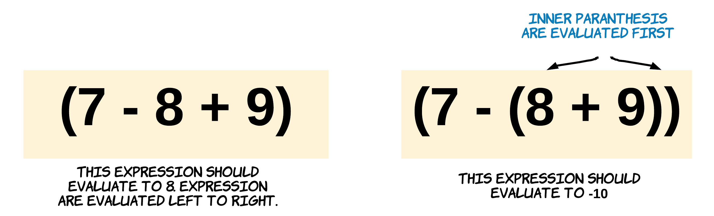
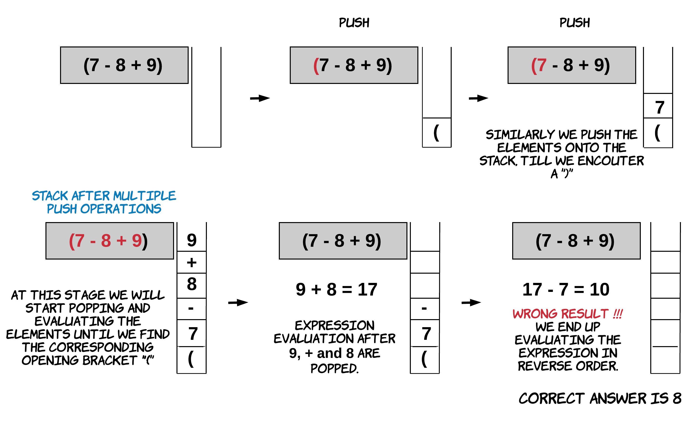
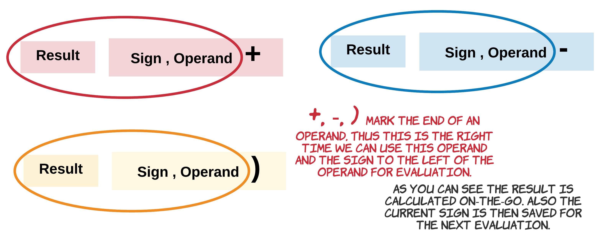

# Tính toán biểu thức từ xâu

## Nguồn

 [LeetCode 224 -  Basic Calculator - Editorial](https://leetcode.com/problems/basic-calculator/editorial/)

**Lưu ý**: Editorial này chỉ những người có account LeetCode Premium mới đọc được.

## Đề bài

Cho một xâu `s` biểu diễn một biểu thức hợp lệ, cài đặt một hàm tính toán nó, và trả về kết quả của biểu thức. Lưu ý là bạn không được sử dụng các hàm cho sẵn của ngôn ngữ lập trình để tính toán biểu thức, ví dụ như `eval()`.

Ví dụ 1:

```
Input: s = "1 + 1"
Output: 2
```

Ví dụ 2:

```
Input: s = " 2-1 + 2 "
Output: 3
```

Ví dụ 3:

```
Input: s = "(1+(4+5+2)-3)+(6+8)"
Output: 23
```

Giới hạn:

- `1 <= s.length <= 3 * 10^5`
- `s` bao gồm các chữ số, `'+'`, `'-'`, `'('`, `')'`, và `' '`.
- `s` biểu diễn một biểu thức hợp lệ.
- `'+'` **không** được dùng như một toán tử đơn (ví dụ, `"+1"` và `"+(2 + 3)"` đều không hợp lệ).
- `'-'` có thể được dùng như một toán tử đơn (ví dụ, `"-1"` và `"-(2 + 3)"` đều hợp lệ).
- Sẽ không có hai toán tử liền nhau trong input.
- Tất cả các số và mọi tính toán đều nằm trong kiểu số nguyên có dấu 32-bit.

## Tổng quát

Để giải được bài này cần hiểu những điều sau:

- Input luôn là xâu hợp lệ.
- Luật của phép cộng và trừ.
- Thứ tự ưu tiên với dấu ngoặc đơn.
- Các dấu cách (space) không làm ảnh hưởng đến việc tính toán biểu thức.

{ style="display: block; margin: 0 auto" }

## Cách giải 1: Stack và Đảo xâu

### Ý tưởng

Bài này rất hợp cho việc dùng stack. Vì biểu thức có thể có ngoặc, ta có thể dùng một stack để tìm giá trị của mỗi biểu thức con trong ngoặc. Quan trọng là, ta phải trì hoãn việc xử lý biểu thức chính cho đến khi hoàn thành việc tính các biểu thức con trong ngoặc đơn, và để làm được điều này, ta dùng stack.

Ta đẩy từng phần tử của biểu thức vào stack cho đến khi nhận được dấu ngoặc đóng `)`. Sau đó ta lấy từng phần tử ra khỏi stack và tính biểu thức luôn. Điều này được thực hiện cho đến khi ta thấy dấu mở ngoặc `(` tương ứng. Cách tính này rất phổ biến khi dùng stack. Tuy nhiên, nếu bạn để ý đến cách ta sẽ tính ra đáp án, bạn sẽ nhận ra rằng ta sẽ xử lý các giá trị từ phải sang trái trong khi lẽ ra phải là ngược lại.

{ style="display: block; margin: 0 auto" }

Với ví dụ trên, ta nhận ra rằng dùng push và pop đơn giản sẽ không thể giải được. Ta cần hiểu `+` và `-` hoạt động như thế nào. `+` có tính chất kết hợp. Với biểu thức $A + B + C$, ta có $(A + B) + C = A + (B + C)$. Tuy nhiên, `-` không có tính chất này, đây là nguyên nhân vì sao không thể làm như vậy.

Nếu ta dùng stack và đọc các phần tử của biểu thức từ trái sang phải, ta sẽ phải đi tính toán biểu thức từ phải sang trái. Nghĩa là ta đang hiểu là $(A - B) - C$ lại bằng $(C - B) - A$, điều này không đúng. Phép trừ không có tính kết hợp hay giao hoán gì cả.

Bài này có thể giải rất dễ dàng bằng cách đảo xây và dùng stack. Đảo xâu hiệu quả vì giờ ta cho các phần tử của biểu thức vào stack từ phải sang trái và việc tính toán sẽ được thực hiện đúng từ trái sang phải.

{ style="display: block; margin: 0 auto" }

### Thuật toán

1. Duyệt từng ký tự trong biểu thức. Chú ý cẩn thận khi ta đọc các chữ số và các ký tự không phải chữ số.
2. Các toán hạng có thể được tạo thành từ nhiều ký tự. Một xâu `123` nghĩa là số $123$, được tạo thành như sau: `123` >> `120 + 3` >> `100 + 20 + 3`. Vì vậy, nếu ký tự đang đọc là chữ số, ta cần tạo toán hạng bằng cách nhân nó với một số mũ của `10` với chữ số hiện tại và thêm nó vào toán hạng đang tạo. Ta làm điều này vì ta đang xử lý xâu theo hướng ngược lại. Khi ta đọc một ký tự mà nó không phải chữ số, ta cho toán hạng vào stack.
3. Khi ta gặp một dấu mở ngoặc, nó có nghĩa là một biểu thức đã kết thúc. Nhớ lại rằng ta có một biểu thức bị đảo. Vì vậy dấu mở ngoặc sẽ là hết một biểu thức. Đến đây ta có thể tính biểu thức này bằng cách lấy ra các toán hạng và toán tử từ stack cho đến khi đến ngoặc đóng. Kết quả cuối cùng của biểu thức đó sẽ được cho lại vào stack. 
    
    Lưu ý: ta đang tính toán tất cả các biểu thức con trong biểu thức chính. Các biểu thức con bên phải được tính trước nhưng biểu thức chính được tính từ trái sang phải khi tất cả các biểu thức con được tính, điều này rất quan trong để tính đúng. 
   
    Ví dụ, cho biểu thức $A - (B + C) + (D + E - F)$, $D + E - F$ được tính trước $B + C$. Khi tính $D + E - F$, thứ tự là từ trái sang phải. Tương tự với biểu thức cha, các biểu thức con được tính và lưu trong stack để phép tính cuối là từ trái sang phải.

4. Làm đến khi có kết quả cuối cùng. Sẽ có trường hợp ta không còn ký tự nào để xử lý nhưng stack vẫn không rỗng. Trường hợp này xảy ra khi biểu thức chính không nằm trong ngoặc. Vì vậy, khi ta tính xong toàn bộ biểu thức, ta sẽ xem stack có rỗng không. Nếu vẫn còn gì đó trong stack, ta tính lần cuối biểu thức trong stack. Ta cũng có thể cho biểu thức ban đầu vào cặp ngoặc để khỏi tính đến trường hợp này.

```cpp
class Solution {
public:
    // ta muốn lưu cả số và ký tự nhưng C++ không hỗ trợ nhiều nên ta tự tạo một struct
    struct Obj {
        int num = 0;
        char ch = ' ';
    };

    int evaluate(vector<Obj> &st) {
        // Nếu stack rỗng hoặc bắt đầu với ký tự không phải số, thêm 0 vào stack
        // ví dụ [1, '-', 2, '-'] trở thành [1, '-', 2, '-', 0]
        if (st.empty() || st.back().ch != ' ') {
            st.push_back({0, ' '});
        }

        int res = st.back().num;
        st.pop_back();

        // tính biểu thức cho đến khi gặp ')'
        while (!st.empty() && st.back().ch != ')') {
            int x = st.back().ch; st.pop_back();
            if (x == '+') {
                res += st.back().num; st.pop_back();
            } else {
                res -= st.back().num; st.pop_back();
            }
        }

        return res;
    }

    int calculate(string s) {
        int n = s.size();
        long long pow10 = 1;
        int operand = 0;
        // stack ta sẽ dùng vector để debug cho tiện
        vector<Obj> st;

        for (int i = n-1; i >= 0; i--) {
            if (s[i] >= '0' && s[i] <= '9') {
                // tạo toán hạng theo chiều ngược lại
                operand += pow10 * (s[i] - '0');
                pow10 *= 10;
            } else if (s[i] != ' ') {
                if (pow10 != 1) {
                    // lưu toán hạng vào stack khi gặp ký tự không phải số
                    st.push_back({operand, ' '});
                    operand = 0;
                    pow10 = 1;
                }
                if (s[i] == '(') {
                    int res = evaluate(st);
                    st.pop_back();

                    // lưu kết quả biểu thức hiện tại vào stack
                    st.push_back({res, ' '});
                } else {
                    // với các ký tự khác thì cứ cho vào stack
                    st.push_back({0, s[i]});
                }
            }
        }

        // cho toán hạng cuối cùng (nếu có) vào stack
        if (pow10 != 1) {
            st.push_back({operand, ' '});
        }

        // tính những thứ còn lại trong stack
        return evaluate(st);
    }
};
```

### Độ phức tạp

- Độ phức tạp thời gian: $O(N)$, với $N$ là độ dài xâu input.
- Độ phức tạp bộ nhớ: $O(N)$, với $N$ là độ dài xâu input.

## Cách giải 2: Stack và Không đảo xâu

### Ý tưởng

Một cách rất đơn giản để giải bài này với tính chất kết hợp cho `-`, là dùng toán tử `-` làm độ lớn cho toán hạng bên phải toán tử. Khi ta bắt đầu dùng `-` làm độ lớn cho toán hạng, ta chỉ còn lại một toán tử `+` và nó có tính chất kết hợp.

Ví dụ, $A - B - C$ có thể được viết là $A + (-B) + (-C)$.

Viết lại biểu thức như thế sẽ có tính chất kết hợp. Vì vậy việc tính biểu thức từ phải sang trái sẽ không thay đổi kết quả.

Cần lưu ý là làm thế sẽ làm cho biểu thức phức tạp hơn, nghĩa là có nhiều biểu thức con hơn. Ngay cả khi ta có ví dụ như $(A - (B - C))$, ta cần kết hợp dấu trừ ngoài $B - C$ với kết quả của $B - C$ thay vì chỉ với $B$.

Ta có thể giải quyết vấn đề này bằng cách làm cơ bản, và kết hợp dấu với biểu thức bên phải nó. Tuy nhiên, cách này sẽ giúp ta tính hầu hết các biểu thức ngay lập tức. Điều này giúp giảm số lần push và pop.

{ style="display: block; margin: 0 auto" }

### Thuật toán

1. Duyệt từng ký tự trong biểu thức. Chú ý cẩn thận khi ta đọc các chữ số và các ký tự không phải chữ số.
2. Các toán hạng có thể được tạo thành từ nhiều ký tự. Một xâu `123` nghĩa là số $123$, được tạo thành như sau: `123` >> `120 + 3` >> `100 + 20 + 3`. Vì vậy, nếu ký tự đang đọc là chữ số, ta cần tạo toán hạng bằng cách nhân toán hạng với `10` thêm chữ số vào toán hạng đang tạo. Ta làm điều này vì ta đang xử lý xâu theo hướng ngược lại. Khi ta đọc một ký tự mà nó không phải chữ số, ta cho toán hạng vào stack.
3. Khi ta gặp toán tử `+` hay `-`, ta tính biểu thức bên trái và lưu dấu cho lần tính tiếp theo.

    { style="display: block; margin: 0 auto" }

4. Nếu ký tự là dấu mở ngoặc, ta cho kết quả đã tính và dấu vào stack (dấu và độ lớn), và tính biểu thức mới.
5. Nếu ký tự là dấu đóng ngoặc, ta tính biểu thức bên trái. Kết quả sẽ là kết quả của biểu thức trong cặp ngoặc vừa kết thúc. Kết quả sau đó sẽ được nhân với dấu, nếu có trên đỉnh của stack. Nhớ rằng ta lưu dấu trên đỉnh stack khi mở ngoặc không? Dấu này sẽ kết hợp với dấu mở ngoặc sau nó, vì vậy nên khi biểu thức kết thúc, ta lấy dấu và nhân nó với kết quả của biểu thức. Sau đó nó được cộng vào phần tử tiếp theo trên đỉnh stack.

```cpp
class Solution {
public:
    int calculate(string s) {
        vector<int> st;
        int operand = 0;
        int res = 0; // kết quả hiện tại
        int sign = 1; // 1 là dương, -1 là âm
        int n = s.size();

        for (int i = 0; i < n; i++) {
            if (s[i] >= '0' && s[i] <= '9') {
                // tạo toán hạng
                operand = operand * 10 + (s[i] - '0');
            } else if (s[i] == '+') {
                // tính biểu thức bên trái
                res += sign * operand;
                // gặp dấu + nên lưu nó
                sign = 1;
                // reset toán hạng
                operand = 0;
            } else if (s[i] == '-') {
                // tính biểu thức bên trái
                res += sign * operand;
                // gặp dấu - nên lưu nó
                sign = -1;
                // reset toán hạng
                operand = 0;
            } else if (s[i] == '(') {
                // cho kết quả bây giờ và dấu vào stack để tính sau
                st.push_back(res);
                st.push_back(sign);

                // reset toán hạng và kết quả, vì ta đã đến biểu thức con mới
                sign = 1;
                res = 0;
            } else if (s[i] == ')') {
                // tính biểu thức bên trái
                res += sign * operand;

                // ')' đánh dấu kết thúc biểu thức, kết quả của nó sẽ nhân với dấu ở đính stack
                res *= st.back(); st.pop_back();
                // sau đó thêm vào toán hạng tiếp theo trên dỉnh stack.
                // nghĩa là (toán hạng trong stack) + (dấu trên stack * (kết quả trong ngoặc))
                res += st.back(); st.pop_back();

                // reset toán hạng
                operand = 0;
            }
        }

        return res + sign * operand;
    }
};
```

### Độ phức tạp

- Độ phức tạp thời gian: $O(N)$, với $N$ là độ dài xâu input. Sự khác biệt giữa cách này và cách đầu tiên là tất cả các ký tự trong cách này được xử lý đúng một lần. Tuy nhiên, trong cách giải trước, mỗi ký tự có thể được xử lý hai lần, một khi cho vào stack, và một khi lấy ra để tính biểu thức. Đó là lý do vì sao cách này nhanh hơn.
- Độ phức tạp bộ nhớ: $O(N)$, với $N$ là độ dài xâu input.

## Mở rộng 1: Có phép nhân chia nhưng không có dấu ngoặc

Đây là bài [LeetCode 227 - Basic Calculator II](https://leetcode.com/problems/basic-calculator-ii). Sơ qua về đề bài thì nó tương tự bài gốc, chỉ có điều là không có dấu ngoặc và có thêm hai phép nhân và chia.

Bài này không có ngoặc nên sẽ dễ hơn một chút. Ta sẽ đi vào các cách giải ngay sau đây.

### Cách giải 1: Dùng stack

Ta có 4 toán tử `+`, `-`, `*`, `/`. Khi không có ngoặc, ta biết rằng `*` và `/` được ưu tiên hơn `+` và `-`. Vì thế ta có thuật toán sau:

1. Duyệt xâu từ trái sang phải.
2. Nếu gặp số, ta thêm số vào toán hạng hiện tại.
3. Nếu toán tử là `+` hoặc `-`, ta phải tính biểu thức sau, dựa vào toán tử tiếp theo, nên ta phải lưu toán hạng hiện tại vào stack.
4. Nếu toán tử là `*` hoặc `/`, ta lấy toán hạng ở đỉnh stack và tính biểu thức hiện tại, sau đó cho giá trị sau cùng vào lại stack.
5. Sau khi duyệt hết xâu, lấy lần lượt các giá trị từ stack và thêm vào kết quả.

```cpp
class Solution {
public:
    int calculate(string s) {
        int len = s.length();
        if (len == 0) return 0;
        stack<int> stack;
        int currentNumber = 0;
        char operation = '+';
        for (int i = 0; i < len; i++) {
            char currentChar = s[i];
            if (isdigit(currentChar)) {
                currentNumber = (currentNumber * 10) + (currentChar - '0');
            }
            if (!isdigit(currentChar) && !iswspace(currentChar) || i == len - 1) {
                if (operation == '-') {
                    stack.push(-currentNumber);
                } else if (operation == '+') {
                    stack.push(currentNumber);
                } else if (operation == '*') {
                    int stackTop = stack.top();
                    stack.pop();
                    stack.push(stackTop * currentNumber);
                } else if (operation == '/') {
                    int stackTop = stack.top();
                    stack.pop();
                    stack.push(stackTop / currentNumber);
                }
                operation = currentChar;
                currentNumber = 0;
            }
        }
        int result = 0;
        while (stack.size() != 0) {
            result += stack.top();
            stack.pop();
        }
        return result;
    }
};
```

- Độ phức tạp thời gian: $O(N)$, với $N$ là độ dài xâu input. Ta duyệt xâu `s` nhiều nhất hai lần.
- Độ phức tạp bộ nhớ: $O(N)$, với $N$ là độ dài xâu input.

### Cách giải 2: Không dùng stack

Thực ra ta chỉ cần toán hạng hiện tại cùng với toán hạng ngay trước nó, nên ta sẽ không nhất thiết cần stack ở đây. Vậy làm cụ thể như thế nào?

- Thay vì dùng stack, ta dùng biến `lastNumber` để lưu giá trị của biểu thức được tính trước đó.
- Nếu toán tử là `+` hoặc `-`, thêm `lastNumber` vào kết quả thay vì cho vào stack. `currentNumber` sẽ thành `lastNumber`.
- Nếu toán tử là `*` hoặc `/`, ta tính `lastNumber = lastNumber  * currentNumber`. Kết quả này sẽ được thêm vào kết quả cuối cùng sau khi cả xâu được xử lý hết.

```cpp
class Solution {
public:
    int calculate(string s) {
        int length = s.length();
        if (length == 0) return 0;
        int currentNumber = 0, lastNumber = 0, result = 0;
        char sign = '+';
        for (int i = 0; i < length; i++) {
            char currentChar = s[i];
            if (isdigit(currentChar)) {
                currentNumber = (currentNumber * 10) + (currentChar - '0');
            }
            if (!isdigit(currentChar) && !iswspace(currentChar) || i == length - 1) {
                if (sign == '+' || sign == '-') {
                    result += lastNumber;
                    lastNumber = (sign == '+') ? currentNumber : -currentNumber;
                } else if (sign == '*') {
                    lastNumber = lastNumber * currentNumber;
                } else if (sign == '/') {
                    lastNumber = lastNumber / currentNumber;
                }
                sign = currentChar;
                currentNumber = 0;
            }
        }
        result += lastNumber;
        return result;  
    }
};
```

- Độ phức tạp thời gian: $O(N)$, với $N$ là độ dài xâu input. Ta duyệt xâu `s` nhiều nhất hai lần.
- Độ phức tạp bộ nhớ: $O(N)$, với $N$ là độ dài xâu input.

## Mở rộng 2: Có phép nhân chia và ngoặc

Đây là bài [LeetCode 772 - Basic Calculator III](https://leetcode.com/problems/basic-calculator-iii). Sơ qua về đề bài thì nó tương tự bài gốc, với thêm hai phép nhân và chia (vẫn có dấu ngoặc).

Code của bài này có thể được dùng cho cả hai bài Basic Calculator trước.

Để giải một cách đơn giản, ta sẽ dùng đệ quy kết hợp với cách giải 1 của bài Basic Calculator II. Ta sẽ cho nó vào một hàm có tên là `parseExpression`. Ở đây, nó sẽ xử lý cho đến khi gặp dấu ngoặc đóng hoặc hết xâu. Nếu gặp một dấu ngoặc mở, ta sẽ gọi lại hàm để tính biểu thức phía trong. Ta có thêm một hàm `parseNum` để tính toán hạng khi gặp số. Code sẽ như sau:

```cpp
class Solution {
public:
    int parseExpression(string &s, int &i) {
        int n = s.size();
        // v là một stack
        vector<int> v;
        // toán hạng hiện tại
        char op = '+';
        
        // duyệt đến hết xâu hoặc đến ngoặc đóng tương ứng
        for (;i < n && op != ')'; i++) {
            // bỏ qua dấu cách
            if (s[i] == ' ') {
                continue;
            }
            int num = 0;
            if (s[i] == '(') {
                // khi gặp ngoặc mở, tính biểu thức trong đó
                num = parseExpression(s, ++i);
            } else {
                // khi gặp số, tính toán hạng
                num = parseNum(s, i);
            }
            // điều chỉnh stack theo toán tử trước đó
            if (op == '+') {
                v.push_back(num);
            } else if (op == '-') {
                v.push_back(-num);
            } else if (op == '*') {
                v.back() *= num;
            } else if (op == '/') {
                v.back() /= num;
            }
            // cập nhật toán tử
            op = s[i];
        }
        
        // tổng tất cả phần tử trong stack
        int res = 0;
        for (auto x : v) res += x;
        return res;
    }
    
    // parse cho đến khi không gặp số nữa, trả về toán hạng đã tìm ra
    int parseNum(string &s, int &i) {
        int res = 0;
        while (i < s.length() && isdigit(s[i]))
            res = s[i++] - '0' + 10 * res;
        return res;
    }
    
    int calculate(string s) {
        int i = 0;
        return parseExpression(s, i);
    }
};
```

- Độ phức tạp thời gian: $O(N)$, với $N$ là độ dài xâu input.
- Độ phức tạp bộ nhớ: $O(N)$, với $N$ là độ dài xâu input.
