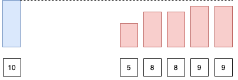
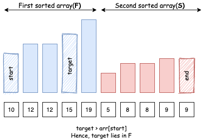

# Tìm kiếm trên mảng đã sắp xếp nhưng đã xoay

## Nguồn

 [LeetCode 81 -  Search in Rotated Sorted Array II - Editorial](https://leetcode.com/problems/search-in-rotated-sorted-array-ii/editorial/)

## Đề bài

Có một mảng `nums` được sắp xếp không giảm (**có thể có hai phần tử trùng nhau**).

Mảng `nums` được **xoay** ở một vị trí pivot `k` (`0 <= k < nums.length`) sao cho mảng kết quả là `[nums[k], nums[k+1], ..., nums[n-1], nums[0], nums[1], ..., nums[k-1]]` (**đánh số từ 0**). Ví dụ, `[0,1,2,4,4,4,5,6,6,7]` có thể được xoay ở vị trí pivot `5` và trở thành `[4,5,6,6,7,0,1,2,4,4]`.

Cho mảng `nums` sau khi xoay và một số nguyên `target`, trả về `true` nếu `target` nằm trong `nums`, ngược lại trả về `false`.

Bạn phải giảm số thao tác tìm kiếm đến mức tối thiểu.

## Tìm kiếm nhị phân

Đây là mở rộng của [bài 33 - Search in Rotated Sorted Array](https://leetcode.com/problems/search-in-rotated-sorted-array/). Điểm khác biệt ở đây là bài này có thể có các phần tử giống nhau.

### Mở đầu

Sau khi xoay một mảng đã sắp xếp, ta sẽ có 2 mảng đã sắp xếp chập vào nhau.

{ style="display: block; margin: 0 auto" }

Gọi mảng đã sắp xếp đầu tiên là `F`, còn mảng thứ hai là `S`.

{ style="display: block; margin: 0 auto" }

Ta có thể thấy là tất cả các phần tử của mảng thứ hai `S` sẽ nhỏ hơn hoặc bằng phần tử đầu tiên `start` của `F` (cũng là phần tử đầu tiên của mảng ban đầu).

{ style="display: block; margin: 0 auto" }

Với observation này, ta có thể biết được phần tử `target` nằm trong mảng `F` hay `S` bằng cách so sánh nó với phần tử đầu tiên của mảng.

Giả sử ta đang tìm phần tử `target` trong mảng `arr`:

- Trường hợp 1: Nếu `target > arr[start]`: `target` nằm trong mảng `F`

{ style="display: block; margin: 0 auto" }

- Trường hợp 2: Nếu `target < arr[start]`: `target` nằm trong mảng `S`

{ style="display: block; margin: 0 auto" }

- Trường hợp 3: Nếu `target == arr[start]`: `target` rõ ràng nằm trong mảng `F`, nhưng cũng có thể nằm trong mảng `S`.

{ style="display: block; margin: 0 auto" }

Hàm dưới đây cho ta biết phần tử `target` có thể nằm trong mảng `F` hay không:

```cpp
// trả về true nếu element nằm trong mảng đầu tiên, false nếu nó nằm trong mảng thứ hai
bool existsInFirst(vector<int>& nums, int start, int element) {
    return nums[start] <= element;
}
```

### Thuật toán

Nhớ lại rằng trong tìm kiếm nhị phân bình thường, ta có hai con trỏ (`start` và `end`) để giữ phạm vi tìm kiếm trong mảng `arr`. Ta chia không gian tìm kiếm thành 3 phần: `[start, mid)`, `[mid, mid]`, `(mid, end]`. Ta tiếp tục tìm kiếm `target` trong một trong các không gian tìm kiếm đó.

Bằng cách xác định vị trí của `arr[mid]` và `target` trong `F` và `S`, ta có thể gia giảm không gian tìm kiếm bằng cách tương tự với tìm kiếm nhị phân bình thường:

- Trường hợp 1: `arr[mid]` nằm trong `F`, `target` nằm trong `S`: Vì mảng `S` bắt đầu khi `F` hết, ta biết `target` nằm trong đoạn `(mid, end]`.

{ style="display: block; margin: 0 auto" }

- Trường hợp 2: `arr[mid]` nằm trong `S`, `target` nằm trong `F`: Tương tự, ta biết `target` nằm trong đoạn `[start, mid)`.

{ style="display: block; margin: 0 auto" }

- Trường hợp 3: `arr[mid]` và `target` nằm trong `F`: Vì cả hai nằm trong cùng một mảng đã sắp xếp, ta có thể so sánh `arr[mid]` và `target` để biết làm sao gia giảm không gian tìm kiếm.

{ style="display: block; margin: 0 auto" }

- Trường hợp 4: `arr[mid]` và `target` nằm trong `S`: Tương tự, vì cả hai nằm trong cùng một mảng đã sắp xếp, ta có thể so sánh `arr[mid]` và `target` để biết làm sao gia giảm không gian tìm kiếm.

{ style="display: block; margin: 0 auto" }

**Nhưng có một trường hợp đặc biệt**, nếu `arr[mid]` bằng `arr[start]`, ta biết rằng `arr[mid]` có thể nằm trong cả `F` lẫn `S`, nên ta không thể tìm vị trí tương đối của `target` từ đó.

{ style="display: block; margin: 0 auto" }

```cpp
// trả về true nếu ta có thể gia giảm không gian tìm kiếm với không gian tìm kiếm nhị phân hiện tại
bool isBinarySearchHelpful(vector<int>& nums, int start, int element) {
    return nums[start] != element;
}
```

Trong trường hợp này, ta không còn cách nào khác ngoài việc di chuyển con trỏ `start` đi tiếp một bước. Vì vậy, có những không gian tìm kiếm cho phép tìm kiếm nhị phân, và một số khác không cho phép.

```cpp
class Solution {
public:
    bool search(vector<int>& nums, int target) {
        int n = nums.size();
        if (n == 0) return false;
        int end = n - 1;
        int start = 0;

        while (start <= end) {
            int mid = start + (end - start) / 2;

            if (nums[mid] == target) {
                return true;
            }

            if (!isBinarySearchHelpful(nums, start, nums[mid])) {
                start++;
                continue;
            }

            // pivot nằm trong mảng đầu tiên hay không
            bool pivotArray = existsInFirst(nums, start, nums[mid]);

            // target nằm trong mảng đầu tiên hay không
            bool targetArray = existsInFirst(nums, start, target);
            if (pivotArray ^ targetArray) { // target và pivot nằm khác mảng đã sắp xếp, nhớ lại xor chỉ true khi hai toán tử khác nhau
                if (pivotArray) {
                    start = mid + 1; // pivot nằm ở mảng đầu, target nằm ở mảng sau
                } else {
                    end = mid - 1; // target nằm ở mảng đầu, pivot nằm ở mảng sau
                }
            } else { // target và pivot nằm cùng mảng đã sắp xếp
                if (nums[mid] < target) {
                    start = mid + 1;
                } else {
                    end = mid - 1;
                }
            }
        }
        return false;
    }

    // trả về true nếu ta có thể gia giảm không gian tìm kiếm với không gian tìm kiếm nhị phân hiện tại
    bool isBinarySearchHelpful(vector<int>& nums, int start, int element) {
        return nums[start] != element;
    }

    // trả về true nếu element nằm trong mảng đầu tiên, false nếu nó nằm trong mảng thứ hai
    bool existsInFirst(vector<int>& nums, int start, int element) {
        return nums[start] <= element;
    }
};
```

### Phân tích độ phức tạp

**Độ phức tạp thời gian**: $O(N)$ trong trường hợp xấu nhất, $O(\log N)$ trong trường hợp tốt nhất, với N là độ dài mảng ban đầu.

Trường hợp xấu nhất: Trường hợp này xảy ra khi tất cả phần tử giống nhau và ta tìm một số khác. Ở mỗi bước, ta chỉ có thể gia giảm không gian tìm kiếm đi 1 đơn vị, vì `arr[mid]` bằng `arr[start]` và không thể tìm vị trí tương đối của `target` từ `arr[mid]`. Ví dụ: `[1, 1, 1, 1, 1, 1, 1], target = 2`.

Trường hợp tốt nhất: Trường hợp này xảy ra khi tất cả phần tử khác nhau. Ở mỗi bước, ta có thể chia không gian tìm kiếm làm đôi như tìm kiếm nhị phân bình thường

Điều này cũng giải thích câu hỏi follow-up. Ta có thể thấy, vì có thể các phần tử giống nhau, ta có thể lỡ mất cơ hội tìm kiếm nhị phân trên một số không gian tìm kiếm cụ thể. Vì vậy, ta tồn $O(N)$ trong trường hợp xấu nhất (với các phần tử trùng nhau), và $O(\log N)$ trong trường hợp tốt nhất (không có phần tử trùng nhau).

**Độ phức tạp bộ nhớ**: $O(1)$.

## Luyện tập

| Problem | Status | Submission | Code | Date |
| :---: | :-----------: | :---: | :---: | :---: |
| [LC 81 - Search in Rotated Sorted Array II](https://leetcode.com/problems/search-in-rotated-sorted-array-ii/) | :white_check_mark: | Unavailable public link | [Code](https://github.com/farmerboy95/CompetitiveProgramming/blob/master/LeetCode/LC81-search-in-rotated-sorted-array.cpp) | 08/03/2022 |
