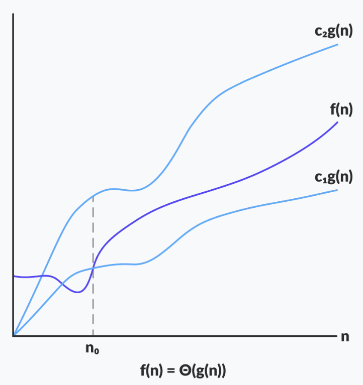
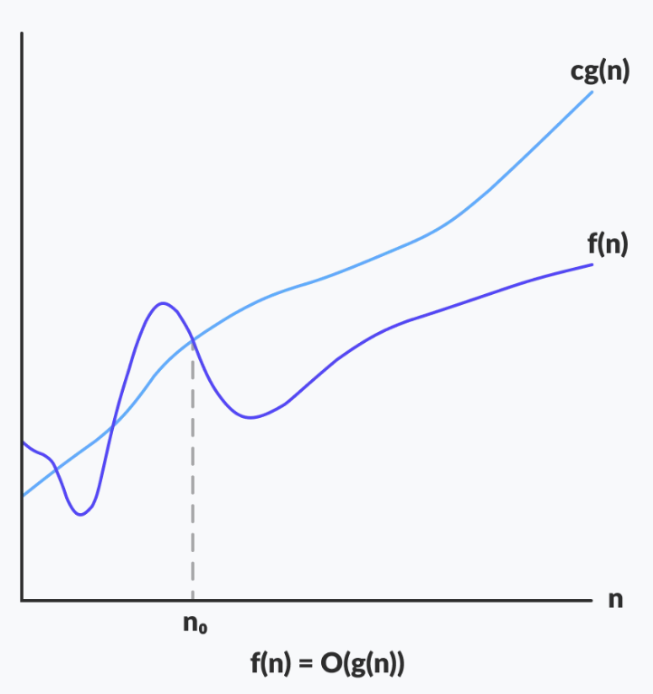
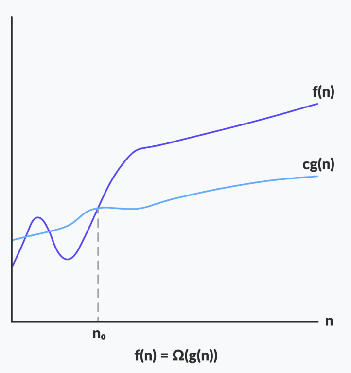

# Các ký hiệu tiệm cận

## Nguồn

 [What are Asymptotic Notations in Complexity Analysis of Algorithms - GeeksForGeeks](https://www.geeksforgeeks.org/analysis-of-algorithms-set-3asymptotic-notations)

Hình vẽ tham khảo từ [Asymptotic Analysis: Big-O Notation and More - Programiz](https://www.programiz.com/dsa/asymptotic-notations)

## Lời tựa

Các kí hiệu tiệm cận đóng vai trò rất quan trọng trong phân tích độ phức tạp thuật toán. Phân tích tiệm cận giúp đo đạc độ hiệu quả của các thuật toán mà không phụ thuộc vào các hằng số (hằng số tuỳ vào loại máy tính) và không yêu cầu phải cài đặt thuật toán và thời gian biên dịch. Các kí hiệu tiệm cận là những công cụ toán học để biểu thị độ phức tạp về mặt thời gian của thuật toán cho việc phân tích tiệm cận. 

Có 3 loại ký hiệu tiệm cận chính:

- Kí hiệu Big-O (kí hiệu $O$)
- Kí hiệu Omega (kí hiệu $\Omega$)
- Kí hiệu Theta (kí hiệu $\Theta$)

## Kí hiệu Theta (kí hiệu $\Theta$) { data-toc-label='Kí hiệu Theta' }

Kí hiệu Theta bao hàm **cận trên và cận dưới** của hàm. Vì nó đại diện cho 2 cận của thời gian chạy, nó được dùng để phân tích độ phức tạp thuật toán trong các trường hợp thông thường (không phải xấu nhất cũng không phải tốt nhất).

Gọi $g$ và $f$ là các hàm ánh xạ từ tập số tự nhiên đến chính nó. Hàm $f$ được coi là $\Theta(g)$, khi tồn tại hằng số $c_1, c_2 > 0$ và một số tự nhiên $n_0$ sao cho $c_1 * g(n) \leq f(n) \leq c_2 * g(n)$ với mọi $n \geq n_0$.

{ style="display: block; margin: 0 auto" }

Biểu diễn toán học của kí hiệu Theta:

$$\Theta(g(n)) = \{ f(n): \text{tồn tại các hằng số dương }c_1\text{, }c_2\text{ và }n_0\text{ sao cho }0 \leq c_1 * g(n) \leq f(n) \leq c_2 * g(n)\text{ với mọi }n \geq n_0 \}$$

**Lưu ý**: $\Theta(g)$ là một tập

Biểu thức ở trên có thể được mô tả là: nếu $f(n)$ là $\Theta$ của $g(n)$, giá trị $f(n)$ sẽ luôn nằm giữa $c_1 * g(n)$ và $c_2 * g(n)$ với mọi giá trị lớn của $n$ ($n \geq n_0$). Định nghĩa của $\Theta$ cũng yêu cầu rằng $f(n)$ phải không âm với mọi giá trị $n > n_0$.

Một cách đơn giản để lấy được $\Theta$ của một biểu thức là bỏ qua những toán hạng yếu hơn và các hằng số. Ví dụ, xét biểu thức $3n^3 + 6n^2 + 6000 = \Theta(n^3)$, việc bỏ đi các toán hạng yếu hơn được chấp nhận vì sẽ luôn tồn tại $n$ mà các giá trị sau nó làm cho $\Theta(n^3)$ luôn có giá trị lớn hơn $\Theta(n^2)$ mà không liên quan gì đến các hằng số trong biểu thức. Với một hàm $g(n)$ cho trước, ta biểu thị $\Theta(g(n))$ như sau:

Ví dụ:

- Tập $\{ 100\text{, }\log(2000)\text{, }10^4 \}$ nằm trong $\Theta(1)$
- Tập $\{ \frac{n}{4}\text{, }2n + 3\text{, }\frac{n}{100} + \log(n) \}$ nằm trong $\Theta(n)$
- Tập $\{ n^2 + n\text{, }2n^2\text{, }n^2 + \log(n) \}$ nằm trong $\Theta(n^2)$

**Lưu ý**: $\Theta$ thể hiện chính xác các cận.

## Kí hiệu Big-O (kí hiệu $O$) { data-toc-label='Kí hiệu Big-O' }

Kí hiệu Big-O đại diện cho **cận trên** của thời gian chạy của thuật toán. Vì vậy, nó cho biết độ phức tạp của trường hợp xấu nhất của một thuật toán.

Nếu $f(n)$ mô tả thời gian chạy của thuật toán, $f(n)$ là $O(g(n))$ nếu tồn tại một hằng số dương $C$ và $n_0$ mà $0 \leq f(n) \leq C * g(n)$ với mọi $n \geq n_0$.

{ style="display: block; margin: 0 auto" }

Biểu diễn toán học của kí hiệu Big-O:

$$O(g(n)) = \{ f(n): \text{tồn tại các hằng số dương }c\text{ và }n_0\text{ sao cho }0 \leq f(n) \leq c * g(n)\text{ với mọi }n \geq n_0 \}$$

Ví dụ, xét thuật toán Insertion Sort. Nó tốn thời gian tuyến tính trong trường hợp tốt nhất nhưng tốn thời gian bậc hai cho trường hợp xấu nhất. Ta có thể nói rằng độ phức tạp thời gian của Insertion Sort là $O(n^2)$.

**Lưu ý**: $O(n^2)$ cũng bao gồm thời gian tuyến tính.

Nếu ta dùng kí hiệu $\Theta$ để biểu diễn độ phức tạp thời gian của Insertion Sort, ta phải dùng 2 mệnh đề cho các trường hợp tốt và xấu nhất:

- Độ phức tạp thời gian cho trường hợp xấu nhất của Insertion Sort là $\Theta(n^2)$
- Độ phức tạp thời gian cho trường hợp tốt nhất của Insertion Sort là $\Theta(n)$

Kí hiệu Big-O phát huy tác dụng khi ta chỉ có cận trên của độ phức tạp của thuật toán. Đa phần ta có thể tìm ra được cận trên này chỉ bằng cách nhìn vào thuật toán.

Ví dụ:

- Tập $\{ 100\text{, }\log(2000)\text{, }10^4 \}$ nằm trong $O(1)$
- $\cup$ Tập $\{ \frac{n}{4}\text{, }2n + 3\text{, }\frac{n}{100} + \log(n) \}$ nằm trong $O(n)$
- $\cup$ Tập $\{ n^2 + n\text{, }2n^2\text{, }n^2 + \log(n) \}$ nằm trong $O(n^2)$

**Lưu ý**: Ở đây $\cup$ là kí hiệu hợp, ta có thể viết thế này vì Big-O thể hiện cận chính xác hoặc cận trên.

## Kí hiệu Omega (kí hiệu $\Omega$) { data-toc-label='Kí hiệu Omega' }

Kí hiệu Omega đại diện cho **cận dưới** của thời gian chạy của thuật toán. Vì vậy, nó cho biết độ phức tạp của trường hợp tốt nhất của một thuật toán.

Gọi $g$ và $f$ là các hàm ánh xạ từ tập số tự nhiên đến chính nó. Hàm $f$ được coi là $\Omega(g)$, khi tồn tại hằng số $c > 0$ và một số tự nhiên $n_0$ sao cho $c * g(n) \leq f(n)$ với mọi $n \geq n_0$.

{ style="display: block; margin: 0 auto" }

Biểu diễn toán học của kí hiệu Omega:

$$\Omega(g(n)) = \{ f(n): \text{tồn tại các hằng số dương }c\text{ và }n_0\text{ sao cho }0 \leq c * g(n) \leq f(n) \text{ với mọi }n \geq n_0 \}$$

Xét lại ví dụ Insertion Sort ở trên. Độ phức tạp thời gian của Insertion Sort có thể được viết là $\Omega(n)$, nhưng đây không phải là một thông tin quá hữu ích, vì nhìn chung chúng ta hay quan tâm đến trường hợp xấu nhất hoặc thỉnh thoảng là trường hợp trung bình.

Ví dụ:

- Tập $\{ n^2 + n\text{, }2n^2\text{, }n^2 + \log(n) \}$ nằm trong $\Omega(n^2)$
- $\cup$ Tập $\{ \frac{n}{4}\text{, }2n + 3\text{, }\frac{n}{100} + \log(n) \}$ nằm trong $\Omega(n)$
- $\cup$ Tập $\{ 100\text{, }\log(2000)\text{, }10^4 \}$ nằm trong $\Omega(1)$

**Lưu ý**: Ở đây $\cup$ là kí hiệu hợp, ta có thể viết thế này vì Big-O thể hiện cận chính xác hoặc cận dưới.

## Tính chất của các kí hiệu tiệm cận

### Tính chất chung

Nếu $f(n)$ là $O(g(n))$ thì $a * f(n)$ cũng là $O(g(n))$, với $a$ là hằng số.

Ví dụ:

$$\begin{align}
&f(n) = 2n^2 + 5\text{ là }O(n^2) \\
&\text{thì , }7 * f(n) = 7 * (2n^2 + 5) = 14n^2 + 35\text{ cũng là }O(n^2)\\
\end{align}$$

Tương tự, tính chất này cũng thoả với $\Theta$ và $\Omega$.

Ta có thể nói là:

- Nếu $f(n)$ là $\Theta(g(n))$ thì $a * f(n)$ cũng là $\Theta(g(n))$, với $a$ là một hằng số.
- Nếu $f(n)$ là $\Omega(g(n))$ thì $a * f(n)$ cũng là $\Omega(g(n))$, với $a$ là một hằng số.

### Tính chất bắc cầu

Nếu $f(n)$ là $O(g(n))$ và $g(n)$ là $O(h(n))$ thì $f(n) = O(h(n))$.

Ví dụ:

$$\begin{align}
&\text{Nếu }f(n) = n\text{, }g(n) = n^2\text{ và }h(n) = n^3 \\
&n\text{ là }O(n^2)\text{ và }n^2\text{ là }O(n^3)\text{ thì }n\text{ là }O(n^3)\\
\end{align}$$

Tương tự, tính chất này cũng thoả với $\Theta$ và $\Omega$.

Ta có thể nói là:

- Nếu $f(n)$ là $\Theta(g(n))$ và $g(n)$ là $\Theta(h(n))$ thì $f(n) = \Theta(h(n))$.
- Nếu $f(n)$ là $\Omega(g(n))$ và $g(n)$ là $\Omega(h(n))$ thì $f(n) = \Omega(h(n))$.

### Tính chất ánh xạ

Tính ánh xạ có thể được suy ra từ tính chất bắc cầu.

Nếu $f(n)$ được cho thì $f(n)$ là $O(f(n))$, vì giá trị lớn nhất của $f(n)$ là chính $f(n)$.

Vậy nên $x = f(n)$ và $y = O(f(n))$ luôn gắn với nhau trong quan hệ ánh xạ.

Ví dụ:

$$\begin{align}
&f(n) = n^2\text{ tức là }O(n^2)\text{ hay là }O(f(n)) \\
\end{align}$$

Tương tự, tính chất này cũng thoả với $\Theta$ và $\Omega$.

Ta có thể nói là:

- Nếu $f(n)$ được cho thì $f(n)$ là $\Theta(f(n))$.
- Nếu $f(n)$ được cho thì $f(n)$ là $\Omega(f(n))$.

### Tính chất đối xứng

Nếu $f(n)$ là $\Theta(g(n))$ thì $g(n)$ là $\Theta(f(n))$.

Ví dụ:

$$\begin{align}
&\text{Nếu }f(n) = n\text{, }g(n) = n^2 \\
&\text{thì }f(n)\text{ là }\Theta(n^2)\text{ và }g(n)\text{ là }\Theta(n^2)\\
\end{align}$$

Tính chất này chỉ thoả với $\Theta$.

### Tính chất chuyển đổi đối xứng

Nếu $f(n)$ là $O(g(n))$ thì $g(n)$ là $\Omega(f(n))$.

Ví dụ:

$$\begin{align}
&\text{Nếu }f(n) = n\text{, }g(n) = n^2 \\
&\text{thì }n\text{ là }O(n^2)\text{ và }n^2\text{ là }\Omega(n)\\
\end{align}$$

Tính chất này chỉ thoả với $O$ và $\Omega$.

### Các tính chất khác

1. Nếu $f(n) = O(g(n))$ và $f(n) = \Omega(g(n))$ thì $f(n) = \Theta(g(n))$
2. Nếu $f(n) = O(g(n))$ và $d(n) = O(e(n))$ thì $f(n) + d(n) = O(max(g(n),e(n)))$

    Ví dụ:

    $$\begin{align}
    &f(n) = n\text{ tức là }O(n)\\
    &d(n) = n^2\text{ tức là }O(n^2)\\
    &\text{thì }f(n) + d(n) = n + n^2\text{ tức là }O(n^2)\\
    \end{align}$$

3. Nếu $f(n) = O(g(n))$ và $d(n) = O(e(n))$ thì $f(n) * d(n) = O(g(n) * e(n))$

    Ví dụ:

    $$\begin{align}
    &f(n) = n\text{ tức là }O(n)\\
    &d(n) = n^2\text{ tức là }O(n^2)\\
    &\text{thì }f(n) * d(n) = n * n^2 = n^3\text{ tức là }O(n^3)\\
    \end{align}$$

    **Lưu ý**: nếu $f(n) = O(g(n))$ thì $g(n) = \Omega(f(n))$

Ngoài ra còn 2 loại kí hiệu nữa là **O nhỏ** (little O) và **Omega nhỏ** (little Omega). Little O cung cấp cho chúng ta một cận trên chặt chẽ hơn (điều kiện bằng được bỏ khỏi Big O) và Little Omega cung cấp cho chúng ta một cận dưới chặt chẽ hơn (điều kiện bằng được bỏ khỏi Big Omega).
