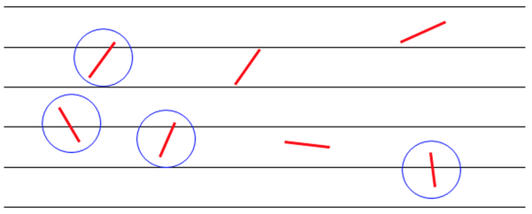

# Kỳ vọng tuyến tính

## Nguồn

 [Linearity of Expectation - Brilliant](https://brilliant.org/wiki/linearity-of-expectation/)

## Lời tựa

**Kỳ vọng tuyến tính (Linearity of Expectation)** là tính chất thể hiện rằng [giá trị kỳ vọng](https://brilliant.org/wiki/expected-value-definition/) (Expected Value) của tổng các biến ngẫu nhiên sẽ bằng tổng của các giá trì kỳ vọng của từng biến ngẫu nhiên mà không cần quan tâm rằng các biến ngẫu nhiên có độc lập hay không.

Giá trị kỳ vọng của một biến ngẫu nhiên là trung bình có trọng số của tất cả các kết quả có thể xảy ra. Ta thường chỉ quan tâm đến giá trị kỳ vọng của tổng các biến ngẫu nhiên. Ví dụ, giả sử ta có một trò chơi, ta sẽ lấy tổng các số khi gieo hai con xúc xắc:

{ style="display: block; margin: 0 auto" }

Với phương pháp thông thường, việc tính giá trị kỳ vọng tổng các số sẽ rất là chán. Thay vào đó, ta làm như sau: *"Giá trị kỳ vọng của mỗi lần gieo xúc xắc là $3.5$, và hai lần gieo là hai [biến cố độc lập](https://brilliant.org/wiki/probability-independent-events/), nên kỳ vọng của tổng của chúng sẽ là $3.5 + 3.5 = 7$"*.

Và điều này đúng - lấy tổng các giá trị kỳ vọng. Nhưng còn hơn thế nữa! Tính tuyến tính của kỳ vọng rất mạnh mẽ vì nó cho ta biết rằng **ta có thể cộng giá trị kỳ vọng ngay cả khi các biến ngẫu nhiên không độc lập**.

Nghe có vẻ khá là phản khoa học. Ví dụ, điều đó có nghĩa là giá trị kỳ vọng của lượng mưa vào cuối tuần sẽ là giá trị kỳ vọng của lượng mưa vào thứ bảy cộng với giá trị kỳ vọng của lượng mưa vào ngày chủ nhật, cho dù ta không nghĩ rằng lượng mưa vào ngày thứ bảy độc lập với lượng mưa của ngày chủ nhật (một ngày thứ bảy mưa tầm tã có thể tăng khả năng mưa vào ngày chủ nhật chẳng hạn).

Bài viết này sẽ tìm hiểu tính chất này của giá trị kỳ vọng. Ta sẽ giải vài bài cơ bản, rồi đi sâu vào các kỹ thuật nâng cao để giải các bài toán tổ hợp, từ đơn giản đến phức tạp. Cuối cùng, ta sẽ tìm hiểu các ứng dụng của nó trong các lĩnh vực khác như khoa học máy tính hay hình học.

## Định nghĩa và chứng minh

Đầu tiên, ta sẽ đi vào làm rõ tính tuyến tính của hàm giá trị kỳ vọng (thường được gọi đơn giản là "tuyến tính của kỳ vọng", hay "kỳ vọng tuyến tính"):

!!! info "Định lý"
    Với các biến ngẫu nhiên $X$ và $Y$ (có thể phụ thuộc),

    $$ E[X + Y] = E[X] + E[Y] $$

    Tổng quát hơn, với các biến ngẫu nhiên $X_1, X_2, \ldots, X_n$ và các hằng số $c_1, c_2, \ldots, c_n,$

    $$E[\sum_{i=1}^n c_i X_i] = \sum_{i=1}^n (c_i \cdot E[X_i])$$

??? tip "Chứng minh"
    Ta sẽ đi vào chứng minh định lý này với các [biến ngẫu nhiên rời rạc](https://brilliant.org/wiki/discrete-random-variables-definition/) $X$ và $Y$. Theo định nghĩa cơ bản của giá trị kỳ vọng,

    $$\begin{align}
    E[X + Y] &= \sum_{x} \sum_{y} [(x + y) \cdot P(X = x, Y = y)]\\
    &= \sum_{x} \sum_{y} [x \cdot P(X = x, Y = y)] + \sum_{x} \sum_{y} [y \cdot P(X = x, Y = y)] \\
    &= \sum_{x} x \underbrace{\sum_{y} P(X = x, Y = y)}_\textrm{P(X = x)} + \sum_{y} y \underbrace{\sum_{x} P(X = x, Y = y)}_\textrm{P(Y = y)} \\
    &= \sum_{x} x \cdot P(X = x) + \sum_{y} y \cdot P(Y = y) \\
    &= E[X] + E[Y] \\
    \end{align}$$

    Kết quả này có thể được mở rộng với $n$ biến bằng quy nạp.

    Lưu ý rằng ta không sử dụng bất cứ tính chất độc lập nào nên kỳ vọng tuyến tính vẫn đúng với tất cả các biến ngẫu nhiên!

    Với [biến ngẫu nhiên liên tục](https://brilliant.org/wiki/continuous-random-variables-definition/), chứng minh trên vẫn như vậy, chỉ khác là phép cộng được thay bằng tích phân. Ngoài ra, có thể dễ dàng mở rộng chứng minh cho hai biến ngẫu nhiên sang trường hợp tổng quát hơn bằng các sử dụng [các tính chất của giá trị kỳ vọng](https://brilliant.org/wiki/expected-value-properties/).

Hi vọng rằng chứng minh trên là đủ để ta hiểu tại sao có tính chất như vậy, mà không quan tâm đến việc các biến ngẫu nhiên có độc lập hay không. Đây là mấu chốt của kỳ vọng tuyến tính, nên là hãy đọc kỹ chứng minh nếu bạn chưa rõ.

## Các ví dụ cơ bản

Trước khi đi vào các kỹ thuật problem-solving, ta sẽ xem làm thế nào để trực tiếp áp dụng kỳ vọng tuyến tính. Ví dụ, tung hai con xúc xắc. Ta đã tìm được ra giá trị kỳ vọng của tổng là $7$, vì kỳ vọng của mỗi con xúc xắc là $3.5$.

Tuy nhiên, nhớ rằng ta có một trong những tính chất quan trọng nhất của kỳ vọng tuyến tính là nó có thể áp dụng cho biến ngẫu nhiên **phụ thuộc**. Hãy thử với một ví dụ khác.

!!! question "Ví dụ 1"
    Vẫn là hai con xúc xắc đó. Nếu tổng các số tung ra được là $A$, và tích các số tung ra được là $B$, tính $E[A + B]$.

??? tip "Lời giải"
    Ta biết rằng $E[A] = 7$, và hai số độc lập, ta có $E[B] = 3.5 \cdot 3.5 = 12.25$. Vì vậy, ngay cả khi $A$ và $B$ phụ thuộc lẫn nhau, kỳ vọng tuyến tính cho ta kết quả

    $$E[A + B] = E[A] + E[B] = 7 + 12.25 = 19.25$$

Giờ thử với bài này xem sao

!!! question "Ví dụ 2"
    Kỳ vọng lượng mưa trong ngày thứ bảy và chủ nhật lần lượt là 2 inch và 3 inch. Có 50% khả năng mưa trong ngày thứ bày. Nếu trời mưa vào ngày thứ bảy, có 75% khả năng chủ nhật cũng mưa, nhưng nếu thứ bảy không mưa, khả năng chủ nhật mưa chỉ còn 50%.

    Vậy thì cuối tuần kỳ vọng lượng mưa (tính theo inch) là bao nhiêu?

??? tip "Lời giải"
    Kỳ vọng lượng mưa vào cuối tuần sẽ bằng tổng kỳ vọng lượng mưa ngày thứ bảy và kỳ vọng lượng mưa ngày chủ nhật. Nếu để ý, bạn sẽ thấy nó đã được cho ngay trong câu đầu tiên, các chi tiết còn lại chỉ để đánh lạc hướng. Như vậy kết quả sẽ là $5$.

Giờ ta đã thấy một số ứng dụng trực tiếp của kỳ vọng tuyến tính, ta sẽ đến với một số kỹ thuật nhé!

## Giới thiệu Problem-solving

Một trong những ứng dụng phổ biến nhất của kỳ vọng tuyến tính trong problem-solving là khi nào nó có thể được áp dụng để tìm kỳ vọng của một biến ngẫu nhiên. Bạn có thể đang tự hỏi rằng "Làm thế nào để áp dụng một công cụ nói về tổng các biến ngẫu nhiên cho một biến ngẫu nhiên?".

Trong các trường hợp kỳ vọng tuyến tính hữu ích nhất, bạn thường sẽ không thể thấy ngay rằng bạn nên dùng nó. Thay vào đó, ta phải sử dụng kỹ năng giải quyết vấn đề để điều chỉnh lại biến ngẫu nhiên duy nhất của chúng ta thành tổng một số biến ngẫu nhiên khác.

Đầu tiên, lưu ý hai dấu hiệu quan trọng cho việc ta có thể áp dụng kỳ vọng tuyến tính để giải quyết một bài toán kỳ vọng:

1. Việc tính kỳ vọng theo công thức trung bình trọng số là rất khó / tốn thời gian vì xác suất của các khả năng cũng khó tính ra.
2. Biến ngẫu nhiên được cho có thể được viết thành tổng một số biến ngẫu nhiên khác.

Cùng xem một ví dụ nhé:

!!! question "Ví dụ 1"
    Caroline muốn tung 10 đồng xu. Nếu chị tung ra được $n$ mặt ngửa, chị sẽ được trả $n$ đô. Kỳ vọng số tiền được trả là bao nhiêu?

??? tip "Lời giải"
    Gọi số tiền Caroline được trả là $X$ đô. Thông thường điều đầu tiên mà ta làm là tìm xác suất khi $X = 0, 1, 2, \ldots$ và lấy trung bình, nhưng tính toán xác suất để lấy kỳ vọng ở đây khá là mệt - dấu hiệu đầu tiên để cân nhắc sử dụng kỳ vọng tuyến tính! Nhưng làm thế nào ta có thể biểu diễn $X$ thành tổng của các biến ngẫu nhiên con?

    Lưu ý rằng được trả $n$ đô cho $n$ mặt ngửa đồng xu nghĩa là Caroline nhận $1$ đô với mỗi mặt ngửa, nên ta có thể xem tổng tiền nhận được là tổng số lần nhận được tiền cho mỗi đồng xu. Vì vậy, nếu ta cho $X_i = 1$ nếu đồng xu thứ $i$ là mặt ngửa, và $X_i = 0$ khi gặp mặt sấp, ta có thể tính tổng tiền là

    $$X = X_1 + X_2 + \ldots + X_{10}$$

    Để tìm kỳ vọng của $X$, ta cần tìm kỳ vọng của $$X_1 + X_2 + \ldots + X_{10}$$. Giờ nó trông giống một bài toán kỳ vọng tuyến tính rồi!

    Dĩ nhiên, vì xác suất có mặt ngửa là $\frac{1}{2}$, $E[X_i] = 1 \cdot \frac{1}{2} + 0 \cdot \frac{1}{2} = \frac{1}{2}$ với mọi $i$. Vì vậy,

    $$E[X] = E[X_1 + X_2 + \ldots + X_{10}] = 10 \cdot \frac{1}{2} = 5$$

    suy ra kỳ vọng số tiền nhận được là $5$ đô.

Ta thấy rằng, kỳ vọng tuyến tính có thể đơn giản hoá rất nhiều việc tính toán kỳ vọng. Hãy để ý cách ta thấy việc tính kỳ vọng theo cách thông thường khá là phức tạp để cân nhắc việc dùng kỳ vọng tuyến tính, sau đó biến đổi biến ngẫu nhiên được cho thành tổng các biến ngẫu nhiên đơn giản hơn. Tiếp tục thử các bài sau nhé:

!!! question "Ví dụ 2"
    Sammy bị lạc và mất phương hướng. Với mỗi phút, cậu ấy tiến về phía trước $1$ mét với xác suất $\frac{1}{2}$, đứng yên với xác suất $\frac{1}{3}$, và đi lùi $1$ mét với xác suất $\frac{1}{6}$.

    Sau một giờ, kỳ vọng quãng đường di chuyển về phía trước (tính theo mét) của Sammy là bao nhiêu?

??? tip "Lời giải"
    Gọi $X_i$ là quãng đường di chuyển về phía trước của Sammy trong phút thứ $i$ và để ý rằng:

    $$E[X_i] = \frac{1}{2} \cdot (1) + \frac{1}{3} \cdot (0) + \frac{1}{6} \cdot (-1) = \frac{1}{3}$$

    với mọi $i$. Vì vậy, quãng đường di chuyển về phía trước sau một giờ là $X_1 + X_2 + \ldots + X_{60}$. Dùng kỳ vọng tuyến tính,

    $$E[\sum_{i=1}^{60} X_i] = \sum_{i=1}^{60} E[X_i] = 60 \cdot \frac{1}{3} = 20$$

Trong hai ví dụ trên, ta đã áp dụng kỳ vọng tuyến tính để lấy tổng các biến ngẫu nhiên độc lập. Tuy nhiên hãy nhớ rằng khả năng mạnh nhất của kỳ vọng tuyến tính là nó có thể được dùng cho biến ngẫu nhiên phụ thuộc! Hãy xem xét ví dụ có tổng các biến ngẫu nhiên phụ thuộc sau

!!! question "Ví dụ 3"
    Các chữ số $1$, $2$, $3$ và $4$ được dùng để tạo ngẫu nhiên hai số có hai chữ số, $\overline{AB}$ và $\overline{CD}$. Ví dụ ta có thể có $\overline{AB} = 42$ và $\overline{CD} = 13$. Kỳ vọng của $\overline{AB} \cdot \overline{CD}$ là bao nhiêu?

??? tip "Lời giải"
    Thông thường ta sẽ đi tính $E[\overline{AB}]$ và $E[\overline{CD}]$ và lấy tích. Tuy nhiên nhớ rằng $E[xy] = E[x] \times E[y]$ [chỉ đúng khi các biến ngẫu nhiên độc lập](https://brilliant.org/wiki/expected-value-independent-variables/). Rõ ràng là $\overline{AB}$ và $\overline{CD}$ không độc lập vì các chữ số chỉ được dùng một lần. Ví dụ $\overline{AB} = 13$ thì $\overline{CD}$ chỉ có thể là $24$ hoặc $42$. Tuy nhiên ta có thể thử biến nó thành tổng gì đó.

    Vì các biến ngẫu nhiên đơn giản ở đây là các chữ số, ta có thể viết nó thành

    $$(10A + B) \cdot (10C + D) = 100 \cdot AC + 10 \cdot AD + 10 \cdot BC + BD$$

    Tuy nhiên, rõ ràng là kỳ vọng của bất cữ tích nào có dạng $AC$ là như nhau vì có sự đối xứng giữa $A$, $B$, $C$, $D$. Ta có thể tính

    $$E[AC] = \frac{1 \cdot 2 + 1 \cdot 3 + 1 \cdot 4 + 2 \cdot 3 + 2 \cdot 4 + 3 \cdot 4}{6} = \frac{35}{6}$$

    Vì vậy, theo kỳ vọng tuyến tính,

    $$E[\overline{AB} \cdot \overline{CD}] = E[100 \cdot AC] + E[10 \cdot AD] + E[10 \cdot BC] + E[BD] = 121 \cdot E[AC] = \frac{4235}{6} = 705.83$$

Ta đã có được các kiến thức nền. Giờ hãy đi vào các kỹ thuật problem-solving phức tạp hơn nhé.

## Sử dụng biến chỉ báo

Trong phần này, ta sẽ tiếp tục khám phá các kỹ thuật giúp **giải các bài toán tổ hợp** bằng cách sử dụng kỳ vọng tuyến tính, cùng với việc giới thiệu một công cụ mới được gọi là các [biến chỉ báo](https://brilliant.org/wiki/discrete-random-variables-indicator-variables/). Kỹ thuật này rất hữu ích khi biến ngẫu nhiên đang *đếm* số lần xuất hiện của các sự kiện đơn giản.

Với các dạng bài này, việc biến ngẫu nhiên đang xét có thể viết dưới dạng tổng của các biến ngẫu nhiên khác sẽ ít rõ ràng hơn so với phần trước. Nhưng với những kiến thức đã học, ta có thể giải chúng trong nháy mắt.

Ta cùng đi vào một ví dụ về những cách thông minh để viết biến ngẫu nhiên dưới dạng tổng các biến ngẫu nhiên đơn giản hơn:

!!! question "Ví dụ 1"
    Cho một cái hộp chứa một quả bóng vàng, một bóng cam, một bóng xanh lá và một bóng xanh da trời. Billy chọn ngẫu nhiên 4 bóng trong hộp (có thay thế). Kỳ vọng số màu khác nhau là bao nhiêu?

??? tip "Lời giải"
    Ta muốn tìm kỳ vọng số màu khác nhau. Ta có thể tính trực tiếp xác suất Billy chonk $k = 1, 2, 3, 4$ màu khác nhau, nhưng trông khá là mệt (và còn mệt hơn khi có nhiều hơn 4 bóng). Đây là một gợi ý cho việc dùng kỳ vọng tuyến tính.

    Giờ ta cần nghĩ xem làm sao để viết số màu khác nhau dưới dạng tổng các biến ngẫu nhiên khác. Để bắt đầu, giả sử 4 lựa chọn của Billy lần lượt là: cam, xanh là, cam, xanh da trời.

    Làm sao bạn có thể xác định số màu khác nhau? Ta thấy rằng có 3 màu khác nhau. Bạn có thể nghĩ là "Ờ tôi biết đếm rồi mà". Tuy nhiên, đây là lúc điều kỳ diệu xảy ra.

    Vì biến ngẫu nhiên của chúng ta là đếm số màu được chọn, ta có thể biến nó thành tổng của 4 biến ngẫu nhiên: mỗi biến cho một màu, bằng 1 khi có màu đó và bằng 0 khi không có. Vì vậy, trong ví dụ trên, biến ngẫu nhiên cho màu cam, xanh lá và xanh da trời sẽ là 1, cho màu vàng thì sẽ là 0. Tổng chúng lại sẽ là 3.

    Thêm vào đó, kỳ vọng của các biến này cũng dễ tính. Trong thực tế, với định nghĩa của kỳ vọng, ta có thể thấy rằng kỳ vọng của nó bằng với xác suất màu đó được chọn. Sử dụng kỹ thuật [xác suất bù](https://brilliant.org/wiki/probability-by-complement/), ta thấy rằng xác suất của một màu nào đó (ví dụ như vàng) là

    $$ 1 - P(\text{vàng dược chọn}) = 1 - (\frac{3}{4})^4 = \frac{175}{256}$$

    Cuối cùng, với kỳ vọng tuyến tính, kỳ vọng số màu khác nhau là

    $$4 \cdot \frac{175}{256} = \frac{175}{64} \approx 2.73$$

Với ví dụ trên, ta chốt được các ý tưởng sau:

- Kỳ vọng tuyến tính giúp ta tính một kỳ vọng có vẻ phức tạp theo một cách cực kỳ đơn giản (dù phải dùng cách thông minh - nhưng bạn sẽ sớm đạt được khi luyện nhiều)
- Kỳ vọng tuyến tính cho phép ta không phải lo về việc các biến ngẫu nhiên đơn giản có phụ thuộc nhau hay không. Rõ ràng là chúng phụ thuộc rồi: ví dụ, nếu có 3 biến là 0 thì biến thứ 4 phải là 1 (vì có ít nhất 1 màu được chọn). Tuy nhiên, ta đã chứng minh rằng kỳ vọng tuyến tính đúng với mọi biến ngẫu nhiên, không quan trọng có phụ thuộc hay không.
- Vì biến ngẫu nhiên của ta đếm cái gì đó (như số màu khác nhau), ta có thể viết nó thành tổng các biến ngẫu nhiên cho biết những thứ gì sẽ được đếm (như 1 cho mỗi màu được chọn).

Với điểm cuối cùng, nó thực sự khá gợi nhớ đến cách ta xử lý ví dụ tung đồng xu của Caroline khi đến số mặt ngửa bằng cách tính tổng các biến ngẫu nhiên cho biết rằng nó có phải mặt ngửa không. Trên thực tế, có một thuật ngữ chính thức cho một biến ngẫu nhiên như vậy:

!!! info "Định nghĩa"
    Một **biến ngẫu nhiên chỉ báo** cho một biến cố $t$, thường đặt là $1_t$ là biến ngẫu nhiên bằng $1$ nếu $t$ xảy ra, và bằng $0$ nếu $t$ không xảy ra. Theo định nghĩa kỳ vọng,

    $$E[1_t] = P(\text{t xảy ra}) \cdot 1 + P(\text{t không xảy ra}) \cdot 0 = P(\text{t xảy ra})$$

Các biến ngẫu nhiên chỉ báo này rất hữu dụng để giải các bài toán kỳ vọng tuyến tính, đặc biệt là khi tính kỳ vọng (cũng là xác suất biến cố xảy ra). Với ý tưởng này, bạn có thể giải các bài tập mà nếu không dùng cách này thì sẽ rất khó để giải.

!!! question "Ví dụ 2"
    Tung 25 đồng xu lần lượt. Kỳ vọng số cặp ngửa ngửa liên tiếp nhau là bao nhiêu? Ví dụ, nếu 6 đồng xu được tung cho ra NNSNNN (ngửa-ngửa-sấp-ngửa-ngửa-ngửa), số cặp ngửa-ngửa là 3.

??? tip "Lời giải"
    Ta sẽ có $24$ cặp đồng xu $[1,2], [2,3], \ldots, [24,25]$. Đánh dấu chúng là $X_1, X_2, \ldots, X_{24}$.

    Gọi $x_i (1 \le i \le 24)$ là một biến ngẫu nhiên chỉ báo được định nghĩa như sau

    $$x_i = \begin{cases}
    1 &\text{nếu } P_i \text{ là cặp NN} \\
    0 &\text{nếu } P_i \text{ không là cặp NN}
    \end{cases}$$

    Ta sẽ có 

    $$\begin{align}
    E[x_i] &= 1 \cdot P(X_i \text{ là cặp NN}) + 0 \cdot P(X_i \text{ không là cặp NN})\\
    &= 1 \cdot (\frac{1}{2})(\frac{1}{2}) + 0\\
    &= \frac{1}{4}\\
    \end{align}$$

    Vậy kỳ vọng số cặp ngửa ngửa là

    $$E\left[\sum_{i=1}^{24} x_i \right] = \sum_{i=1}^{24} E[x_i] = 24 \cdot \frac{1}{4} = 6$$

Tổng kết lại, việc sử dụng kỳ vọng tuyến tính với biến ngẫu nhiên chỉ báo sẽ có ích khi:

- bài toán trông có vẻ giải được bằng kỳ vọng tuyến tính;
- không có cách rõ ràng nào để viết biến ngẫu nhiên đang xét dưới dạng tổng các biến ngẫu nhiên đơn giản hơn;
- biến ngẫu nhiên đang xét đang đến số lần xảy ra của một số cho trước các biến cố đơn giản.

## Sử dụng trạng thái

Trong phần này, ta sẽ giới thiệu một kỹ thuật áp dụng kỳ vọng tuyến tính khi biến ngẫu nhiên đang xét tính toán thời gian hoặc số bước cần để hoàn tất một quá trình nào đó. Nếu nghe có vẻ mù mờ, ta sẽ đi vào một ví dụ để xem "trạng thái" có nghĩa là gì:

!!! question "Ví dụ 1"
    Allison có một dồng xu không công bằng với xác suất tung được mặt ngửa là $p$. Kỳ vọng số lần tung để có mặt ngửa là bao nhiêu?

??? tip "Lời giải"
    Mới nhìn qua thì biến ngẫu nhiên là đếm một số biến cố đơn giản, nên có vẻ là biến ngẫu nhiên chỉ báo sẽ có ích. Ta chỉ cần đếm số mặt sấp khi tung, và mỗi lần tung mặt sấp sẽ có xác suất $1-p$. Nhưng vấn đề ở đây là ta không biết sẽ tung bao nhiêu lần để tính tổng. Trên thực tế, đó gần như chính xác là câu hỏi được đặt ra.

    Thay vào đó, ta coi bài toán như là việc "hoàn thành một quy trình", trong đó ta có nhiều trạng thái. Trong trường hợp này, trạng thái khá đơn giản: ta chưa tung ra được mặt ngửa (gọi trạng thái này là $0$), hoặc ta tung được mặt ngửa (trạng thái này gọi là $1$).

    Gọi $E[X_i]$ là kỳ vọng số lần tung để hoàn thành quy trình (ra được mặt ngửa) khi đang ở trạng thái $i$. Rõ ràng là $E[X_1] = 0$, vì trạng thái $1$ nghĩa là ta đã có mặt ngửa nên quy trình hoàn tất. Ngược lại, khi ta tung đồng xu trong trạng thái $0$, ta sẽ ở lại trạng thái này với xác suất $1-p$, và sẽ sang trạng thái $1$ với xác suất là $p$. Vì vậy, xét trạng thái sau khi ta tung ở trạng thái $0$, ta có

    $$E[X_0] = 1 + (1 - p) \cdot E[X_0] + p \cdot \underbrace{E[X_1]}_\textrm{0}$$

    nên $p \cdot E[X_0] = 1$, suy ra $E[X_0] = \frac{1}{p}$

    Đây là một cách để tính kỳ vọng của [phân phối Bernoulli](https://brilliant.org/wiki/bernoulli-distribution/).

Sang một ví dụ phức tạp hơn với trạng thái, ở đây ta sẽ áp dụng trực tiếp kết quả ta vừa tìm được.

!!! question "Ví dụ 2"
    Với mỗi lần mua sắm ở SlurpeeShack, ta sẽ nhận được một mảnh ngẫu nhiên của hình dưới (12 mảnh). Khi ta có tất cả 12 mảnh, ta sẽ nhận được một ly nước miễn phí. Kỳ vọng số lần mua hàng để có được tất cả các mảnh là bao nhiêu?

    { style="display: block; margin: 0 auto" }

??? tip "Lời giải"
    Ở đây, các trạng thái của chúng ta là số mảnh khác nhau mà ta có. Gọi $X_i$ là số lần mua hàng để có được mảnh thứ $i$, nên biến ngẫu nhiên được xét là $\sum_{i=1}^{12} X_i$.

    Khi có được $i-1$ mảnh khác nhau, xác suất có được mảnh tiếp theo là $\frac{12-(i-1)}{12}$. Với ví dụ trước, kỳ vọng số lần mua hàng sẽ là $E[X_i] = \frac{12}{12 - (i-1)}$. Nên theo kỳ vọng tuyến tính

    $$E\left[\sum_{i=1}^{12} X_i \right] = \sum_{i=1}^{12} E[X_i] = \sum_{i=1}^{12} \frac{12}{12 - (i-1)} = \frac{12}{12} + \frac{12}{11} + \ldots + \frac{12}{1} = \frac{86021}{2310} \approx 37$$

    **Bonus**: Đây là bài toán khá nổi tiếng, thường được nhắc đến với tên là **bài toán thu gom coupon**. Tổng quát thì với $n$ coupon, kỳ vọng số lần mua hàng sẽ là $nH_n$, với $H_n = \sum_{i=1}^{n} \frac{1}{i}$ là số hài hoà thứ $n$. Với vi tích phân thì ta có, với $n$ lớn, $H_n \approx \ln n$, nên kỳ vọng sẽ xấp xỉ $n \ln n$

Ta có thể thấy rằng, trạng thái sẽ hữu ích khi ta có thể viết các biến ngẫu nhiên thành tổng các biến ngẫu nhiên khác có thể tính thời gian / số bước cần để đi từ trạng thái này sang trạng thái tiếp theo. Ta sẽ có các ví dụ như sau:

!!! question "Ví dụ 3"
    Sóc Sarah đang tìm quả sồi nhưng không nhớ đã để nó ở đâu.

    { style="display: block; margin: 0 auto; height: 300px" }

    Sarah bắt đầu từ góc trái dưới của lưới $2 \times 2$, và ở mỗi đỉnh, nó đi đến đỉnh kề với đỉnh hiện tại (nên có thể sẽ đi qua một cạnh nhiều lần).

    Hỏi rằng kỳ vọng số bước để đi đến góc phải trên, nơi chứa quả sồi là bao nhiêu?

??? tip "Lời giải"
    { style="display: block; margin: 0 auto; height: 300px" }
    
    Gọi $E_i$ là kỳ vọng số bước cần đi để đi từ trạng thái $i$ đến trạng thái $i+1$, với $1 \le i \le 4$, trạng thái 5 là trạng thái kết thúc.

    Ta có thể thấy rằng xác suất để đi từ trạng thái $i$ đến trạng thái $i+1$ hay $i-1$ đều nhất quán, ví dụ, trạng thái 1 chắc chắn đi đến trạng thái 2 (xác suất bằng 1), trạng thái 2 có xác suất $\frac{2}{3}$ đi đến trạng thái 3 và xác suất $\frac{1}{3}$ đi về trạng thái 1 (dù ta có 2 chỗ có trạng thái 2 nhưng xác suất của chúng như nhau), tương tự với trạng thái 3 ($\frac{1}{2}$ khả năng đi tới, $\frac{1}{2}$ khả năng đi lùi) và 4 ($\frac{1}{3}$ khả năng đi tới, $\frac{2}{3}$ khả năng đi lùi).

    Như vậy, từ trạng thái 1, ta cần đúng 1 bước để đến trạng thái 2, vậy $E_1 = 1$.

    Từ trạng thái 2, với xác suất $\frac{2}{3}$, ta có thể đi tới trạng thái 3 trong 1 bước, và với xác suất $\frac{1}{3}$, ta có thể đi về trạng thái 1, sau đó cần $E_1$ bước để đến lại trạng thái 2, và $E_2$ bước để đến trạng thái 3. Vì vậy:

    $$E_2 = \frac{2}{3} \cdot 1 + \frac{1}{3} \cdot (1 + E_1 + E_2)$$

    Giải ra ta có $E_2 = 2$.

    Tương tự:

    $$E_3 = \frac{1}{2} \cdot 1 + \frac{1}{2} \cdot (1 + E_2 + E_3)$$

    $$E_4 = \frac{1}{3} \cdot 1 + \frac{2}{3} \cdot (1 + E_3 + E_4)$$

    Giải lần lượt ra thì ta có $E_3 = 4$ và $E_4 = 11$.
    
    Kết quả sẽ là tổng kỳ vọng số bước để đi từ trạng thái 1 lên 2, 2 lên 3, 3 lên 4 và 4 lên 5, nghĩa là $E_1 + E_2 + E_3 + E_4 = 18$.

!!! question "Ví dụ 4"
    Jorge có một con xúc xắc công bằng $N$ mặt, các mặt là các số khác nhau từ $1$ đến $N$ và đang muốn xem phải tung nó bao nhiêu lần để có tất cả các số từ $1$ đến $N$ (theo bất kỳ thứ tự nào). Jorge tính nhanh và tìm ra kỳ vọng số lần tung là 91 khi làm tròn về số nguyên gần nhất. 

    Vậy con xúc xắc có bao nhiêu mặt nhỉ?

??? tip "Lời giải"
    Giống với bài coupon ta sẽ có kỳ vọng số lần tung để có tất cả các số là:

    $$E\left[\sum_{i=1}^{N} X_i \right] = \sum_{i=1}^{N} E[X_i] = \sum_{i=1}^{N} \frac{N}{N - (i-1)} = \frac{N}{N} + \frac{N}{N} + \ldots + \frac{N}{1} $$

    Đây là hàm tăng, nên ta có thể dùng tìm kiếm nhị phân để tìm ra đáp án. Đó là $24$ lần tung.

!!! question "Ví dụ 5"
    Một hàng các cục đá nằm trên một cái hồ to vô hạn.

    Một con ếch khởi đầu từ hòn đá thứ 2 từ bờ.

    Mỗi giây, nó nhảy đến hòn đá bên cạnh, với xác suất 60% là hướng về bờ, và 40% hướng xa bờ.

    Kỳ vọng số lần nhảy để quay lại hòn đá đầu tiên (hòn đá gần bờ nhất) là bao nhiêu?

??? tip "Lời giải"
    Gọi $E_n$ là kỳ vọng số bước nhảy để đến hòn đá đầu tiên từ hòn đá thứ $n$.

    Từ hòn đá thứ hai, con ếch có xác suất $0.6$ nhảy về hòn đá thứ nhất, và $0.4$ nhảy đến hòn đá tiếp theo. Vì vậy,

    $$E_2 = 0.6 \cdot (1 + E_1) + 0.4 \cdot (1 + E_3) = 1 + 0.6 \cdot E_1 + 0.4 \cdot E_3$$

    Vì $E_1 = 0$, nó trở thành

    $$E_2 = 1 + 0.4 \cdot E_3$$

    Tuy nhiên, vì xác suất ở mỗi hòn đá là như nhau, nên kỳ vọng số bước để đi từ hòn đá $i$ đến hòn đá $i-1$ là như nhau với mọi $i$. Nghĩa là $E_2$ bằng với kỳ vọng đi từ hòn đá thứ 3 đến hòn đá thứ 2. Mà $E_3$ lại bằng kỳ vọng đi từ hòn đá thứ 3 về hòn đá đầu tiên, nghĩa là từ 3 về 2 xong từ 2 về 1. Suy ra $E_3 = 2 \cdot E_2$.

    Như vậy $E_2 = 1 + 0.4 \cdot 2 \cdot E_2$. Suy ra $E_2 = 5$.

## Ứng dụng

Ta đã xem cách để giải các bài toán tổ hợp với kỳ vọng tuyến tính. Tuy nhiên, vẫn còn rất nhiều ứng dụng thực tế của kỳ vọng tuyến tính, hãy cùng xem xét một vài ví dụ nhé.

Đầu tiên là trò xổ số.

!!! question "Ví dụ 1"
    Có một cuộc thi xổ số. Người chơi trả 1 đô để chọn 5 số khác nhau từ 1 đến 50. Công ty xổ số sẽ trả 2.5 triệu đô tiền thường nếu ai đoán trúng cả 5 số (và tiền giải sẽ chia đều ra cho tất cả những người đoán trúng).

    Với [tổ hợp](https://brilliant.org/wiki/combinations/) thì ta biết rằng có $\binom{50}{5} = 2118760$ cách chọn. Nhưng với [nguyên tắc chuồng chim](https://brilliant.org/wiki/pigeonhole-principle-definition/), nếu ta có chừng đó người, mỗi người đoán một bộ số khác nhau, ta có thể lời tiền!

    Điều đó đúng, tuy nhiên, các công ty xổ số biết rằng người chơi không có đủ tài nguyên để chơi kiểu đó. Thay vào đó, họ sẽ giả dụ rằng mỗi người sẽ chọn các số một cách ngẫu nhiêu. Trong trường hợp này, $n$ người tham gia chơi với $m$ cách chọn, xác suất để ai đó thắng là bao nhiêu?

??? tip "Lời giải"
    Gọi $X_i$ là biến ngẫu nhiên chỉ báo cho biến cố tổ hợp xổ số $1 \le i \le m$ không được chọn bởi bất kỳ người chơi nào. Vì ai cũng chọn ngẫu nhiên,

    $$E[X_i] = (1 - \frac{1}{m}) ^ n$$

    với mọi $i$. Dùng kỳ vọng tuyến tính, kỳ vọng số tổ hợp không được chọn là

    $$E[\sum_{i=1}^{m} X_i] = \sum_{i=1}^{m} E[X_i] = m \cdot (1 - \frac{1}{m})^n$$

    Vì tổ hợp thắng cuộc được chọn ngẫu nhiên nên,

    $$1 - \frac{m \cdot (1-\frac{1}{m})^n}{m} = 1 - (1 - \frac{1}{m})^n$$

    Ví dụ, nếu xổ số có $2118760$ tổ hợp và $2118760$ người chơi (chọn tổ hợp ngẫu nhiên), xác suất ai đó thắng là khoảng 63%.

    **Bonus**: Điều gì xảy ra khi $m$ quá lớn? Làm thế nào công ty xổ số đối phó khi số người tham gia tăng lên? Gợi ý: Kết quả này liên quan đến một [giới hạn dãy](https://brilliant.org/wiki/limits-of-sequences/) nổi tiếng liên quan đến hằng số $e$. Ngoài ra, đọc [đáp án](https://math.stackexchange.com/a/347172/476627) này để thấy được sự liên quan giữa $e$ và tổ hợp.

Thật thú vị khi thấy cách để áp dụng kỳ vọng tuyến tính để khám phá một sự thật thú vị về xổ số. Giờ ta hãy sang một chủ đề khác: một bài toán [xác suất hình học](https://brilliant.org/wiki/1-dimensional-geometric-probability/#2-dimensional-geometric-probability) nổi tiếng:

!!! question "Ví dụ 2"
    Giả sử một cây kim độ dài 1 đơn vị bị rơi xuống sàn nhà, sàn nhà này có các dải gỗ cách nhau 1 đơn vị. Xác suất cây kim nằm trên hai dải gỗ là bao nhiêu?

    { style="display: block; margin: 0 auto" }

    Bài này thường được giải bằng vi tích phân, nhưng ta sẽ dùng kỳ vọng tuyến tính để giải nó.

??? tip "Lời giải"
    Đầu tiên, ta sẽ thảo luận rằng kỳ vọng số lần cây kim nằm trên hai dải gỗ tỉ lệ trực tiếp với độ dài $l$ của cây kim. Giả sử rằng cây kim được làm từ $n$ mảnh có độ dài bằng nhau. và gọi $X_i$ là biến chỉ báo cho biến cố mảnh thứ $i$ chạm hai dải gỗ. Thì kỳ vọng tất cả các lần chạm vạch, theo kỳ vọng tuyến tính, là

    $$E\left[\sum_{i=1}^{n} X_i \right] = \sum_{i=1}^{n} E[X_i] = n \cdot E[X_1]$$

    Giữ chiều dài các mảnh nhỏ này không đổi, ta thấy rằng kỳ vọng sẽ tỉ lệ thuận với chiều dài kim.

    Vậy nên, với hàm của độ dài $l$, kỳ vọng số lần chạm vạch sẽ là $cl$ với hằng số $c$ nào đó. Tuy nhiên, xét một hình tròn đường kính là $1$ (chu vi sẽ là $\pi$); với xác suất $1$, hình tròn này sẽ giao với đúng hai dải gỗ. Vì thế $c\pi = 2$, nên $c = \frac{2}{\pi}$. Nếu bạn không thoải mái với ý tưởng hình tròn, xét hình kiểu tròn với rất nhiều các mảnh nhỏ là đoạn thẳng.

    Với bất kỳ cây kim nào giao nhiều nhất một dải gỗ, $\sum_{i=1}^{n}$ thực ra là một biến chỉ báo cho biến cố cây kim nằm trên hai dải gỗ, nên kỳ vọng sẽ là xác suất việc này xảy ra. Vậy xác suất để chạm vạch với kim độ dài $1$ là $\frac{2}{\pi} \approx 64%$.

    **Bonus**: Bạn có thể nghĩ xem làm sao ta có thể dùng kết quả này để ước lượng giá trị của $\pi$ thông qua mô phỏng [Monte-Carlo](https://brilliant.org/wiki/monte-carlo/) không?

Sau đây là một số ví dụ khác có thể được giải bằng kỳ vọng tuyến tính:

!!! question "Ví dụ 3"
    Nhiều bài toán về kỳ vọng trong đồ thị ngẫu nhiên có thể được giải bằng kỳ vọng tuyến tính. Ví dụ, giả sử có một nhóm $n$ người có khả năng trở thành bạn, và mỗi cặp có khả năng trở thành bạn với xác suất $\frac{1}{2}$. Vậy thì kỳ vọng số bộ ba bạn bè là bao nhiêu (nhóm 3 người có khả năng trở thành bạn của nhau)?

??? tip "Lời giải"
    Có $\binom{n}{3}$ bộ ba, mỗi bộ ba là bộ ba bạn bè với xác suất $(\frac{1}{2})^3 = \frac{1}{8}$. Nếu gọi $X_i$ là biến ngẫu nhiên chỉ báo cho biến cố bộ ba thứ $i$ là bộ ba bạn bè, thì kỳ vọng số bộ ba bạn bè là

    $$E\left[\sum_{i=1}^{\binom{n}{3}} X_i \right] = \sum_{i=1}^{\binom{n}{3}} E[X_i] = \frac{\binom{n}{3}}{8}$$

!!! question "Ví dụ 4"
    Có $n$ người trong một phòng, kỳ vọng số ngày sinh nhật khác nhau là bao nhiêu? Giả sử năm nào cũng có 365 ngày. Việc này liên quan gì đến bài toán [nghịch lý ngày sinh nhật](https://brilliant.org/wiki/birthday-paradox/)?

??? tip "Lời giải"
    Gọi $X_i$ là biến ngẫu nhiên chỉ báo cho ngày thứ $i$ (trong 365 ngày) là ngày sinh nhật của một người nào đó. Giả sử ngày sinh nhật của một người là ngẫu nhiên, ta có,

    $$E[X_i] = 1 - (1 - \frac{1}{365})^n = 1 - (\frac{364}{365})^n$$

    Như vậy số ngày sinh nhật khác nhau sẽ là tổng kỳ vọng mỗi ngày trong 365 ngày, tức là

    $$E[X] = 365 \cdot (1 - (\frac{364}{365})^n)$$

    Lấy ví dụ $n = 30$ thì số $E[X] \approx 28.83$, nghĩa là có tồn tại 1 ngày sinh nhật bị trùng của hai người nào đó, trong khi $n$ không quá lớn.

!!! question "Ví dụ 5"
    Trong khoa học máy tính, thuật toán ngẫu nhiên [quicksort](https://brilliant.org/wiki/quicksort/) có thời gian chạy kỳ vọng là $O(n \log n)$. Làm sao để chứng minh với kỳ vọng tuyến tính?

??? tip "Lời giải"
    Xem phần Theorem 3.3 của [bài giảng này](https://www.cs.cmu.edu/afs/cs/academic/class/15451-s07/www/lecture_notes/lect0123.pdf), nó có liên quan đến số hài hoà mà ta có đề cập ở trên.
