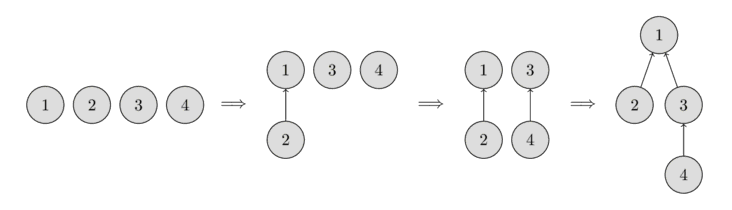

# Disjoint Set Union

## Nguồn

 [Disjoint Set Union](https://cp-algorithms.com/data_structures/disjoint_set_union.html)

## Mở đầu

Bài viết này nói về cấu trúc dữ liệu **Disjoint Set Union**, hay viết tắt là **DSU**. Đôi khi nó cũng được gọi là **Union Find** vì hai thao tác chính của nó.

Ta có một số phần tử, mỗi phần tử là một tập hợp riêng biệt. Một DSU sẽ có một phép toán cho phép kết hợp (chập) hai tập bất kỳ và cũng có thể cho biết một phần tử nào đó nằm trong tập hợp nào. Phiên bản cổ điển của DSU có một thao tác thứ ba, là tạo một tập hợp từ một phần tử mới.

Do đó, cấu trúc dữ liệu này về cơ bản có ba thao tác sau:

- `make_set(v)` - tạo một tập hợp gồm chỉ một phần tử `v`.
- `union_sets(a, b)` - hợp nhất hai tập chỉ định (tập chứa `a` và tập chứa `b`)
- `find_set(v)` - trả về đại diện (còn gọi là leader) của tập chứa phần tử `v`. Đại diện này là một phần tử của tập đó. Nó được cấu trúc dữ liệu chọn ra trong mỗi tập (và có thể thay đổi theo thời gian, cụ thể là sau các lời gọi `union_sets`). Đại diện này có thể được dùng để kiểm tra xem hai phần tử có cùng nằm trong một tập hay không. `a` và `b` cùng nằm trong một tập khi `find_set(a) == find_set(b)`. Ngược lại chúng nằm khác tập với nhau.

Cấu trúc dữ liệu này cho phép ta thực hiện các thao tác đó trong thời gian trung bình gần như là $O(1)$.

Ngoài ra, có một phần trong bài viết nói về một cấu trúc dữ liệu thay thế cho DSU, với độ phức tạp trung bình chậm hơn là $O(\log n)$, nhưng mạnh hơn DSU bình thường.

## Xây dựng một cấu trúc dữ liệu mạnh mẽ

Ta sẽ lưu các tập theo dạng các **cây**: mỗi cây sẽ tương ứng với một tập. Và gốc của cây sẽ là đại diện / leader của tập.

Hình sau sẽ cho thấy đại diện của những cây như thế.

{ style="display: block; margin: 0 auto" }

Ban đầu, mỗi phần tử là một tập, nên mỗi đỉnh cũng là một cây. Sau đó ta hợp nhất tập chứa phần tử 1 và tập chứa phần tử 2. Sau đó ta hợp nhất tập chứa phần tử 3 và tập chứa phần tử 4. Ở bước cuối cùng, hợp nhất tập chứa phần tử 1 và tập chứa phần tử 3.

Về mặt cài đặt, điều này có nghĩa là ta phải duy trì một mảng `parent` lưu tham chiếu đến đỉnh cha của đỉnh hiện tại trên cây.

### Cài đặt trâu bò

Đến đây ta đã có thể cài sơ bộ được cấu trúc dữ liệu này. Mặc dù ban đầu nó sẽ không hiệu quả lắm, nhưng ta có thể cải thiện nó với 2 bước tối ưu, làm cho nó chỉ tốn thời gian gần như là hằng số với mỗi lời gọi hàm.

Như ta đã đề cập, tất cả thông tin về tập các phần tử sẽ được lưu trong mảng `parent`.

Để tạo một tập mới (thao tác `make_set(v)`), ta chỉ cần tạo một cây với gốc ở node `v`, nghĩa là nó sẽ là cha của chính nó.

Để kết hợp 2 tập (thao tác `union_sets(a, b)`), đầu tiên ta tìm đại diện của tập mà `a` nằm trong tập đó, và đại diện của tập mà `b` nằm trong tập đó. Nếu hai đại diện giống nhau, thì ta không làm gì thêm, vì hai tập này là như nhau, chúng ta được ghép lại với nhau sẵn rồi. Ngược lại, ta có thể cho một đại diện là node cha của đại diện còn lại, sau đó ghép 2 cây lại.

Cuối cùng là việc tìm đại diện (thao tác `find_set(v)`): ta chỉ cần đi theo các node cha của `v` cho đến node gốc, nghĩa là tìm node cha cho đến khi cha của một node là chính node đó. Ta có thể dễ dàng cài đặt với đệ quy.

```cpp
void make_set(int v) {
    parent[v] = v;
}

int find_set(int v) {
    if (v == parent[v])
        return v;
    return find_set(parent[v]);
}

void union_sets(int a, int b) {
    a = find_set(a);
    b = find_set(b);
    if (a != b)
        parent[b] = a;
}
```

Tuy nhiên, cách cài này không hiệu quả. Ta có thể dễ dàng suy ra một ví dụ sao cho cây là một dãy dài các node. Trong trường hợp này, mỗi lần gọi `find_set(v)` sẽ tốn thời gian $O(n)$, còn xa mới đến được thời gian mà ta muốn (gần như hằng số). Vì vậy, ta sẽ xem xét hai bước tối ưu để tăng tốc rõ rệt cấu trúc dữ liệu này.

### Tối ưu nén đường đi

Đây là bước tối ưu cho hàm `find_set(v)`.

Nếu ta gọi `find_set(v)` cho một node `v` nào đó, ta sẽ tìm đại diện `p` cho tất cả các node ta thăm trên đường đi từ `v` đến `p`. Trick ở đây là làm đường đi này ngắn hơn, bằng cách set node cha của mỗi đỉnh được thăm thẳng lên `p`.

Bạn có thể thấy thao tác này trong hình dưới. Bên trái là một cái cây, còn bên phải là cái cây được nén sau khi gọi `find_set(7)`, nó sẽ làm cho đường đi ngắn hơn cho các node 7, 5, 3 và 2.

{ style="display: block; margin: 0 auto" }

Cài đặt mới cho `find_set` như sau:

```cpp
int find_set(int v) {
    if (v == parent[v])
        return v;
    return parent[v] = find_set(parent[v]);
}
```

Đầu tiên nó sẽ tìm đại diện của tập (node gốc), sau đó trong quá trình tháo stack, các node đã thăm sẽ được gắn trực tiếp vào đại diện.

Thay đổi đơn giản này đã đạt được độ phức tạp thời gian $O(\log n)$ trong trung bình mỗi lần gọi (ở đây không có chứng minh). Có một thay đổi tiếp theo sẽ làm cho nó còn nhanh hơn.

### Chập theo kích thước / cấp bậc

Trong bước tối ưu này, ta sẽ thay đổi thao tác `union_set`. Nói đúng hơn, ta sẽ thay đổi cách cây này được gắn vào cây kia. Trong cách cài trâu, cây thứ hai luôn được gắn vào cây đầu tiên. Trong thực tế, điều này có thể dẫn đến việc cây chứa 1 đoạn dài $O(n)$. Với tối ưu này, ta sẽ tránh được việc đó bằng cách chọn cẩn thận việc gắn.

Có rất nhiều kinh nghiệm có thể được sử dụng. Trong đó phổ biến nhất là hai cách tiếp cận sau:

Trong cách tiếp cận đầu tiên, ta sử dụng kích thước của cây làm cấp bậc và trong cách tiếp cận thứ hai, ta sử dụng độ sâu của cây (chính xác hơn là cận trên của độ sâu của cây, vì độ sâu sẽ nhỏ hơn khi áp dụng nén đường dẫn).

Trong cả hai cách tiếp cận, bản chất của việc tối ưu hóa là giống nhau: ta gắn cây có cấp bậc thấp hơn với cây có cấp bậc cao hơn.

Và đây là cách cài đặt chập theo kích thước:

```cpp
void make_set(int v) {
    parent[v] = v;
    size[v] = 1;
}

void union_sets(int a, int b) {
    a = find_set(a);
    b = find_set(b);
    if (a != b) {
        if (size[a] < size[b])
            swap(a, b);
        parent[b] = a;
        size[a] += size[b];
    }
}
```

Và đây là cách cài đặt chập theo cấp bậc dựa vào độ sâu của các cây con:

```cpp
void make_set(int v) {
    parent[v] = v;
    rank[v] = 0;
}

void union_sets(int a, int b) {
    a = find_set(a);
    b = find_set(b);
    if (a != b) {
        if (rank[a] < rank[b])
            swap(a, b);
        parent[b] = a;
        if (rank[a] == rank[b])
            rank[a]++;
    }
}
```

Cả hai kiểu tối ưu đều tương đương về độ phức tạp thời gian và không gian. Vì vậy trong thực tế, bạn có thể dùng cái nào cũng được.

### Độ phức tạp thời gian

Như đã nói, nếu ta kết hợp hai bước tối ưu (nén đường đi với chập theo kích thước / cấp bậc), ta sẽ tiến sát đến độ phức tạp hằng số khi truy vấn. Hóa ra, độ phức tạp thời gian phân bổ cuối cùng là $O(\alpha(n))$, trong đó $\alpha(n)$ là hàm Ackermann nghịch đảo, hàm này tăng rất chậm. Trên thực tế, nó tăng cực chậm, không quá $4$ cho tất cả $n$ không quá lớn (tầm $n < 10^{600}$).

Độ phức tạp phân bổ (amortized time) là tổng thời gian cho mỗi thao tác, được đánh giá qua một chuỗi nhiều thao tác. Ý tưởng là đảm bảo tổng thời gian của toàn bộ chuỗi, đồng thời cho phép các thao tác đơn lẻ chậm hơn nhiều so với thời gian phân bổ. Ví dụ, trong trường hợp của chúng ta, một lời gọi nào đó có thể tốn $O(\log n)$ trong trường hợp xấu nhất, nhưng nếu ta gọi $m$ lần như vậy liên tiếp, ta sẽ có thời gian trung bình là $O(\alpha(n))$.

Chứng minh khá dài và phức tạp nên ta sẽ không nghiên cứu ở đây.

Ngoài ra, lưu ý là DSU với chập theo kích thước / thứ bậc mà không dùng nén đường đi thì có thời gian là $O(\log n)$ cho mỗi truy vấn.

### Liên kết theo chỉ số / Liên kết tung đồng xu

Cả việc chập theo cấp bậc và chập theo kích thước đều yêu cầu lưu trữ dữ liệu bổ sung cho từng tập và duy trì các giá trị này trong mỗi thao tác chập.
Ngoài ra còn tồn tại một thuật toán ngẫu nhiên, giúp đơn giản hóa thao tác chập một chút: chập theo chỉ số.

Ta gán cho mỗi tập một giá trị ngẫu nhiên được gọi là chỉ số, và ta gắn tập có chỉ số nhỏ hơn với tập có chỉ số lớn hơn. Sẽ có khả năng là một tập to hơn sẽ có chỉ số lớn hơn tập hợp nhỏ hơn, do đó thao tác này có liên quan chặt chẽ với việc chập theo kích thước. Thực ra, có thể chứng minh rằng thao tác này có độ phức tạp về thời gian tương đương với phép chập theo kích thước. Tuy nhiên, trong thực tế, nó chậm hơn một chút so với chập theo kích thước.

```cpp
void make_set(int v) {
    parent[v] = v;
    index[v] = rand();
}

void union_sets(int a, int b) {
    a = find_set(a);
    b = find_set(b);
    if (a != b) {
        if (index[a] < index[b])
            swap(a, b);
        parent[b] = a;
    }
}
```

Có một quan niệm sai lầm phổ biến rằng chỉ cần tung một đồng xu, để quyết định tập nào chúng ta gắn với tập nào, cũng có cùng độ phức tạp với những kĩ thuật trên. Tuy nhiên điều đó không đúng. Bài báo khoa học ở trên phỏng đoán rằng chập kiểu tung đồng xu kết hợp với nén đường đi có độ phức tạp $\Omega\left(n \frac{\log n}{\log \log n}\right)$. Và trong các benchmark, nó hoạt động kém hơn nhiều so với chập theo kích thước / cấp bậc hoặc chập theo chỉ số.

```cpp
void union_sets(int a, int b) {
    a = find_set(a);
    b = find_set(b);
    if (a != b) {
        if (rand() % 2)
            swap(a, b);
        parent[b] = a;
    }
}
```

## Các ứng dụng và cải tiến

Trong phần này, chúng ta xem xét một số ứng dụng của cấu trúc dữ liệu này, bao gồm các ứng dụng thông thường và một số cải tiến của DSU.

### Các thành phần liên thông trong đồ thị

Đây là một trong những ứng dụng dễ thấy nhất của DSU.

Bài toán sẽ như sau: Ta có một đồ thị rỗng, ta sẽ phải thêm các đỉnh và cạnh vô hướng vào, và trả lời các truy vấn theo dạng $(a, b)$ - các đỉnh $a$ và $b$ có nằm trong cùng một thành phần liên thông của đồ thị không?

Ở đây ta có thể áp dụng trực tiếp DSU, và lấy kết quả trong thời gian trung bình gần như là hằng số.

Ứng dụng này khá quan trọng, vì bài toán gần như tương tự đã xuất hiện trong [Thuật toán Kruskal tìm cây khung nhỏ nhất](https://cp-algorithms.com/graph/mst_kruskal.html). Với DSU ta có thể [cải tiến](https://cp-algorithms.com/graph/mst_kruskal_with_dsu.html) nó từ $O(m \log n + n^2)$ lên $O(m \log n)$.

### Tìm các thành phần liên thông trong một hình ảnh

Ta có bài toán sau: cho một hình ảnh có $n \times m$ pixel. Ban đầu các pixel đều trắng, nhưng sau đó người ta vẽ lên một số pixel đen. Ta muốn tìm kích thước của mỗi thành phần liên thông trắng trong hình sau cùng.

Về đáp án thì ta đơn giản duyệt tất cả các pixel trắng của hình, với mỗi ô duyệt 4 ô kề nó, và nếu ô kề cũng trắng thì gọi `union_sets`. Vậy ta sẽ có một DSU với $n m$ đỉnh tương ứng với các pixel trong hình. Các cây kết quả trong DSU là các thành phần liên thông cần tìm.

Bài này cũng có thể giải với DFS hay BFS, nhưng cách trên có một ưu điểm: nó có thể xử lý bảng theo từng hàng (nghĩa là ta chỉ cần hàng hiện tại và hàng trước nó, và chỉ cần xây dựng một DSU cho một hàng) trong không gian $O(\min(n, m))$.

### Lưu thông tin thêm vào mỗi tập

DSU cho phép ta lưu thông tin thêm vào các tập một cách dễ dàng.

Một ví dụ là kích thước của các tập: lưu kích thước đã được mô tả trong phần Chập theo kích thước (thông tin được lưu vào đại diện hiện tại của tập).

Bằng cách tương tự - nghĩa là lưu theo đỉnh đại diện - ta cũng có thể lưu bất cứ thông tin nào của tập mà ta muốn.

### Nén các bước nhảy trên đoạn / Tô màu đoạn con offline

Bài toán như sau: Có một tập các đỉnh, và mỗi đỉnh có một cạnh nối với một đỉnh khác. Với DSU bạn có thể tìm đỉnh cuối cùng trên dãy các đỉnh mà ta đi theo các cạnh từ đỉnh đầu tiên, trong thời gian gần như hằng số.

Một ví dụ của ứng dụng này là **bài toán tô màu đoạn con**. Ta có một đoạn độ dài $L$, mỗi phần tử ban đầu có màu $0$. Ta phải tô lại đoạn $[l, r]$ với màu $c$ cho mỗi truy vấn $(l, r, c)$. Cuối cùng ta muốn tìm màu của mỗi ô sau khi tô xong. Ta giả sử rằng ta biết tất cả các truy vấn rồi, nghĩa là ta có thể xử lý offline.

Về đáp án, ta có thể tạo một DSU, với mỗi ô, ta liên kết nó đến một ô chưa tô tiếp theo. Như vậy ban đầu mỗi ô trỏ đến chính nó. Sau khi tô màu một đoạn, tất cả các ô trong đoạn đó sẽ trỏ đến ô nằm sau đoạn đó.

Giờ để giải bài này, ta xét các truy vấn theo **thứ tự ngược lại**: từ cuối lên đầu. Bằng cách này, khi thực hiện một truy vấn, ta chỉ cần tô những ô chưa tô trong đoạn con $[l, r]$. Các ô còn lại đã được tô màu trùng với màu sau khi thực hiện tất cả các truy vấn. Để duyệt qua tất cả các ô chưa tô, ta dùng DSU. Ta tìm ô chưa tô bên trái nhất trong đoạn, tô nó, và với con trỏ đã lưu thì ta đi đến ô chưa tô tiếp theo.

Ở đây ta có thể dùng DSU với nén đường đi, nhưng ta không thể dùng chập theo kích thước / thứ bậc (vì đại diện sau khi chập rất quan trọng). Vậy nên độ phức tạp sẽ là $O(\log n)$ mỗi lần chập (cũng khá nhanh).

Cài đặt:

```cpp
for (int i = 0; i <= L; i++) {
    make_set(i);
}

for (int i = m-1; i >= 0; i--) {
    int l = query[i].l;
    int r = query[i].r;
    int c = query[i].c;
    for (int v = find_set(l); v <= r; v = find_set(v)) {
        answer[v] = c;
        parent[v] = v + 1;
    }
}
```

Có một bước tối ưu ở đây, ta có thể dùng **chập theo thứ bậc**, nếu ta lưu ô chưa tô tiếp theo trong một mảng `end[]`. Như thế ta có thể chập 2 tập thành một dựa vào heuristic và ta có thể giải trong $O(\alpha(n))$.

### Lấy khoảng cách đến đại diện

Đôi khi trong một số ứng dụng cụ thể của DSU, bạn cần phải duy trì khoảng cách giữa một đỉnh và đại diện trong tập chứa nó (nghĩa là độ dài đường đi trên cây từ đỉnh hiện tại đến gốc của cây).

Nếu không dùng nén đường đi, khoảng cách chỉ là số lần gọi đệ quy, nhưng nó không hiệu quả lắm. Tuy nhiên, ta có thể dùng nén đường đi, nếu ta lưu **khoảng cách đến đỉnh cha** vào mỗi node.

Trong cài đặt nó sẽ tiện hơn khi dùng mảng các pair cho `parent[]` và hàm `find_set` giờ sẽ trả về hai số: dại diện và khoảng cách đến đại diện.

```cpp
void make_set(int v) {
    parent[v] = make_pair(v, 0);
    rank[v] = 0;
}

pair<int, int> find_set(int v) {
    if (v != parent[v].first) {
        int len = parent[v].second;
        parent[v] = find_set(parent[v].first);
        parent[v].second += len;
    }
    return parent[v];
}

void union_sets(int a, int b) {
    a = find_set(a).first;
    b = find_set(b).first;
    if (a != b) {
        if (rank[a] < rank[b])
            swap(a, b);
        parent[b] = make_pair(a, 1);
        if (rank[a] == rank[b])
            rank[a]++;
    }
}
```

### Lấy tính chẵn lẻ của độ dài đường đi / Kiểm tra tính hai phía online

Bằng cách tính khoảng cách từ đỉnh đến đại diện như vậy, ta cũng có thể duy trì tính chẵn lẻ của độ dài đường đi. Nhưng vì sao ta lại cho nó một mục ứng dụng riêng vậy?

Bài toán đặt ra như sau: Đầu tiên ta có một đồ thị rỗng, sau đó ta có thể thêm cạnh, và trả lời các truy vấn dưới dạng "cho một đỉnh, thành phần liên thông chứa đỉnh này có phải là thành phần liên thông **hai phía** hay không?".

Để giải được bài này, ta tạo một DSU lưu các thành phần liên thông và lưu tính chẵn lẻ của đường đi từ một đỉnh đến đại diện của thành phần liên thông chứa đỉnh đó. Vậy ta có thể kiểm tra nếu thêm cạnh làm cho đồ thị mất tính hai phía hay không: cụ thể là nếu hai đỉnh của cạnh nằm cùng thành phần liên thông và có cùng tính chẵn lẻ khi xét độ dài đến đại diện, thì thêm cạnh này sẽ tạo ra một chu trình lẻ, làm đồ thị mất tính hai phía.

Cái khó ở đây là làm sao tính được tính chẵn lẻ trong hàm `union_find`.

Nếu ta thêm cạnh $(a, b)$ nối hai thành phần liên thông thành một, thì khi gắn cây này vào cây kia ta cần phải tính điều chỉnh tính chẵn lẻ.

Ta sẽ tìm công thức tính toán tính chẵn lẻ cho đại diện của tập sẽ được gắn vào tập khác. Gọi $x$ là tính chẳn lẽ của độ dài đường đi từ đỉnh $a$ lên đại diện $A$, $y$ là tính chẳn lẽ của độ dài đường đi từ đỉnh $b$ lên đại diện $B$, và $t$ là tính chẵn lẻ cần mà ta phải gán cho $B$ sau khi chập. Đường đi bao gồm 3 phần: từ $B$ đến $b$, từ $b$ đến $a$, được nối với nhau bằng một cạnh và có tính chẵn lẻ là $1$, và từ $a$ đến $A$. Do đó ta có công thức ($\oplus$ là biểu thị phép toán XOR):

$$t = x \oplus y \oplus 1$$

Như vậy, không quan trọng ta chập bao nhiêu lần, tính chẵn lẻ của các cạnh được mang từ đại diện này sang đại diện khác.

Ở dưới là cài đặt DSU với tính chẵn lẻ. Như phần trước thì ta dùng pair để lưu đỉnh cha và tính chẵn lẻ. Thêm vào đó, với mỗi tập ta lưu sẽ trong mảng `bipartite[]` để xem nó có hai phía hay không.

```cpp
void make_set(int v) {
    parent[v] = make_pair(v, 0);
    rank[v] = 0;
    bipartite[v] = true;
}

pair<int, int> find_set(int v) {
    if (v != parent[v].first) {
        int parity = parent[v].second;
        parent[v] = find_set(parent[v].first);
        parent[v].second ^= parity;
    }
    return parent[v];
}

void add_edge(int a, int b) {
    pair<int, int> pa = find_set(a);
    a = pa.first;
    int x = pa.second;

    pair<int, int> pb = find_set(b);
    b = pb.first;
    int y = pb.second;

    if (a == b) {
        if (x == y)
            bipartite[a] = false;
    } else {
        if (rank[a] < rank[b])
            swap (a, b);
        parent[b] = make_pair(a, x^y^1);
        bipartite[a] &= bipartite[b];
        if (rank[a] == rank[b])
            ++rank[a];
    }
}

bool is_bipartite(int v) {
    return bipartite[find_set(v).first];
}
```

### Offline RMQ (range minimum query) trong trung bình $O(\alpha(n))$ / Arpa's trick { #arpa data-toc-label="Offline RMQ / Arpa's trick"}

Cho mảng `a[]` và ta phải tính min của một số đoạn trên mảng.

Ý tưởng để giải với DSU là như sau: Duyệt mảng và khi ta đang ở phần tử thứ `i`, ta sẽ trả lời tất cả truy vấn `(L, R)` với `R == i`. Để tính một cách hiệu quả, ta sẽ dùng DSU với `i` phần tử đầu tiên với cấu trúc như sau: đỉnh cha của một phần tử là phần tử nhỏ hơn nó gần nhất bên phải. Sau đó ta dùng cấu trúc này để trả lời một truy vấn sẽ là `a[find_set(L)]`, số nhỏ nhất bên phải `L`.

Cách tiếp cận này hiệu quả khi làm offline, nghĩa là khi ta biết tất cả truy vấn trước đó.

Dễ thấy là ta có thể nén đường đi ở đây. Và ta cũng có thể dùng chập theo cấp bậc, nếu ta lưu đại diện trong một mảng riêng.

```cpp
struct Query {
    int L, R, idx;
};

vector<int> answer;
vector<vector<Query>> container;
```

`container[i]` chứa tất cả truy vấn với `R == i`.

```cpp
stack<int> s;
for (int i = 0; i < n; i++) {
    while (!s.empty() && a[s.top()] > a[i]) {
        parent[s.top()] = i;
        s.pop();
    }
    s.push(i);
    for (Query q : container[i]) {
        answer[q.idx] = a[find_set(q.L)];
    }
}
```

Thuật này ngày nay gọi là Arpa's trick. Nó được đặt theo tên của AmirReza Poorakhavan, người đã tìm ra và phổ biến kỹ thuật này. Mặc dù thuật toán này đã tồn tại trước khi anh này tìm ra nó.

### Offline LCA (lowest common ancestor in a tree) trong trung bình $O(\alpha(n))$ {data-toc-label="Offline LCA"}

Thuật toán tìm LCA đã được nói đến trong bài [Lowest Common Ancestor - Tarjan's off-line algorithm](https://cp-algorithms.com/graph/lca_tarjan.html). Thuật toán này so sánh thuận lợi với các thuật toán tìm LCA khác do tính đơn giản của nó (đặc biệt là khi so với thuật toán tối ưu như thuật toán của [Farach-Colton và Bender](https://cp-algorithms.com/graph/lca_farachcoltonbender.html)).

### Lưu tường minh DSU vào một set list / Ứng dụng của ý tưởng này khi chập nhiều cấu trúc dữ liệu

Một cách khác để lưu DSU là lưu mỗi tập theo dạng **tường minh các phần tử của tập đó**. Cùng lúc thì mỗi phần tử cũng lưu tham chiếu đến đại diện của tập chứa nó.

Thoạt nhìn thì đây có vẻ như là một cấu trúc dữ liệu không hiệu quá: khi chập 2 tập thì ta phải thêm một dãy vào sau dãy kia và cập nhật đại diện của một trong hai tập.

Tuy nhiên, hóa ra, việc sử dụng **heuristic trọng số** (tương tự như chập theo kích thước) có thể làm giảm đáng kể độ phức tạp tiệm cận:
$O(m + n \log n)$ để thực hiện $m$ truy vấn trên $n$ phần tử.

Theo heuristic trọng số, ta sẽ luôn **thêm tập nhỏ hơn vào tập hợp lớn hơn**. Việc thêm một tập này vào một tập khác rất dễ thực hiện trong `union_sets` và sẽ mất thời gian tỷ lệ thuận với kích thước của tập hợp đã thêm. Việc tìm kiếm đại diện trong `find_set` sẽ mất $O(1)$ với cách lưu trữ này.

Giờ ta sẽ chứng minh **độ phức tạp thời gian** $O(m + n \log n)$ khi thực hiện $m$ truy vấn. Ta sẽ cố một phần tử tùy ý $x$ và đếm số lần nó được dùng trong thao tác chập `union_sets`. Khi phần tử $x$ được dùng lần đầu tiên, kích thước của tập hợp mới sẽ ít nhất là $2$. Khi nó được dùng lần thứ hai, tập kết quả sẽ có kích thước ít nhất là $4$, bởi vì tập nhỏ hơn được thêm vào tập lớn hơn, cứ như vậy. Điều này có nghĩa là $x$ chỉ có thể được di chuyển trong nhiều nhất $\log n$ thao tác chập. Do đó, tổng trên tất cả các đỉnh cho ta $O(n \log n)$ cộng với $O(1)$ cho mỗi truy vấn.

Cài đặt như sau:

```cpp
vector<int> lst[MAXN];
int parent[MAXN];

void make_set(int v) {
    lst[v] = vector<int>(1, v);
    parent[v] = v;
}

int find_set(int v) {
    return parent[v];
}

void union_sets(int a, int b) {
    a = find_set(a);
    b = find_set(b);
    if (a != b) {
        if (lst[a].size() < lst[b].size())
            swap(a, b);
        while (!lst[b].empty()) {
            int v = lst[b].back();
            lst[b].pop_back();
            parent[v] = a;
            lst[a].push_back (v);
        }
    }
}
```

Ý tưởng thêm phần nhỏ hơn vào phần lớn hơn cũng được dùng trong nhiều bài tập không liên quan gì đến DSU.

Ví dụ, ta xét bài toán sau: cho một cây, mỗi node lá được gắn một số (các node lá khác nhau có thể có cùng số). Ta muốn tính số số khác nhau trong cây con của mọi node trên cây.

Áp dụng ý tưởng tương tự cho bài này, ta sẽ có đáp án sau: ta có thể cài DFS, nó sẽ trả về một con trỏ đến một tập các số nguyên - dãy số trên cây con. Sau đó để lấy được đáp án của node hiện tại (tất nhiên trừ khi nó là node lá), ta gọi DFS cho tất cả node con, và chập những tập nhận được với nhau. Kích thước của tập kết quả sẽ là đáp án của node hiện tại. Để chập hiệu quả nhiều tập với nhau, ta chỉ cần áp dụng cách ở trên: mang tập nhỏ chập vào tập to. Cuối cùng ta sẽ có một cách giải $O(n \log^2 n)$, vì một số sẽ chỉ được thêm vào một tập tối đa $O(\log n)$ lần.

### Lưu DSU bằng cách duy trì cấu trúc cây rõ ràng / Tìm cầu online trong trung bình $O(\alpha(n))$ {data-toc-label="Lưu DSU bằng cách duy trì cấu trúc cây rõ ràng / Tìm cầu online"}

Một trong những ứng dụng mạnh mẽ nhất của DSU là nó cho phép bạn lưu cả dưới dạng **cây nén và cây không nén**. Dạng nén có thể được dùng để chập các cây và để xem hai đỉnh có cùng thuộc một cây hay không. Dạng không nén có thể được dùng để tìm các đường đi giữa hai đỉnh, hoặc những cách duyệt khác của cấu trúc cây.

Trong cài đặt, điều này có nghĩa là ngoài mảng cha `parent[]` ra thì ta sẽ cần lưu mảng tổ tiên không nén `real_parent[]`. Dễ thấy việc duy trì mảng thêm này không làm tăng độ phức tạp: thay đổi trong cấu trúc chỉ xuất hiện khi ta chập hai cây, và chỉ ở một phần tử.

Mặt khác khi áp dụng vào thực tế, ta thường cần kết nối các cây bằng một cạnh xác định khác với cách dùng hai node gốc. Nghĩa là ta không có lựa chọn nào khác ngoài việc chọn root lại một trong các cây (biến một trong hai đầu của cạnh thành gốc mới của cây).

Thoạt nhìn, có vẻ như việc chọn root lại rất tốn kém và làm tăng độ phức tạp. Thật vậy, để tạo gốc cho cây ở đỉnh $v$ ta phải đi từ đỉnh này đến gốc cũ và thay đổi hướng trong `parent[]` và `real_parent[]` với tất cả các node trên đường đi.

Tuy nhiên thực tế thì không tệ lắm, ta chỉ cần root lại cây nhỏ hơn trong số hai cây, tương tự như ý tưởng trong các phần trước và điều này sẽ tốn trung bình $O(\log n)$.

Bạn có thể tìm thêm chi tiết (bao gồm chứng minh độ phức tạp) trong bài [Tìm cầu online](https://cp-algorithms.com/graph/bridge-searching-online.html).

## Hồi tưởng

Cấu trúc dữ liệu DSU đã được biết đến từ rất lâu.

Cách lưu cấu trúc dữ liệu theo kiểu rừng cây này được giới thiệu lần đầu bởi Galler và Fisher nằm 1964 (Galler, Fisher, "An Improved Equivalence Algorithm"), tuy nhiên phân tích hoàn chỉnh về độ phức tạp chỉ được thực hiện sau đó khá lâu.

Tối ưu nén đường đi và Chập theo cấp bậc được phát triển bởi McIlroy và Morris, và bởi Tritter (độc lập).

Hopcroft và Ullman đã chứng minh được vào nằm 1973 rằng độ phức tạp thời gian là $O(\log^\star n)$ (Hopcroft, Ullman "Set-merging algorithms") - ở đây $\log^\star$ là **iterated logarithm** (hàm tăng chậm, nhưng không chậm như hàm đảo Ackermann).

Lần đầu tiên việc đánh giá $O(\alpha(n))$ được trình bày vào năm 1975 (Tarjan "Efficiency of a Good But Not Linear Set Union Algorithm"). Sau đó vào năm 1985, ông cùng với Leeuwen đã xuất bản nhiều phân tích độ phức tạp cho một số heuristics xếp hạng và những cách nén đường đi (Tarjan, Leeuwen "Worst-case Analysis of Set Union Algorithms").

Cuối cùng vào nằm 1989, Fredman và Sachs chứng minh rằng trong mô hình tính toán được chấp nhận, bất kỳ thuật toán DSU nào cũng phải hoạt động trong thời gian trung bình tối thiểu $O(\alpha(n))$ (Fredman, Saks, "The cell probe complexity of dynamic data structures").

## Luyện tập

| Problem | Status | Submission | Code | Date |
| :---: | :-----------: | :---: | :---: | :---: |
| [TIMUS - Anansi's Cobweb](http://acm.timus.ru/problem.aspx?space=1&num=1671) | :white_check_mark: | Unavailable public link | [Code](https://github.com/farmerboy95/CompetitiveProgramming/blob/master/Timus/TIMUS%201671.cpp) | 10/05/2023 |
| [Codeforces - Roads not only in Berland](http://codeforces.com/contest/25/problem/D) | :white_check_mark: | [Submission](https://codeforces.com/contest/25/submission/205313041) | [Code](https://github.com/farmerboy95/CompetitiveProgramming/blob/master/Codeforces/CF25-D2-D.cpp) | 10/05/2023 |
| [TIMUS - Parity](http://acm.timus.ru/problem.aspx?space=1&num=1003) | :white_check_mark: | Unavailable public link | [Code](https://github.com/farmerboy95/CompetitiveProgramming/blob/master/Timus/TIMUS%201003.cpp) | 11/05/2023 |
| [SPOJ - Strange Food Chain](http://www.spoj.com/problems/CHAIN/) | :white_check_mark: | Unavailable public link | [Code](https://github.com/farmerboy95/CompetitiveProgramming/blob/master/SPOJ/SPOJ%20CHAIN.cpp) | 15/05/2023 |
| [SPOJ - COLORFUL ARRAY](https://www.spoj.com/problems/CLFLARR/) | :white_check_mark: | Unavailable public link | [Code](https://github.com/farmerboy95/CompetitiveProgramming/blob/master/SPOJ/SPOJ%20CLFLARR.cpp) | 15/05/2023 |
| [SPOJ - Consecutive Letters](https://www.spoj.com/problems/CONSEC/) | :white_check_mark: | Unavailable public link | [Code](https://github.com/farmerboy95/CompetitiveProgramming/blob/master/SPOJ/SPOJ%20CONSEC.cpp) | 16/05/2023 |
| [Toph - Unbelievable Array](https://toph.co/p/unbelievable-array) | :white_check_mark: | Unavailable public link | [Code](https://github.com/farmerboy95/CompetitiveProgramming/blob/master/Toph/TOPH%20unbelievable-array.cpp) | 16/05/2023 |
| [HackerEarth - Lexicographically minimal string](https://www.hackerearth.com/practice/data-structures/disjoint-data-strutures/basics-of-disjoint-data-structures/practice-problems/algorithm/lexicographically-minimal-string-6edc1406/) | :white_check_mark: | Unavailable public link | [Code](https://github.com/farmerboy95/CompetitiveProgramming/blob/master/HackerEarth/HACKER%20lexicographically-minimal-string.cpp) | 16/05/2023 |
| [HackerEarth - Fight in Ninja World](https://www.hackerearth.com/practice/algorithms/graphs/breadth-first-search/practice-problems/algorithm/containers-of-choclates-1/) | :white_check_mark: | Unavailable public link | [Code](https://github.com/farmerboy95/CompetitiveProgramming/blob/master/HackerEarth/HACKER%20containers-of-choclates-1.cpp) | 16/05/2023 |
